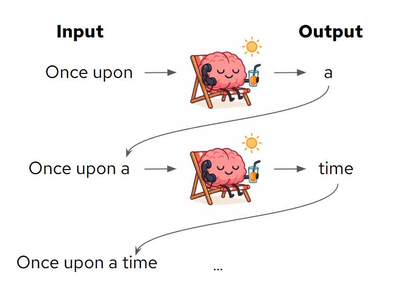
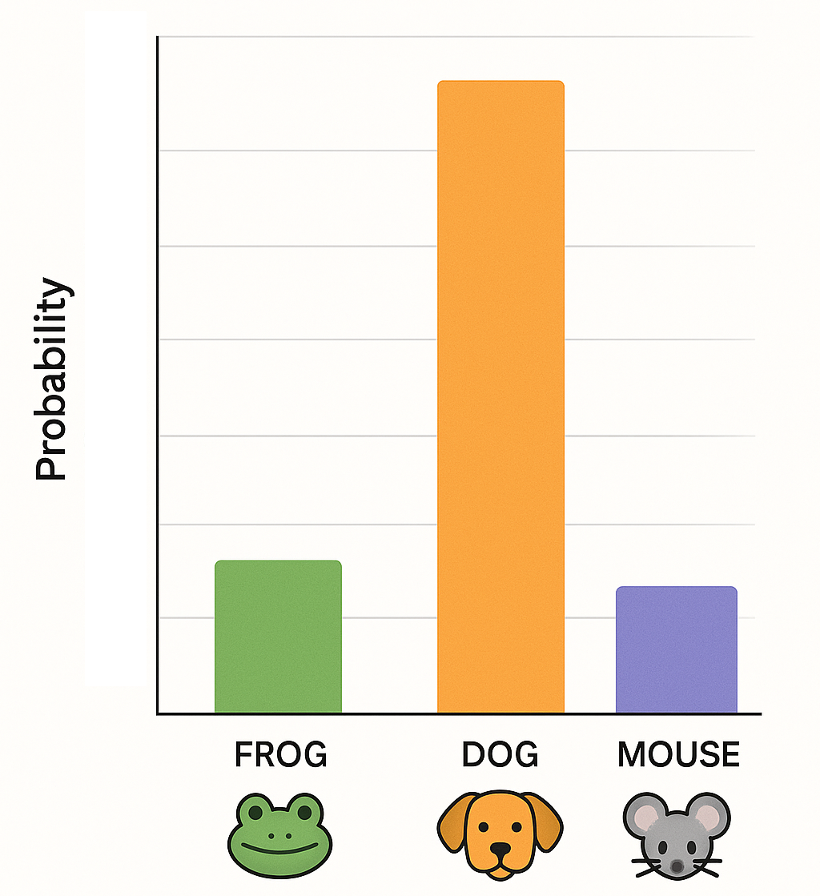
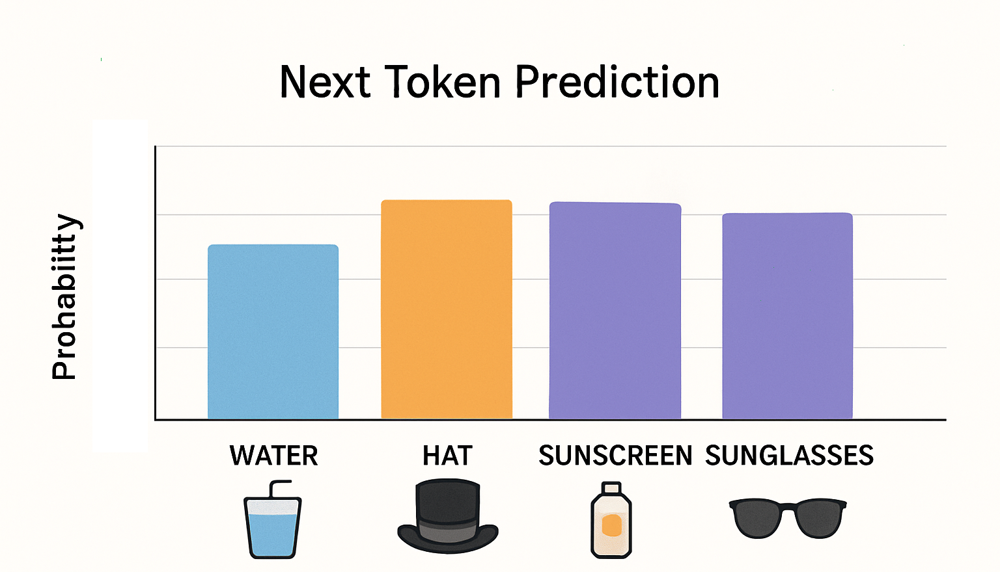

# LLM Fundamentals

## 📚 Contents
- [LLM Fundamentals](#llm-fundamentals)
  - [📚 Contents](#-contents)
  - [🔍 What is a Token?](#-what-is-a-token)
  - [🧠 Context Length and Window](#-context-length-and-window)
  - [🔮 Are LLMs Fixed or Do They Change?](#-are-llms-fixed-or-do-they-change)
  - [🔄 Next-Token Prediction](#-next-token-prediction)

## 🔍 What is a Token?

Before an AI model can understand or generate text, it breaks everything down into tiny pieces called **tokens**.

A token is not quite a word — it could be:
- A whole short word: `"The"` → 1 token
- Parts of a longer word: `"unbelievable"` → 3 tokens (`"un"`, `"believ"`, `"able"`)
- Punctuation: `","` or `"."` might each be 1 token

These are the basic building blocks the model sees. It doesn’t understand text the way humans do — it just sees a stream of tokens and learns patterns in how they appear.

You may ask "why not just feed it words or letters?"  
There are two main reasons to use tokens:
- Regardless of what we use, we need to convert it into numbers because ultimately the computer only understands numbers 🔢 Aaand, there are too many words to give them all a number each.
- They are designed to be as large but also as reusable as possible, so that the **number** of inputs we send to the LLM is as few as possible. For example, if I send the word `unbelievable` it would be 12 inputs if I sent each letter, but only 3 tokens. The number of inputs are important which we explain... now 👇

When you start working with LLMs you will often see people counting tokens. We don't just do this for fun, it's because the number of tokens is now how large our input into the LLM is.  
An LLM can only input and output a certain number of tokens in the same request (think of it as how much context/information it can see at once).  
Besides that, the more we input the more memory it needs to use (GPU memory specifically) to keep track of all the inputs and outputs (remember that the output turns into input in the next step). 



Here you can try your hands on how sentences get converted into tokens:
<iframe
	src="https://agents-course-the-tokenizer-playground.static.hf.space"
	frameborder="0"
	width="500"
	height="750"
	style="border: 1px solid #ccc; border-radius: 8px;"
	loading="lazy">
></iframe>

*The App is from [HuggingFace Learning Course](https://agents-course-the-tokenizer-playground.static.hf.space)*

Let’s test your understanding with a quick quiz!

<!-- 🔍 Token‐capacity calculation (typed answer) -->
<div style="background:linear-gradient(135deg,#e8f2ff 0%,#f5e6ff 100%);padding:20px;border-radius:10px;margin:20px 0;border:1px solid #d1e7dd;">
  <h3 style="margin:0 0 8px;color:#5a5a5a;">🔤 Quiz</h3>
  <p style="color:#495057; font-weight:500;">
    You’re working on a big codebase (thousands of lines long) and you don't feel like reading through it line-by-line. <br>
    So instead, you decide to get help from your favorite LLM 🤖<br>
    You start off by writing some instructions:

    “Explain what this code does, step by step, in simple terms...”
  <p style="color:#495057; font-weight:500;">
    Which takes 96 tokens in total.<br>
    Then you start feeding it the code, line by line, where each line takes about 12 tokens per line.<br>
    Now, you also happen know that the model only can handle 4096 tokens at the same time.<br>
  </p>
  <p style="color:#495057; font-weight:500;">
    👉 <strong>How many <em>full</em> lines of code can you send the LLM at a time?</strong>
  </p>

  <style>
    /* hide the native number-input arrows */
    #cap-input::-webkit-inner-spin-button,
    #cap-input::-webkit-outer-spin-button {
      -webkit-appearance: none;
      margin: 0;
    }
    #cap-input {
      -moz-appearance: textfield;
    }
    /* your existing valid/invalid styling… */
    #cap-input { margin:6px 0 4px; padding:6px 10px; border:2px solid #e9ecef; border-radius:6px; width:120px; font-size:1em; }
    #cap-input:focus { outline:none; border-color:#6ea8fe; }
    #cap-input:valid { background:#d4edda; border-color:#28a745; color:#155724; }
    #cap-input:invalid:not(:placeholder-shown) { background:#f8d7da; border-color:#dc3545; color:#721c24; }
    .feedback-cap { display:none; margin:4px 0; padding:8px 16px; border-radius:6px; }
    #cap-input:valid + .feedback-cap[data-feedback="correct"],
    #cap-input:invalid:not(:placeholder-shown) + .feedback-cap[data-feedback="wrong"] {
      display:block;
    }
    .feedback-cap[data-feedback="correct"] { background:#d1f2eb; color:#0c5d56; border:1px solid #a3d9cc; }
    .feedback-cap[data-feedback="wrong"]   { background:#fce8e6; color:#58151c; border:1px solid #f5b7b1; }
  </style>

  <input
    id="cap-input"
    type="number"
    placeholder="---"
    min="333"
    max="333"
    step="1"
    required>

  <div class="feedback-cap" data-feedback="correct">✅ Right! 333 lines.</div>
  <div class="feedback-cap" data-feedback="wrong">❌ Nope, that’s not it.</div>
</div>

<script>
  // prevent Up/Down arrows from jumping to 333 when empty
  document.getElementById('cap-input')
    .addEventListener('keydown', function(e) {
      if ((e.key === 'ArrowUp' || e.key === 'ArrowDown') && this.value === '') {
        e.preventDefault();
      }
    });
</script>

## 🔄 Next-Token Prediction

At their core, large language models do something surprisingly simple:  
They guess the **next token**.

You give them a string of text, and the model continues it by predicting the most likely next piece. Then it does it again. And again. And again.

It’s like a very fast autocomplete — but one that’s been trained on a massive collection of text from books, websites, conversations, and more.

For example:
> Input: “Photosynthesis is the process by which plants”  
> Model prediction: `“ convert sunlight into energy”`

This step-by-step guessing game is called **inference**.

Because the model is trying to predict what *usually* comes next, it’s sensitive to clues and patterns in your prompt — and sometimes a small change can lead to a very different outcome.

Let’s see how well it guesses in a specific context:


<!-- 🔄 Next token – tricky semantic cue -->
<div style="background:linear-gradient(135deg,#e8f2ff 0%,#f5e6ff 100%);padding:20px;border-radius:10px;margin:20px 0;border:1px solid #d1e7dd;">

<h3 style="margin:0 0 8px;color:#5a5a5a;">📝 Quiz 1</h3>
<p style="color:#495057; font-weight:500;">
Imagine a prompt sent to an LLM reads exactly like this:
</p>

<p style="color:#495057; font-weight:500;">
"It rains like cats and..."
</p>

<p style="color:#495057; font-weight:500;">Which <em>single token</em> is the model most likely to produce next?</p>

<style>
.quiz-container-next-easy{position:relative}
.quiz-option-next-easy{display:block;margin:4px 0;padding:8px 16px;background:#f8f9fa;border-radius:6px;cursor:pointer;transition:.2s;border:2px solid #e9ecef;color:#495057}
.quiz-option-next-easy:hover{background:#fff;transform:translateY(-1px);border-color:#dee2e6}
.quiz-radio-next-easy{display:none}
.quiz-radio-next-easy:checked+.quiz-option-next-easy[data-correct="true"]{background:#d4edda;color:#155724;border-color:#c3e6cb}
.quiz-radio-next-easy:checked+.quiz-option-next-easy:not([data-correct="true"]){background:#f8d7da;color:#721c24;border-color:#f5c6cb}
.feedback-next-easy{display:none;margin:4px 0;padding:8px 16px;border-radius:6px}
#next-easy-correct:checked~.feedback-next-easy[data-feedback="correct"],
#next-easy-wrong1:checked~.feedback-next-easy[data-feedback="wrong"],
#next-easy-wrong2:checked~.feedback-next-easy[data-feedback="wrong"],
#next-easy-wrong3:checked~.feedback-next-easy[data-feedback="wrong"]{display:block}
.feedback-next-easy[data-feedback="correct"]{background:#d1f2eb;color:#0c5d56;border:1px solid #a3d9cc}
.feedback-next-easy[data-feedback="wrong"]{background:#fce8e6;color:#58151c;border:1px solid #f5b7b1}
</style>

<div class="quiz-container-next-easy">
  <input type="radio" name="quiz-next-easy" id="next-easy-wrong1" class="quiz-radio-next-easy">
  <label for="next-easy-wrong1" class="quiz-option-next-easy" data-correct="false">🐸 frogs</label>

  <input type="radio" name="quiz-next-easy" id="next-easy-correct" class="quiz-radio-next-easy">
  <label for="next-easy-correct" class="quiz-option-next-easy" data-correct="true">🐶 dogs</label>

  <input type="radio" name="quiz-next-easy" id="next-easy-wrong2" class="quiz-radio-next-easy">
  <label for="next-easy-wrong2" class="quiz-option-next-easy" data-correct="false">🐭 mouse</label>

  <div class="feedback-next-easy" data-feedback="correct">✅ Exactly!</div>
  <div class="feedback-next-easy" data-feedback="wrong">❌ Read again carefully.</div>
</div>
</div>


The LLM predicts what will likely be the next token, and puts a probability on each of the tokens.  
The higher the probability, the higher the chance it will be chosen.

<details>
<summary> 🕵️ Spoilers! Press here after done with the quiz.</summary>  
<br>

</details>
<br>
In some cases, like with the above quiz, it's pretty clear what it will predict.  
In other cases, it will not be as clear, like the below for example:


<!-- 🔄 Next token – tricky semantic cue -->
<div style="background:linear-gradient(135deg,#e8f2ff 0%,#f5e6ff 100%);padding:20px;border-radius:10px;margin:20px 0;border:1px solid #d1e7dd;">

<h3 style="margin:0 0 8px;color:#5a5a5a;">📝 Quiz 2</h3>
<p style="color:#495057; font-weight:500;">
Imagine a prompt sent to an LLM reads exactly like this:
</p>

<p style="color:#495057; font-weight:500;">
"John carefully packed his bag with essentials for the desert hike: water, sunscreen, and a wide-brimmed hat. He double-checked everything twice. When he arrived, the blazing sun made him immediately grateful he'd remembered his..."
</p>

<p style="color:#495057; font-weight:500;">Which <em>single token</em> is the model most likely to produce next?</p>

<style>
.quiz-container-next-tricky{position:relative}
.quiz-option-next-tricky{display:block;margin:4px 0;padding:8px 16px;background:#f8f9fa;border-radius:6px;cursor:pointer;transition:.2s;border:2px solid #e9ecef;color:#495057}
.quiz-option-next-tricky:hover{background:#fff;transform:translateY(-1px);border-color:#dee2e6}
.quiz-radio-next-tricky{display:none}
.quiz-radio-next-tricky:checked+.quiz-option-next-tricky[data-correct="true"]{background:#d4edda;color:#155724;border-color:#c3e6cb}
.quiz-radio-next-tricky:checked+.quiz-option-next-tricky:not([data-correct="true"]){background:#f8d7da;color:#721c24;border-color:#f5c6cb}
.feedback-next-tricky{display:none;margin:4px 0;padding:8px 16px;border-radius:6px}
#next-tricky-correct:checked~.feedback-next-tricky[data-feedback="correct"],
#next-tricky-wrong1:checked~.feedback-next-tricky[data-feedback="wrong"],
#next-tricky-wrong2:checked~.feedback-next-tricky[data-feedback="wrong"],
#next-tricky-wrong3:checked~.feedback-next-tricky[data-feedback="wrong"]{display:block}
.feedback-next-tricky[data-feedback="correct"]{background:#d1f2eb;color:#0c5d56;border:1px solid #a3d9cc}
.feedback-next-tricky[data-feedback="wrong"]{background:#fce8e6;color:#58151c;border:1px solid #f5b7b1}
</style>

<div class="quiz-container-next-tricky">
  <input type="radio" name="quiz-next-tricky" id="next-tricky-wrong1" class="quiz-radio-next-tricky">
  <label for="next-tricky-wrong1" class="quiz-option-next-tricky" data-correct="false">🥤 water</label>

  <input type="radio" name="quiz-next-tricky" id="next-tricky-correct" class="quiz-radio-next-tricky">
  <label for="next-tricky-correct" class="quiz-option-next-tricky" data-correct="true">🎩 hat</label>

  <input type="radio" name="quiz-next-tricky" id="next-tricky-wrong2" class="quiz-radio-next-tricky">
  <label for="next-tricky-wrong2" class="quiz-option-next-tricky" data-correct="false">🧴 sunscreen</label>

  <input type="radio" name="quiz-next-tricky" id="next-tricky-wrong3" class="quiz-radio-next-tricky">
  <label for="next-tricky-wrong3" class="quiz-option-next-tricky" data-correct="false">🕶️ sunglasses</label>

  <div class="feedback-next-tricky" data-feedback="correct">✅ Exactly! Context indicates intense sun ("blazing sun"), making "hat" the strongest logical continuation.</div>
  <div class="feedback-next-tricky" data-feedback="wrong">❌ Read again carefully. What specific clue ("blazing sun") makes a particular item most relevant?<br>If you think your answer is better, that's cause it might be, but the LLM only guesses based on this limited context.</div>
</div>
</div>

<details>
<summary> 🕵️ Spoilers! Press here after done with the quiz.</summary>  
<br>

</details>

## 🧠 Context Length and Window

  LLMs can't have infinite long inputs. When you send a message, the model needs room to:

  - Read your prompt
  - Think through it
  - And generate a response

  That whole process happens inside a fixed space called the **context window** (or sometimes **max model length** and other similar combinations).

  Think of it like a whiteboard. If you write too much — either in your question or in the answer you expect — the board runs out of space. The model might give up or cut things off.

  Typical context window sizes:

  - Small models: 2,000–4,000 tokens
  - Bigger models: 8,000–128,000 tokens
  - Some cutting-edge models: even more!

  So when you send a really long prompt, or ask for a really long answer, you can run into the model’s limits.

  There’s also something you can control yourself called `max_tokens` (or *max completion tokens*). This tells the model “Only give me up to this many tokens in your answer.”

  It’s like giving the model a writing limit. Let's try this:

  Ask the model `I need a Spanish tortilla recipe.` and change the `max_token` until you get a delicious recipe 🇪🇸

<div class="iframe-scroll-container">
  <iframe 
    src="https://gradio-app-ai501.<CLUSTER_DOMAIN>/context-demo"  
    width="600px" 
    height="700px" 
    frameborder="0"
    style="border: 1px solid transparent; border-radius: 1px;">
  </iframe>
</div>

  What is the number you are happy with?

  But remember — the model’s total capacity doesn’t change. The context window is fixed, and it includes both:

  - The input (your prompt)
  - The output (the model’s response, up to max_tokens)

  So if you set `max_tokens` too high, and your input is already long, the model might not have enough room — and it could return an error.

  So maybe you want to be more sophisticated and ask the model with a bit more details. Send this next and see what happens:

  ```
  I'm interested in learning how to make an authentic Spanish tortilla de patatas, also known as a Spanish omelette. 
  Could you please provide a step-by-step recipe, including ingredients, preparation tips, and cooking techniques that reflect the traditional way it's made in Spain?
  ```

<div class="iframe-scroll-container">
  <iframe 
    src="https://gradio-app-ai501.<CLUSTER_DOMAIN>/max-length-demo"  
    width="600px" 
    height="700px" 
    frameborder="0"
    style="border: 1px solid transparent; border-radius: 1px;">
  </iframe>
</div>

 Uh-oh. You probably got an error message. Why?

  The model has a limited memory space — a fixed number of tokens it can handle per request. That space has to fit:

  - Your prompt (the question or instruction), plus

  - The answer it’s going to generate

  In this case, your longer question already took up a big chunk of that space. On top of that, the model was asked to generate a long, detailed recipe — and it simply didn’t have room to do both. So it gave up and returned an error.

  Again, this space limit is called the maximum context length. It's something set when the model is started, and it affects how much input and output the model can handle together.

  Setting it too high might waste memory; setting it too low might truncate outputs or fail to serve longer prompts.


<!-- 🧠 Context window – chunking strategy -->
<div style="background:linear-gradient(135deg,#e8f2ff 0%,#f5e6ff 100%);
            padding:20px;border-radius:10px;margin:20px 0;border:1px solid #d1e7dd;">

<h3 style="margin:0 0 8px;color:#5a5a5a;">🧠 Quiz</h3>

<p style="color:#495057;font-weight:500;">
Someone gave you the task to create a Q&amp;A over a 90-page contract.<br>
Naturally, you decided to use an LLM to summarize it into a Q&amp;A for you (who reads these days anyway?).
However, those 90 pages amount to about 45 000 tokens, while your model only have a context window of 8 000.
</p>

<p style="color:#495057;font-weight:500;">
Which approach is the <em>most practical</em>?</p>

<style>
.ctxOpt{display:block;margin:4px 0;padding:8px 16px;background:#f8f9fa;border-radius:6px;cursor:pointer;
       border:2px solid #e9ecef;color:#495057;transition:.2s}
.ctxOpt:hover{background:#fff;transform:translateY(-1px);border-color:#dee2e6}
.ctxRadio{display:none}
.ctxRadio:checked + .ctxOpt[data-correct="true"]{background:#d4edda;color:#155724;border-color:#c3e6cb}
.ctxRadio:checked + .ctxOpt[data-correct="false"]{background:#f8d7da;color:#721c24;border-color:#f5b7b1}
.ctxFeed{display:none;margin:4px 0;padding:8px 16px;border-radius:6px}
#ctx-good:checked ~ .ctxFeed[data-type="good"],
#ctx-w1:checked  ~ .ctxFeed[data-type="bad"],
#ctx-w2:checked  ~ .ctxFeed[data-type="bad"]{display:block}
.ctxFeed[data-type="good"]{background:#d1f2eb;color:#0c5d56;border:1px solid #a3d9cc}
.ctxFeed[data-type="bad"]{background:#fce8e6;color:#58151c;border:1px solid #f5b7b1}
</style>

<div>
  <input type="radio" id="ctx-w1" name="ctx" class="ctxRadio">
  <label for="ctx-w1" class="ctxOpt" data-correct="false">
    📚 Fine-tune a new model overnight with the entire contract baked in.
  </label>

  <input type="radio" id="ctx-good" name="ctx" class="ctxRadio">
  <label for="ctx-good" class="ctxOpt" data-correct="true">
    🔍 Split the contract into ~1000-token chunks and  
    insert only the chunks relevant to each question.
  </label>

  <input type="radio" id="ctx-w2" name="ctx" class="ctxRadio">
  <label for="ctx-w2" class="ctxOpt" data-correct="false">
    ⛓️ Chain multiple 6K prompts in one request; the backend will stitch them automatically.
  </label>

  <div class="ctxFeed" data-type="good">
    ✅ Right — on-demand retrieval of multiple 1K chunks respects the 8K limit and allows for some extra context to be added outside the cunks.
  </div>
  <div class="ctxFeed" data-type="bad">
    ❌ Fine-tuning is slow/expensive, and context resets between separate 6K prompts.
  </div>
</div>
</div>


## 🔮 Are LLMs Fixed or Do They Change?

Once a large language model is trained, it becomes **frozen** — it doesn’t learn new things by talking to you. Every time you send a message (called a **prompt**), the model uses what it already knows and responds based only on:
- Its original training data
- The content of your current prompt
- Randomness in the generation process

Even if you tell the model something new today, it won’t “remember” it tomorrow unless you keep mentioning it in your prompt.

So how does systems “remember” facts between conversations?

Let's see if you can figure it out through this quizz:

<!-- 🔮 Frozen-model memory dilemma (harder) -->
<div style="background:linear-gradient(135deg,#e8f2ff 0%,#f5e6ff 100%);padding:20px;border-radius:10px;margin:20px 0;border:1px solid #d1e7dd;">

<h3 style="margin:0 0 8px;color:#5a5a5a;">🧠 Quiz</h3>
<p style="color:#495057; font-weight:500;">
You’re building a helpful AI assistant for your company’s HR team.<br>
During today’s chat, team members type in names of new employees who just joined: Emily Zhang, Jasper Müller, Amina Idris, etc.<br>
The assistant keeps up easily during the conversation.<br>
However, tomorrow, when the chat starts fresh in a brand-new session, the assistant must still remember all of those names.
<p style="color:#495057; font-weight:500;">What is the <em>most practical</em> way to achieve that.</p>

<style>
.quiz-container-sku{position:relative}
.quiz-option-sku{display:block;margin:4px 0;padding:8px 16px;background:#f8f9fa;border-radius:6px;cursor:pointer;transition:.2s;border:2px solid #e9ecef;color:#495057}
.quiz-option-sku:hover{background:#fff;transform:translateY(-1px);border-color:#dee2e6}
.quiz-radio-sku{display:none}
.quiz-radio-sku:checked+.quiz-option-sku[data-correct="true"]{background:#d4edda;color:#155724;border-color:#c3e6cb}
.quiz-radio-sku:checked+.quiz-option-sku:not([data-correct="true"]){background:#f8d7da;color:#721c24;border-color:#f5b7b1}
.feedback-sku{display:none;margin:4px 0;padding:8px 16px;border-radius:6px}
#sku-correct:checked~.feedback-sku[data-feedback="correct"],
#sku-wrong1:checked~.feedback-sku[data-feedback="wrong"],
#sku-wrong2:checked~.feedback-sku[data-feedback="wrong"],
#sku-wrong3:checked~.feedback-sku[data-feedback="wrong"]{display:block}
.feedback-sku[data-feedback="correct"]{background:#d1f2eb;color:#0c5d56;border:1px solid #a3d9cc}
.feedback-sku[data-feedback="wrong"]{background:#fce8e6;color:#58151c;border:1px solid #f5b7b1}
</style>

<div class="quiz-container-sku">
  <input type="radio" name="quiz-sku" id="sku-wrong1" class="quiz-radio-sku">
  <label for="sku-wrong1" class="quiz-option-sku" data-correct="false">🔖 Append “Remember these forever” to the end of today’s prompt</label>

  <input type="radio" name="quiz-sku" id="sku-wrong2" class="quiz-radio-sku">
  <label for="sku-wrong2" class="quiz-option-sku" data-correct="false">🧹 Increase the models context window so <em>today’s</em> chat fits in tomorrow’s prompt untouched</label>

  <input type="radio" name="quiz-sku" id="sku-wrong3" class="quiz-radio-sku">
  <label for="sku-wrong3" class="quiz-option-sku" data-correct="false">🔧 Retrain the model overnight on the new SKUs</label>

  <input type="radio" name="quiz-sku" id="sku-correct" class="quiz-radio-sku">
  <label for="sku-correct" class="quiz-option-sku" data-correct="true">📦 Store the names in a database and auto-inject them into tomorrow’s prompt</label>

  <div class="feedback-sku" data-feedback="correct">✅ Correct! Frozen weights can’t learn overnight—you must feed yesterday’s SKUs back in (fetching from a database is fastest and cheapest).</div>
  <div class="feedback-sku" data-feedback="wrong">❌ Prompts alone can’t alter weights, massive context gets expensive, and retraining the model is often overkill (especially if it's needed frequently).</div>
</div>
</div>


