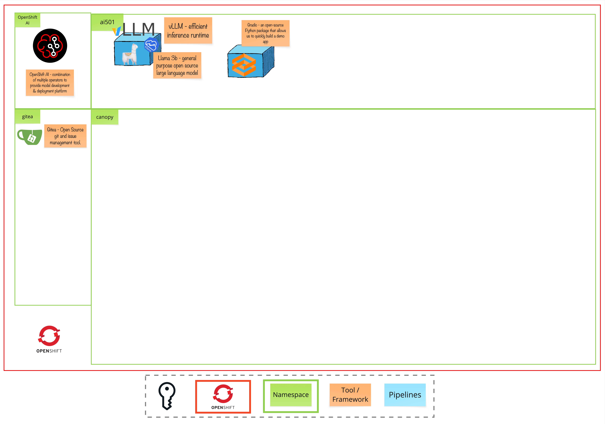

# Module 1 - The AI Orientation

> Let's get started!

# 🧑‍🍳 Module Intro
Dive into the fundamental mechanics of Large Language Models (LLMs), exploring how they process text, generate responses, and operate in real-world deployments. This module equips you with essential knowledge for practical LLM implementation.

# 🖼️ Big Picture

# 🔮 Learning Outcomes
* Understand how LLMs process and generate text through tokens
* Learn what affects LLM performance and memory usage
* Explore basic techniques for controlling LLM outputs
* Discover essential hardware considerations for LLM deployment

# 🔨 Tools used in this module

* LLM - Llama 3.2, a large language model from Meta, designed to understand and generate human-like text.
* Tokenizer Playground - Interactive tool for understanding how LLMs process text
* Chat Interface - Playground for testing LLM conversations and responses, for experimenting with context windows and memory