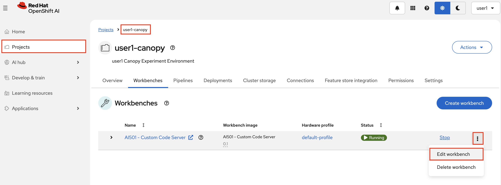
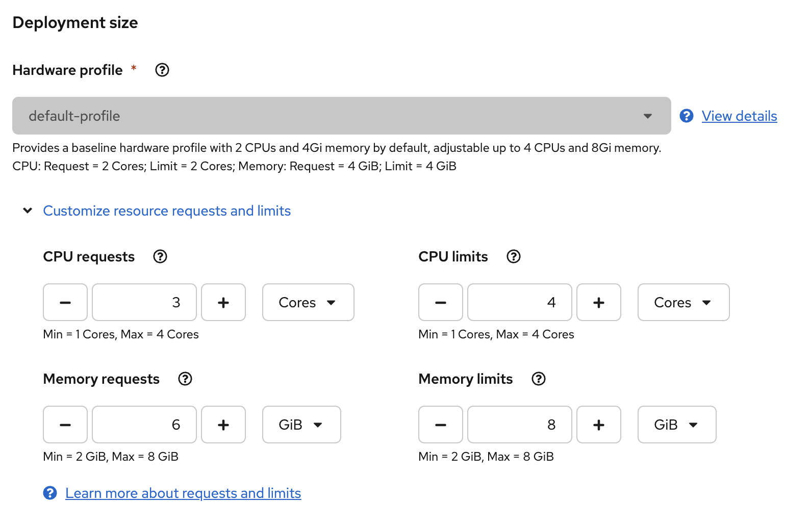

# 🔧 LLM-Compressor: Your Model's Personal Trainer

So you understand what quantization is—now let's actually do it.

[llm-compressor](https://github.com/vllm-project/llm-compressor) is the tool the vLLM team built to compress models for production. Think of it as a Swiss Army knife for quantization: one tool, multiple algorithms, works with HuggingFace, outputs models ready for vLLM serving.

## Why This Tool?

| Feature | Why You Care |
|---------|--------------|
| **Production-tested** | Built by the vLLM team. They use it themselves |
| **HuggingFace native** | Load any Transformers model, compress, save |
| **All the algorithms** | GPTQ, AWQ, SmoothQuant, SparseGPT in one place |
| **vLLM ready** | Output models just work with your serving stack |

## The PTQ Workflow (Post-Training Quantization)

Post-Training Quantization (PTQ) compresses a model *after* it's been trained. No expensive retraining required. It's like tailoring a suit: the fabric (knowledge) is already there, you're just making it fit better.

Here's what happens under the hood:

1. **Load the model** — Start with your FP16/FP32 model
2. **Feed it calibration data** — Show the model representative inputs
3. **Learn the ranges** — Algorithm figures out typical activation values
4. **Compress with compensation** — Quantize weights while minimizing error
5. **Save the result** — Export your shiny compressed model

**Why calibration matters:** Imagine compressing a photo without knowing what's in it. You might crush the important details. Calibration data teaches the algorithm what "normal" looks like, so it knows what to preserve.

<!-- 🧮 Quiz 1: Calibration Understanding -->

<h3 style="margin:0 0 8px;color:#5a5a5a;">📝 Quick Check: Why Calibration?</h3>

Your team is quantizing a model for Canopy. Someone suggests skipping calibration data to save time. Why is this a bad idea?

<input type="radio" name="quiz-calib" id="calib-wrong1" class="quiz-radio-calib">
<label for="calib-wrong1" class="quiz-option-calib" data-correct="false">📊 The model will be larger without calibration</label>
<input type="radio" name="quiz-calib" id="calib-wrong2" class="quiz-radio-calib">
<label for="calib-wrong2" class="quiz-option-calib" data-correct="false">⏱️ Inference will be slower</label>
<input type="radio" name="quiz-calib" id="calib-correct" class="quiz-radio-calib">
<label for="calib-correct" class="quiz-option-calib" data-correct="true">🎯 The algorithm won't know which values to preserve, crushing important details</label>
<input type="radio" name="quiz-calib" id="calib-wrong3" class="quiz-radio-calib">
<label for="calib-wrong3" class="quiz-option-calib" data-correct="false">🔒 Security vulnerabilities will be introduced</label>

✅ <strong>Exactly!</strong> Calibration data teaches the algorithm what "normal" looks like. Without it, the algorithm might crush the values that matter most—like compressing a photo blind.

❌ Model size is determined by the target precision (INT4, INT8), not calibration. Calibration affects <em>quality</em>, not <em>size</em>.

❌ Inference speed depends on the quantization scheme and hardware, not whether calibration was used.

❌ Calibration is about accuracy preservation, not security. The real risk is crushing important information.

## Pick Your Algorithm

Not all compression algorithms are created equal. Here are the main contenders each with its own personality.

### GPTQ: The Perfectionist 🎯

GPTQ stands for GPT Quantization aka a quantization approach designed for GPT models. It is the gold standard for INT4 weight quantization. If accuracy is your top priority, start here.

Imagine packing a suitcase where everything needs to fit perfectly. Naive packing just squishes everything. So some items get damaged. GPTQ is like a master packer who, after compressing one item, carefully rearranges nearby items to compensate. The result? Everything fits, nothing's crushed.

**Under the hood:**
- Processes weights layer by layer
- Uses math (Hessian matrices) to figure out which weights matter most 🧠
- After quantizing each weight, tweaks the remaining weights to compensate
- Slower, but worth it for quality

**Use it when:** Accuracy is non-negotiable!

### AWQ: The Speed Demon 🏎️

AWQ (Activation-aware Weight Quantization) is faster than GPTQ, and nearly as accurate. Won the MLSys 2024 Best Paper Award. It's not just fast, it's clever!

Imagine editing a sunset photo. If you apply the same settings everywhere, you'll either blow out the sun or lose the landscape. AWQ identifies the "highlight" channels; the weights that matter most based on activation patterns, and protects them during compression.

**Under the hood:**
- Finds "salient" channels by looking at activation magnitudes
- Scales important weights up before quantization (protects them)
- Scales activations down to balance things out
- No expensive backpropagation needed

**Use it when:** You need results today, not tomorrow

### SmoothQuant: The Equalizer ⚖️

Quantize *both* weights AND activations to INT8. This is how you get true W8A8.

**The problem:** Weights are well-behaved and easy to compress. Activations are wild—they have outliers that ruin everything.

Picture two people on a seesaw: one heavyweight (difficult activations with outliers), one lightweight (easy weights). SmoothQuant transfers some weight from the heavy side to the light side, balancing the seesaw so both can be handled equally.

**Under the hood:**
- Mathematically shifts the quantization difficulty from activations to weights
- Multiplies activations by a smoothing factor (tames the outliers)
- Divides weights by the same factor (they can absorb it)

**Use it when:** You need W8A8 for maximum throughput on INT8 hardware

### SparseGPT: The Marie Kondo 🗑️

Why just compress when you can delete? SparseGPT removes entire weights that don't contribute to accuracy, allowing you to compress what's left with GPTQ.

Like editing a novel: first cut the filler paragraphs entirely (pruning), then tighten the prose (quantization). You end up with something that's both shorter AND better.

**Under the hood:**
- Identifies weights that can be zeroed without hurting accuracy
- Uses GPTQ-style compensation to maintain quality
- Can combine sparsity + quantization for extreme compression

**Use it when:** You're going for maximum compression and have the patience to tune it

<!-- 🧮 Quiz 3: Algorithm Matching -->

<h3 style="margin:0 0 8px;color:#5a5a5a;">📝 Quick Check: The Outlier Problem</h3>

Your model has activation outliers causing quantization issues. Which algorithm specifically addresses this by "smoothing" the difficulty between weights and activations?

<input type="radio" name="quiz-outlier" id="outlier-wrong1" class="quiz-radio-outlier">
<label for="outlier-wrong1" class="quiz-option-outlier" data-correct="false">🎯 GPTQ</label>
<input type="radio" name="quiz-outlier" id="outlier-wrong2" class="quiz-radio-outlier">
<label for="outlier-wrong2" class="quiz-option-outlier" data-correct="false">🏎️ AWQ</label>
<input type="radio" name="quiz-outlier" id="outlier-correct" class="quiz-radio-outlier">
<label for="outlier-correct" class="quiz-option-outlier" data-correct="true">⚖️ SmoothQuant</label>
<input type="radio" name="quiz-outlier" id="outlier-wrong3" class="quiz-radio-outlier">
<label for="outlier-wrong3" class="quiz-option-outlier" data-correct="false">🗑️ SparseGPT</label>

✅ <strong>Correct!</strong> SmoothQuant transfers quantization difficulty from activations (with outliers) to weights (which are well-behaved). Like balancing a seesaw!

❌ GPTQ is great for accuracy but only quantizes weights. It doesn't address activation outliers directly.

❌ AWQ protects "salient" channels but is a weight-only method. SmoothQuant is the one that handles activation outliers.

❌ SparseGPT removes weights entirely (pruning), but doesn't address the activation outlier problem.

## The Cheat Sheet

Still not sure? Here's the quick decision guide:

| Your Situation | Algorithm | Why |
|----------------|-----------|-----|
| "I need the best accuracy possible" | GPTQ (g128) | Gold standard error compensation |
| "I needed this done yesterday" | AWQ | Fast and good enough |
| "I want W8A8 for max throughput" | SmoothQuant | Only game in town for activation quantization |
| "Squeeze it as much as possible" | SparseGPT + GPTQ | Pruning + quantization combo |
| "Just tell me what to use" | GPTQ or AWQ | Battle-tested, vLLM loves them |

<!-- 🧮 Quiz 2: Pick the Right Algorithm -->

<h3 style="margin:0 0 8px;color:#5a5a5a;">📝 Quick Check: Algorithm Selection</h3>

It's finals week and Canopy is getting slammed with requests. You need to maximize throughput: serving as many students as possible per GPU. Which approach should you use?

<input type="radio" name="quiz-throughput" id="throughput-wrong1" class="quiz-radio-throughput">
<label for="throughput-wrong1" class="quiz-option-throughput" data-correct="false">🎯 GPTQ with W4A16</label>
<input type="radio" name="quiz-throughput" id="throughput-wrong2" class="quiz-radio-throughput">
<label for="throughput-wrong2" class="quiz-option-throughput" data-correct="false">🏎️ AWQ</label>
<input type="radio" name="quiz-throughput" id="throughput-correct" class="quiz-radio-throughput">
<label for="throughput-correct" class="quiz-option-throughput" data-correct="true">⚖️ SmoothQuant with W8A8</label>
<input type="radio" name="quiz-throughput" id="throughput-wrong3" class="quiz-radio-throughput">
<label for="throughput-wrong3" class="quiz-option-throughput" data-correct="false">🗑️ SparseGPT</label>

✅ <strong>Exactly!</strong> W8A8 (both weights AND activations in INT8) gives you maximum throughput because INT8 math is blazing fast on modern hardware. SmoothQuant is how you get W8A8. More students served per GPU!

❌ GPTQ with W4A16 is great for memory savings and latency, but for maximum throughput you want W8A8. Weight-only quantization doesn't speed up the actual computations as much.

❌ AWQ is fast to <em>run</em> (the compression process), but like GPTQ it's weight-only. For maximum serving throughput, you want W8A8.

❌ SparseGPT gives great compression, but sparsity support varies by hardware. For reliable high-throughput serving, W8A8 via SmoothQuant is the proven choice.

## 🧪 Time to Get Your Hands Dirty

Enough reading! Let's compress a model!

But before, we need to beef up our workbench a bit, because compressing a model needs a bit more resources.

1. Go to OpenShift AI dashboard, and find your workbench under `<USER_NAME>-canopy` project. Click on the three dots > `Edit workbench`.

    

2. Scroll down to `Deployment size` and increase the CPU and Memory requests & limits as below.

    

3. You don't need to change anything else. Just hit `Update workbench`. 

4. This will restart your workbench. When it is up, open up **`experiments/9-model-optimization/1-intro-llm-compressor.ipynb`**

In this exercise, you'll take a small model and compress it on CPU (yes, CPU—no fancy hardware needed to learn).

**What you'll do:**

1. **Meet the oneshot API** — llm-compressor's main interface. One function call, compressed model.

2. **Write a recipe** — Configure `GPTQModifier` with parameters like `scheme`, `targets`, and `ignore`

3. **Compress a model** — We'll use `Qwen/Qwen2-0.5B-Instruct` as our guinea pig (compressing Llama 3.2 3B requires more compute power than you have in the workbench. That's why we are experiencing the topic with this Qwen model)

4. **See the difference** — Compare file sizes before and after (prepare to be impressed)

5. **Run a test** — Compare the response from the compressed model to the original model

When you're done, come back and we'll dive into the advanced stuff: schemes, group sizes, and output formats. EXCITING!
