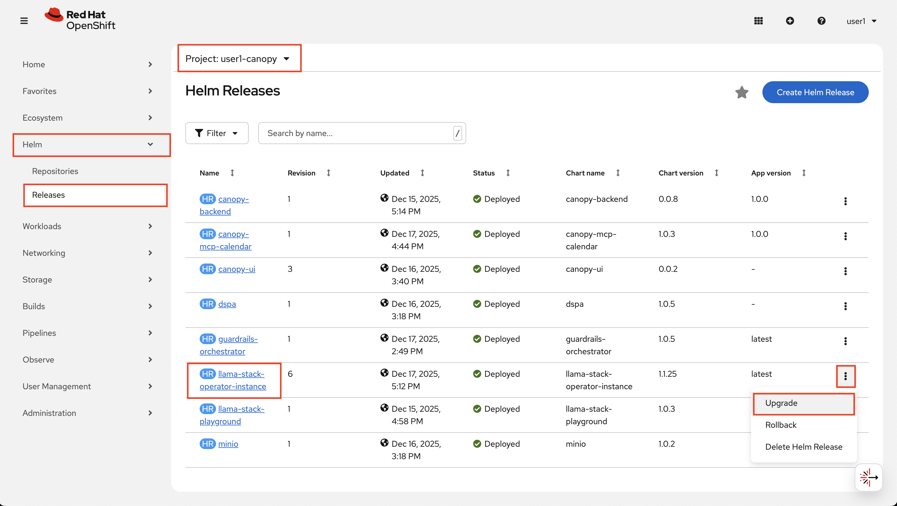
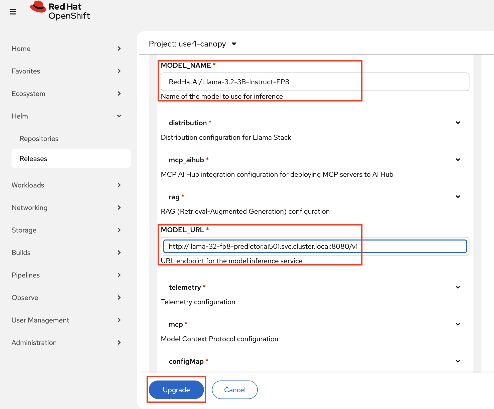
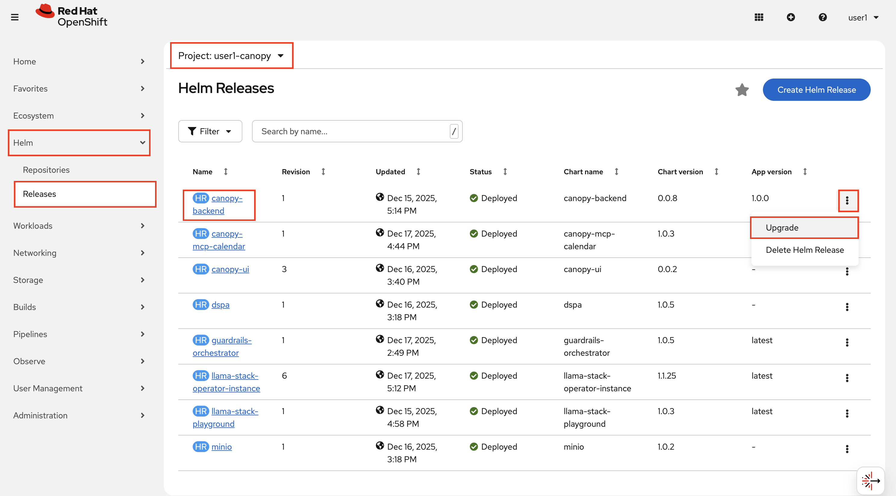
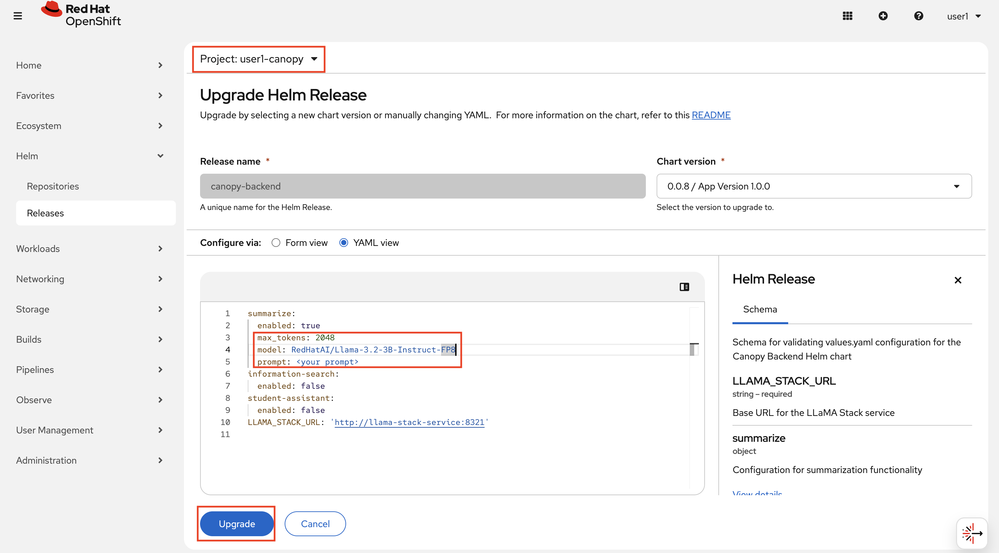

# 🔄 Update Canopy to Use Compressed Llama 3.2 FP8 Model

Let's take our experiment environment from Tiny Llama and point it to the FP8 one. We'll go through the same steps.

## 🦙 Update Llama Stack Configuration

1. Navigate to **OpenShift Console** → **Helm** → **Releases** and find your `llama-stack-operator-instance` release in the `<USER_NAME>-canopy` project.

2. Click on the release and select **Upgrade**.

    

3. Update the model configuration to point to your on-prem endpoint:

    - **Model Name**: `RedHatAI/Llama-3.2-3B-Instruct-FP8`
    - **Model URL**: `http://llama-32-fp8-predictor.ai501.svc.cluster.local:8080/v1`

4. Click **Upgrade** to apply the changes.

    

5. Also we need to update the `backend` 😌 Find `canopy-backend` under **OpenShift Console** → **Helm** → **Releases** 

    

6.  We need to change every `llama32` and/or `tinyllama` to `RedHatAI/Llama-3.2-3B-Instruct-FP8`. And we can bump the `max_token` again. For `summarize`:

    ```yaml
    summarize:
      enabled: true
      max_tokens: 2048 # 👈 update this ❗️❗️❗️
      model: RedHatAI/Llama-3.2-3B-Instruct-FP8 # 👈 update this ❗️❗️❗️
      prompt: "<your prompt>"
    ```

7. Click **Upgrade** to apply the changes.

    

### 🌳 Test Canopy with the New Model

Once Llama Stack and backend are back up, let's verify it can communicate with the quantized model.

1. Go to [Canopy UI](https://canopy-ui-<USER_NAME>-canopy.<CLUSTER_DOMAIN>) and test summarization. You can copy the text about Turkish tea from the previous chapters if you wish ☕️

2. You should receive a response from the quantized model, and still feel like you are using the unquantized one 😌 So why are we waiting to take it to the test and production environment?

### Move Test and Prod to On Prem 🦙

1. Let's first update Llama Stack configs. Go back to your workbench and open up `genaiops-gitops/canopy/test/llama-stack/config.yaml` for **test** and add new model name and model url:

    ```yaml
    ---
    chart_path: charts/llama-stack-operator-instance
    MODEL_NAME: "RedHatAI/Llama-3.2-3B-Instruct-FP8" # 👈 Add this 
    MODEL_URL: "http://llama-32-fp8-predictor.ai501.svc.cluster.local:8080/v1" # 👈 Add this 
    eval:
    enabled: true
    rag:                  
    enabled: true
    mcp:                
    enabled: true     
    ```
2. Push the changes:

    ```bash
    cd /opt/app-root/src/genaiops-gitops
    git pull
    git add .
    git commit -m "🏦 Switch to FP8 🏦"
    git push
    ```
3. Now let's update the `backend`. Open up `backend/chart/values-test.yaml` and update change every `llama32` to `RedHatAI/Llama-3.2-3B-Instruct-FP8`.

    ```yaml

    LLAMA_STACK_URL: "http://llama-stack-service:8321"
    summarize:
    enabled: true
    model: RedHatAI/Llama-3.2-3B-Instruct-FP8 # 👈 Update this 
    temperature: 0.9
    max_tokens: 4096
    prompt: |
        You are a helpful assistant. Summarize the given text please.
    information-search:
    enabled: true
    vector_db_id: latest
    model: RedHatAI/Llama-3.2-3B-Instruct-FP8 # 👈 Update this 
    prompt: |
        You are a helpful assistant specializing in document intelligence and academic content analysis.
    student-assistant:         
    enabled: true
    model: RedHatAI/Llama-3.2-3B-Instruct-FP8 # 👈 Update this 
    temperature: 0.1
    vector_db_id: latest
    mcp_calendar_url: "http://canopy-mcp-calendar-mcp-server:8080/sse"
    prompt: |
        You are ...
    ```

4. Now let's push the changes:

    ```bash
    cd /opt/app-root/src/backend
    git add chart/values-test.yaml
    git commit -m "🏦 Switch to FP8 🏦"
    git push
    ```

    Do you remember what happens when we make a change in the backend? Yes! evaluation pipeline kicks off! Navigate to OpenShift console > Pipelines > Pipeline Runs under `<USER_NAME>-toolings` namespace and observe the evaluations. 

5. You can follow the same steps for **prod** files to move production Canopy to on prem as well!

---

## What You've Achieved

Congratulations! You've transformed how RDU serves its students. Here's what you accomplished:

- **Mastered quantization fundamentals** — You now understand the trade-offs between precision formats (FP16, INT8, INT4) and can make informed decisions about compression strategies
- **Compressed a model hands-on** — Using llm-compressor, you applied GPTQ quantization and saw firsthand how a model shrinks without losing its capabilities
- **Validated quality with benchmarks** — You learned to use lm-evaluation-harness to prove that compressed models still meet production standards
- **Deployed through GitOps** — You updated Canopy to use the FP8-quantized Llama 3.2 3B model and pushed changes through your CI/CD pipeline

### What RDU Gained

By moving to an on-premises quantized model, Redwood Digital University achieved several critical wins:

| Benefit | Impact |
|---------|--------|
| **Data Sovereignty** | Student queries and academic data never leave RDU's infrastructure — no external API calls, no third-party data exposure |
| **Cost Reduction** | The FP8 model uses roughly half the GPU memory of FP16, allowing RDU to serve more students with the same hardware or reduce infrastructure costs |
| **Lower Latency** | On-prem inference eliminates network round-trips to external APIs, resulting in snappier responses for students |
| **Operational Control** | RDU owns the entire stack — no vendor lock-in, no surprise API deprecations, no usage-based pricing surprises |
| **Sustainability** | Smaller models consume less energy per inference, reducing RDU's carbon footprint while maintaining quality 🌳🌳🌳🌳|

The bottom line: RDU now runs a production-grade AI assistant that's faster, cheaper, and keeps student data exactly where it belongs — on campus.

