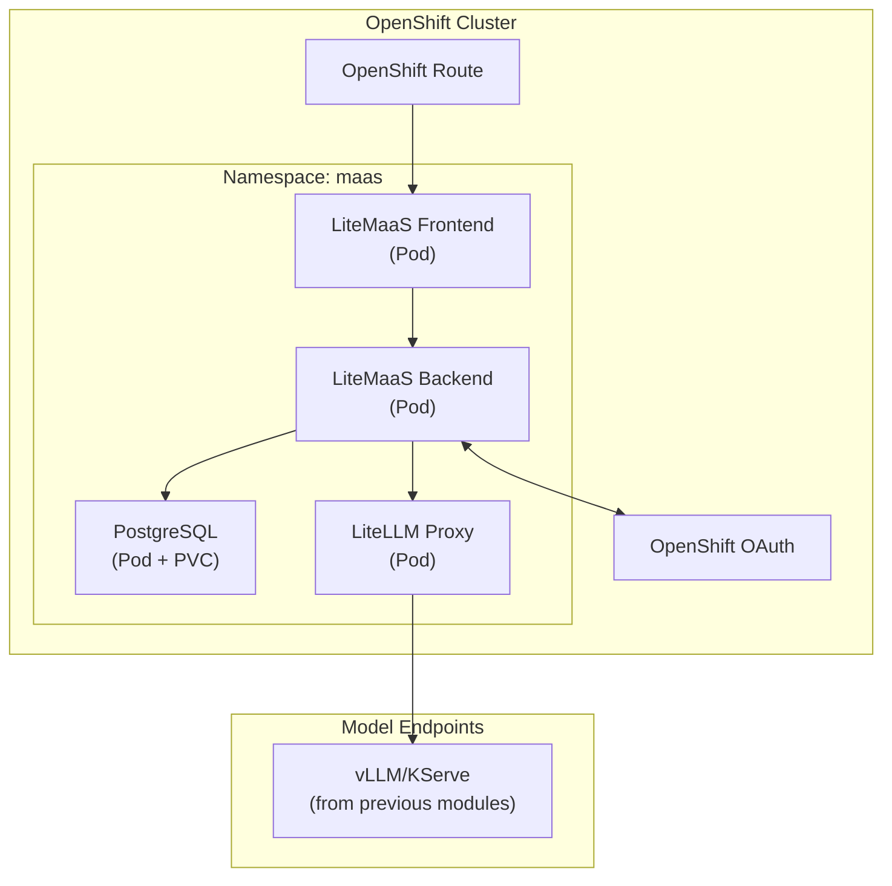
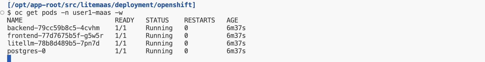
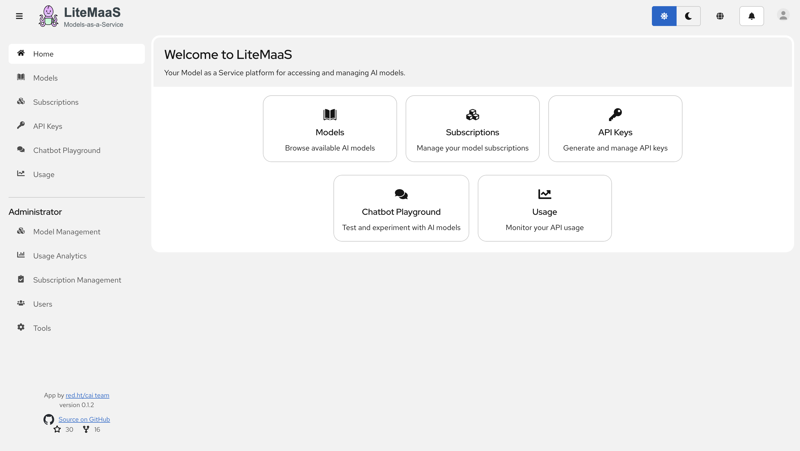
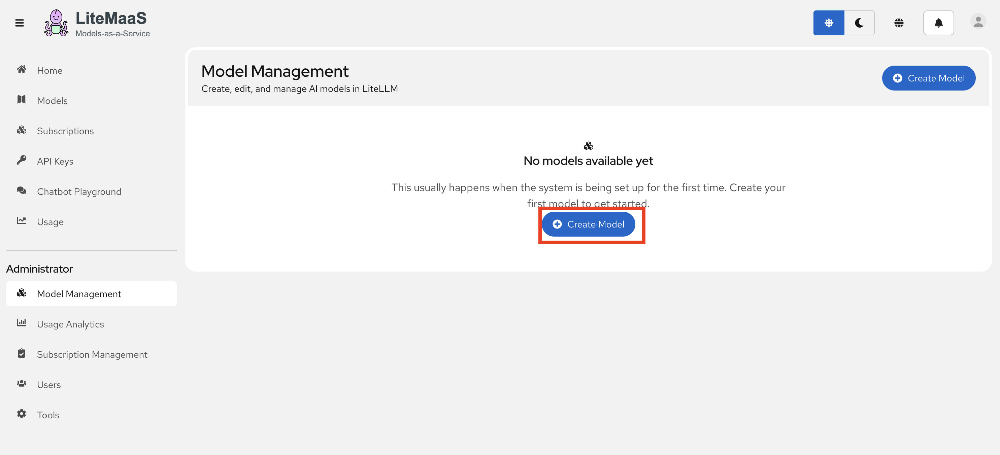
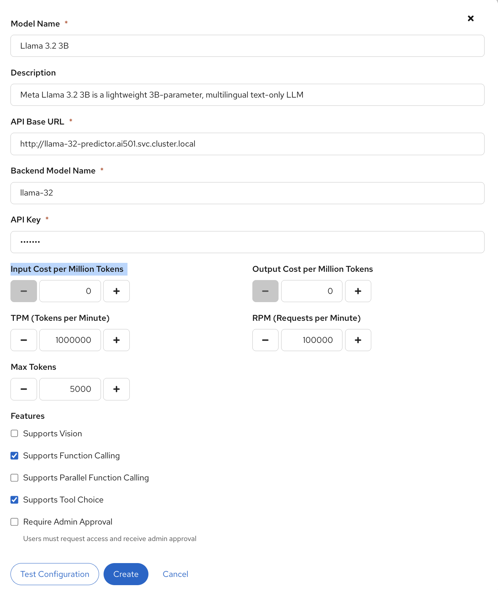
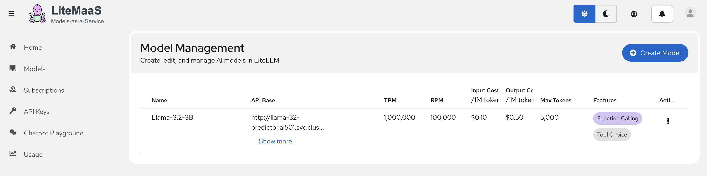
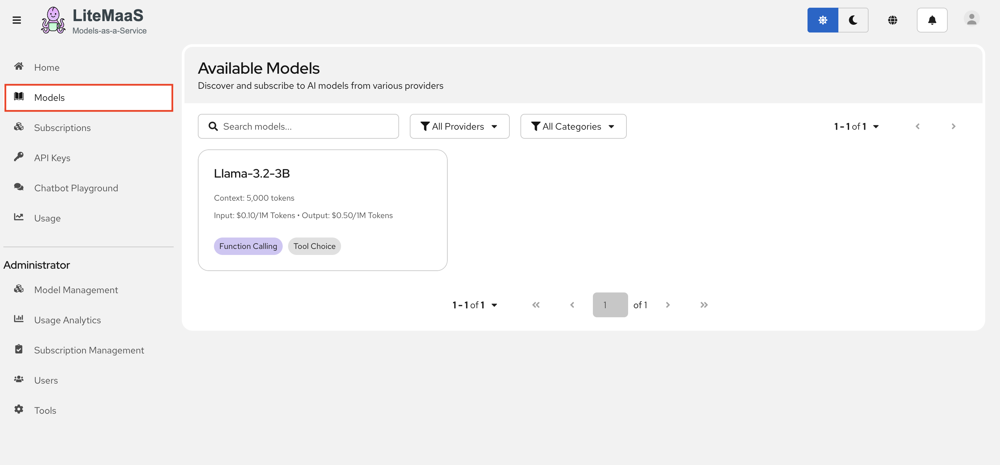

# 🚀 Deploy LiteMaaS

> 🔧 **Persona Focus: The AI Engineer** — Time to put on your infrastructure hat! You're the expert who deploys models once so everyone else can benefit. Think of yourself as the person who builds the water treatment plant while everyone else just turns on their faucets.

---

## 🎯 What You'll Build

By the end of this lesson, you'll have a fully functional LiteMaaS deployment on OpenShift:



---

## ✅ Prerequisites Check

Before we begin, let's make sure everything is in place. Go back to your workspace and run the below commands in the terminal.

### 1. OpenShift Access

Make sure you can access the cluster:

  ```bash
  export CLUSTER_DOMAIN=<CLUSTER_DOMAIN>
  oc login --server=https://api.${CLUSTER_DOMAIN##apps.}:6443 -u <USER_NAME> -p <PASSWORD>
  ```

### 2. Existing Model Endpoints

LiteMaaS is a *gateway* to models — it doesn't deploy models itself. We are going to put the models we've been using behind the gateway:

  ```bash
  # Check if you have model inference services running
  oc get inferenceservices -n ai501
  ```

You should see your Llama-3.2-3b or other model endpoints listed.

### 3. Namespace Preparation

For this exercise, we'll deploy LiteMaaS in a dedicated project:

```bash
# Create the maas project 
oc new-project <USER_NAME>-maas
```

---

## 📦 Step 1: Clone the LiteMaaS Repository

Let's get the LiteMaaS code:

  ```bash
  cd /opt/app-root/src
  git clone https://github.com/rh-aiservices-bu/litemaas.git
  cd litemaas
  ```

Take a moment to explore the structure:

```
litemaas/
├── frontend/          # React + PatternFly UI
├── backend/           # Fastify API server
├── deploy/           # Kubernetes manifests
│   ├── base/         # Base resources
│   └── overlays/     # Environment-specific configs
├── docker/           # Container build files
└── docs/             # Additional documentation
```

---

## ⚙️ Step 2: Configure the Deployment

The deployment needs a few configuration values. We’ll create a Kustomize overlay for our environment.

Up to now, we’ve been using Helm to package and parameterize Kubernetes manifests. For this topic, we’ll use Kustomize instead: it takes a base set of YAML manifests and applies environment-specific overlays (patches and substitutions) to produce the final manifests.

### 2.1 Provide your environment variables

Under `litemaas/deployment/openshift` folder, we need to create a `user-values.env` file.

```bash
touch deployment/openshift/user-values.env
```
and paste the below values to this newly created file.

```yaml
LITEMAAS_VERSION=0.1.2
CLUSTER_DOMAIN_NAME=<CLUSTER_DOMAIN>
NAMESPACE=<USER_NAME>-maas
PG_ADMIN_PASSWORD=change-me-pg-password
NODE_TLS_REJECT_UNAUTHORIZED=0
JWT_SECRET=change-me-secure-jwt-secret-for-production
OAUTH_CLIENT_ID=litemaas-<USER_NAME>
OAUTH_CLIENT_SECRET=change-me-oauth-secret # 👈 we are going to change it in a moment 
ADMIN_API_KEY=change-me-admin-key
LITELLM_API_KEY=sk-change-me-litellm-admin-key
LITELLM_UI_USERNAME=admin
LITELLM_UI_PASSWORD=change-me-ui-password
```

> ⚠️ **Note:** In a real deployment, you'd use proper secrets management (e.g., External Secrets Operator, Vault). For the enablement, we're keeping it simple.

---

## 🔐 Step 3: Configure OAuth with OpenShift

LiteMaaS uses OpenShift OAuth for authentication. This means users can log in with their OpenShift credentials!

### 3.1 Create an OAuth Client

```bash
oc create -f - <<EOF
apiVersion: oauth.openshift.io/v1
kind: OAuthClient
metadata:
  name: litemaas-<USER_NAME>
grantMethod: auto
redirectURIs:
  - https://litemaas-<USER_NAME>-maas.<CLUSTER_DOMAIN>/api/auth/callback
secret: $(openssl rand -base64 32)
EOF
```

### 3.2 Get the OAuth Client Secret

```bash
# The secret was generated above - save it!
oc get oauthclient litemaas-<USER_NAME> -o jsonpath='{.secret}'
```

Update the `OAUTH_CLIENT_SECRET` variable in your environment file with the actual OAuth client secret.

---

## 🚀 Step 4: Deploy to OpenShift

Now the fun part — let's deploy!

### 4.1 Configure the deployment files with your values

First run the preparation script. 

  ```bash
  cd /opt/app-root/src/litemaas/deployment/openshift
  ./preparation.sh
  ```
..and verify the generated files:

   ```bash
   # Check that .local files were created successfully
   ls -la *.local
  ```

  Should show something like this:

  ```bash
  $ ls -la *.local
  -rw-r--r--. 1 1000960000 1000960000 4354 Dec 14 16:33 backend-deployment.yaml.local
  -rw-r--r--. 1 1000960000 1000960000  957 Dec 14 16:33 backend-secret.yaml.local
  -rw-r--r--. 1 1000960000 1000960000 1808 Dec 14 16:33 frontend-deployment.yaml.local
  -rw-r--r--. 1 1000960000 1000960000  416 Dec 14 16:33 litellm-secret.yaml.local
  -rw-r--r--. 1 1000960000 1000960000  292 Dec 14 16:33 namespace.yaml.local
  -rw-r--r--. 1 1000960000 1000960000  200 Dec 14 16:33 postgres-secret.yaml.local
  ```

### 4.2 Run the deployment command

Run the below command to kick off the deployment:

   ```bash
   oc apply -k .
  ```

**Note:** Do not worry about the error below. It won't affect the installation. It happens because your user doesn't have enough privilege to edit a namespace.

  <div class="highlight" style="background: #f7f7f7; overflow-x: auto; padding: 8px;">
    <pre><code class="language-bash"> 
    Error from server (Forbidden): error when applying patch:
    {"metadata":{"annotations":{"kubectl.kubernetes.io/last-applied-configuration":"{\"apiVersion\":\"v1\",\"kind\":\"Namespace\",\"metadata\":{\"annotations\":{},\"labels\":{\"app.kubernetes.io/component\":\"<USER_NAME>-maas\",\"app.kubernetes.io/instance\":\"litemaas\",\"app.kubernetes.io/name\":\"litemaas\",\"app.kubernetes.io/part-of\":\"litemaas\",\"app.kubernetes.io/version\":\"0.1.2\",\"name\":\"<USER_NAME>-maas\"},\"name\":\"<USER_NAME>-maas\"}}\n"},"labels":{"app.kubernetes.io/component":"<USER_NAME>-maas","app.kubernetes.io/instance":"litemaas","app.kubernetes.io/name":"litemaas","app.kubernetes.io/part-of":"litemaas","app.kubernetes.io/version":"0.1.2","name":"<USER_NAME>-maas"}}}
    to:
    Resource: "/v1, Resource=namespaces", GroupVersionKind: "/v1, Kind=Namespace"
    Name: "<USER_NAME>-maas", Namespace: ""
    for: ".": error when patching ".": namespaces "<USER_NAME>-maas" is forbidden: User "<USER_NAME>" cannot patch resource "namespaces" in API group "" in the namespace "<USER_NAME>-maas"
   </code></pre>
  </div>

### 4.3 Watch the Deployment

```bash
# Watch pods come up
oc get pods -n <USER_NAME>-maas -w
```

You should see:
- `postgresql-*` — Database pod
- `litemaas-backend-*` — API server
- `litemaas-frontend-*` — React UI
- `litellm-*` — OpenAI-compatible proxy



Do `Ctrl + C` to break the watch.

---

## ✨ Step 5: Access the LiteMaaS UI

Open your browser and navigate to:

```
https://litemaas-<USER_NAME>-maas.<CLUSTER_DOMAIN>
```

You should see the LiteMaaS login page! Use your OpenShift credentials to login!



By default you have admin privileges. That's why you have the `Administrator` section on the left, but other users won't be able to see that. However, you can still consume LiteMaaS as a regular user too. But first, we need to add some models!

---

## 🔗 Step 6: Configure Model Connections

LiteMaaS uses [LiteLLM](https://github.com/BerriAI/litellm) as its backend proxy. We need to tell LiteLLM about our available models.

### 6.1 Add Llama 3.2 3B to MaaS

1. Let's add our initial cloud model to our  first. Go to `Administator` > `Model Management`  and click `Create Model`.

  

2. Fill out the form as below:

  **Model Name:** `Llama-3.2-3B`

  **Description:** `Meta Llama 3.2 3B is a lightweight 3B-parameter, multilingual text-only LLM`

  **API Base URL:** `http://llama-32-predictor.ai501.svc.cluster.local:8080/v1`

  **Backend Model Name:** `llama32`  

  **API Key:** `fakekey`

  **Input Cost per Million Tokens:** `0,1`

  **Output Cost per Million Tokens:** `0,5` (or you can use your imagination for cost values 💸💸💸)

  **Features:** You can select `Supports Function Calling` and `Supports Tool Choice`


  

  Leave the others default and hit `Create`

  

3. If you want, you can add your `TinyLlama` and quantized `Llama-3.2-3B-Instruct-FP8` to your MaaS for others to use them. 

  You can use the below options to add them:

  <details>
  <summary>TinyLLama</summary>

    **Model Name:** `TinyLlama-1.1B`

    **Description:** `TinyLlama is a compact 1.1B parameter language model`

    **API Base URL:** `http://tinyllama-predictor.<USER_NAME>-canopy.svc.cluster.local:8080/v1`

    **Backend Model Name:** `tinyllama`  

    **API Key:** `fakekey`

    **Input Cost per Million Tokens:** `0,001`

    **Output Cost per Million Tokens:** `0,005`

  </details>

  <details>
  <summary>Llama-3.2-3B-Instruct-FP8</summary>

    **Model Name:** `Llama-3.2-3B-Instruct-FP8`

    **Description:** `Meta Llama 3.2 3B Instruct quantized to FP8 for efficient inference`

    **API Base URL:** `http://llama-32-fp8-predictor.ai501.svc.cluster.local:8080/v1`

    **Backend Model Name:** `RedHatAI/Llama-3.2-3B-Instruct-FP8`  

    **API Key:** `fakekey`

    **Input Cost per Million Tokens:** `0,01`

    **Output Cost per Million Tokens:** `0,05`

    **Features:** You can select `Supports Function Calling` and `Supports Tool Choice`
  </details>

  

---

## 🎯 Next Steps

Your infrastructure is ready! Now it's time to hand off to the 👩‍💼 **Service Admin** to configure users, roles, and budgets.