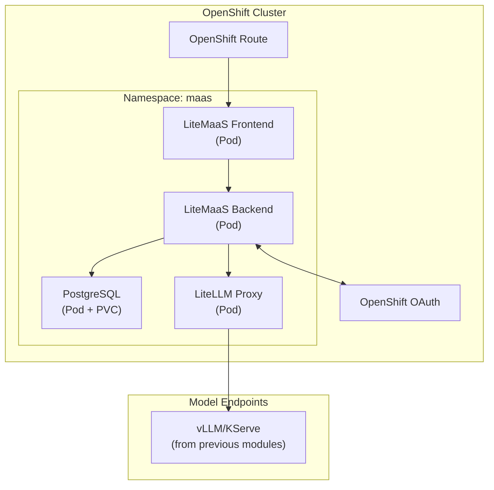

# 🚀 Deploy LiteMaaS

> 🔧 **Persona Focus: The AI Engineer** — Time to put on your infrastructure hat! You're the expert who deploys models once so everyone else can benefit. Think of yourself as the person who builds the water treatment plant while everyone else just turns on their faucets.

---

## 🎯 What You'll Build

By the end of this lesson, you'll have a fully functional LiteMaaS deployment on OpenShift:



---

## ✅ Prerequisites Check

Before we begin, let's make sure everything is in place. Go back to your workspace and run the below commands in the terminal.

### 1. OpenShift Access

Make sure you can access the cluster:

  ```bash
  export CLUSTER_DOMAIN=<CLUSTER_DOMAIN>
  oc login --server=https://api.${CLUSTER_DOMAIN##apps.}:6443 -u <USER_NAME> -p <PASSWORD>
  ```

### 2. Existing Model Endpoints

LiteMaaS is a *gateway* to models — it doesn't deploy models itself. We are going to put the models we've been using behind the gateway:

  ```bash
  # Check if you have model inference services running
  oc get inferenceservices -n ai501
  ```

You should see your Llama-3.2-3b or other model endpoints listed.

### 3. Namespace Preparation

For this exercise, we'll deploy LiteMaaS in a dedicated project:

```bash
# Create the maas project 
oc new-project <USER_NAME>-maas
```

---

## 📦 Step 1: Clone the LiteMaaS Repository

Let's get the LiteMaaS code:

  ```bash
  cd /opt/app-root/src
  git clone https://github.com/rh-aiservices-bu/litemaas.git
  cd litemaas
  ```

Take a moment to explore the structure:

```
litemaas/
├── frontend/          # React + PatternFly UI
├── backend/           # Fastify API server
├── deploy/           # Kubernetes manifests
│   ├── base/         # Base resources
│   └── overlays/     # Environment-specific configs
├── docker/           # Container build files
└── docs/             # Additional documentation
```

---

## ⚙️ Step 2: Configure the Deployment

The deployment needs a few configuration values. We’ll create a Kustomize overlay for our environment.

Up to now, we’ve been using Helm to package and parameterize Kubernetes manifests. For this topic, we’ll use Kustomize instead: it takes a base set of YAML manifests and applies environment-specific overlays (patches and substitutions) to produce the final manifests.

### 2.1 Provide your environment variables

Under `litemaas/deployment/openshift` folder, we need to create a `user-values.env` file.

```bash
touch litemaas/deployment/openshift/user-values.env
```
and paste the below values to this newly created file.

```yaml
LITEMAAS_VERSION=0.1.2
CLUSTER_DOMAIN_NAME=<CLUSTER_DOMAIN>
NAMESPACE=<USER_NAME>-maas
PG_ADMIN_PASSWORD=change-me-pg-password
JWT_SECRET=change-me-secure-jwt-secret-for-production
OAUTH_CLIENT_ID=litemaas-<USER_NAME>
OAUTH_CLIENT_SECRET=change-me-oauth-secret # 👈 we are going to change it in a moment 
ADMIN_API_KEY=change-me-admin-key
LITELLM_API_KEY=sk-change-me-litellm-admin-key
LITELLM_UI_USERNAME=admin
LITELLM_UI_PASSWORD=change-me-ui-password
```

> ⚠️ **Note:** In a real deployment, you'd use proper secrets management (e.g., External Secrets Operator, Vault). For the enablement, we're keeping it simple.

---

## 🔐 Step 3: Configure OAuth with OpenShift

LiteMaaS uses OpenShift OAuth for authentication. This means users can log in with their OpenShift credentials!

### 3.1 Create an OAuth Client

```bash
oc create -f - <<EOF
apiVersion: oauth.openshift.io/v1
kind: OAuthClient
metadata:
  name: litemaas-<USER_NAME>
grantMethod: auto
redirectURIs:
  - https://litemaas-<USER_NAME>-maas.<CLUSTER_DOMAIN>/api/auth/callback
secret: $(openssl rand -base64 32)
EOF
```

### 3.2 Get the OAuth Client Secret

```bash
# The secret was generated above - save it!
oc get oauthclient litemaas-<USER_NAME> -o jsonpath='{.secret}'
```

Update the `OAUTH_CLIENT_SECRET` variable in your environment file with the actual OAuth client secret.

---

## 🚀 Step 4: Deploy to OpenShift

Now the fun part — let's deploy!

### 4.1 Configure the deployment files with your values

First run the preparation script. 

  ```bash
  cd /opt/app-root/src/litemaas/deployment/openshift
  ./preparation.sh
  ```
..and verify the generated files:

   ```bash
   # Check that .local files were created successfully
   ls -la *.local
  ```

  Should show something like this:

  ```bash
  $ ls -la *.local
  -rw-r--r--. 1 1000960000 1000960000 4354 Dec 14 16:33 backend-deployment.yaml.local
  -rw-r--r--. 1 1000960000 1000960000  957 Dec 14 16:33 backend-secret.yaml.local
  -rw-r--r--. 1 1000960000 1000960000 1808 Dec 14 16:33 frontend-deployment.yaml.local
  -rw-r--r--. 1 1000960000 1000960000  416 Dec 14 16:33 litellm-secret.yaml.local
  -rw-r--r--. 1 1000960000 1000960000  292 Dec 14 16:33 namespace.yaml.local
  -rw-r--r--. 1 1000960000 1000960000  200 Dec 14 16:33 postgres-secret.yaml.local
  ```

### 4.2 Watch the Deployment

```bash
# Watch pods come up
oc get pods -n <USER_NAME>-maas -w
```

You should see:
- `postgresql-*` — Database pod
- `litemaas-backend-*` — API server
- `litemaas-frontend-*` — React UI
- `litellm-*` — OpenAI-compatible proxy


Do `Ctrl + C` to break the watch.

### 4.3 Verify Services

```bash
# Check all services are running
oc get svc -n <USER_NAME>-maas
```

### 4.4 Get the Route URL

```bash
# Find your LiteMaaS URL
oc get route litemaas -n <USER_NAME>-maas -o jsonpath='{.spec.host}'
```

---

## 🔗 Step 5: Configure Model Connections

LiteMaaS uses LiteLLM as its backend proxy. We need to tell LiteLLM about our available models.

### 5.1 Get Your Model Endpoints

```bash
# Get the inference service URL from your canopy namespace
oc get inferenceservice llama-32 -n ai501 -o jsonpath='{.status.url}'
```

### 5.2 Update LiteLLM Configuration

Create or update the LiteLLM config:

```bash
oc create configmap litellm-config -n <USER_NAME>-maas --from-literal=config.yaml="
model_list:
  - model_name: llama-32
    litellm_params:
      model: openai/llama-32
      api_base: http://llama-32-predictor.ai501.svc.cluster.local/v1
      api_key: none

  - model_name: granite-3b
    litellm_params:
      model: openai/granite-3b
      api_base: https://your-other-model.<CLUSTER_DOMAIN>/v1
      api_key: none

general_settings:
  master_key: sk-change-me-litellm-admin-key
"
```

### 5.3 Restart LiteLLM to Pick Up Changes

```bash
oc rollout restart deployment/litellm -n <USER_NAME>-maas
```

---

## ✨ Step 6: Access the LiteMaaS UI

Open your browser and navigate to:

```
https://litemaas-<USER_NAME>-maas.apps.<CLUSTER_DOMAIN>
```

You should see the LiteMaaS login page!

[Image: LiteMaaS login page showing:
- LiteMaaS logo
- "Login with OpenShift" button
- Clean, professional PatternFly design
- Footer with version info]

### 6.1 First Login

1. Click **"Login with OpenShift"**
2. Enter your OpenShift credentials (`<USER_NAME>` / `<PASSWORD>`)
3. Authorize the LiteMaaS application
4. You're in! 🎉

### 6.2 Initial Admin Setup

The first user to log in becomes the admin by default. You should see:

[Image: LiteMaaS admin dashboard showing:
- Navigation sidebar with: Dashboard, Users, Models, API Keys, Analytics
- Main area showing welcome message and quick stats
- Cards for: Active Users, API Keys Created, Total Requests, Token Usage]

---

## 🔍 Verification Checklist

Before moving on, verify your deployment:

| Check | Command | Expected Result |
|-------|---------|-----------------|
| All pods running | `oc get pods -n <USER_NAME>-maas` | 4+ pods in Running state |
| Database accessible | Check backend logs | "Database connected" message |
| OAuth working | Try logging in | Successful redirect and login |
| LiteLLM responding | `curl http://litellm:4000/health` | 200 OK |
| Models visible | Check LiteMaaS UI | Models listed in admin panel |

---

## 🐛 Troubleshooting

### Pod not starting?

```bash
# Check pod events
oc describe pod <pod-name> -n <USER_NAME>-maas

# Check logs
oc logs <pod-name> -n <USER_NAME>-maas
```

### OAuth redirect failing?

Make sure your OAuth client redirect URI matches exactly:
```bash
oc get oauthclient litemaas-<USER_NAME> -o yaml
```

The redirect URI should be: `https://litemaas-<USER_NAME>-maas.apps.<CLUSTER_DOMAIN>/api/auth/callback`

### Can't see models?

Check the LiteLLM configuration and ensure your model endpoints are accessible:
```bash
# Test model endpoint from within the cluster
oc run curl-test --rm -it --restart=Never --image=curlimages/curl -- \
  curl -s https://your-model-endpoint/v1/models
```

---

## 🎯 What You've Accomplished

As the AI Engineer, you've just:

* ✅ Deployed a complete MaaS platform on OpenShift
* ✅ Configured OAuth for seamless authentication
* ✅ Connected existing model endpoints through LiteLLM
* ✅ Set up the foundation for centralized model access

[Image: Achievement unlocked style graphic with "🔧 AI Engineer" badge and text "Deployed LiteMaaS - Now everyone can share models instead of hoarding GPUs!"]

---

## 🎯 Next Steps

Your infrastructure is ready! Now it's time to hand off to the 👩‍💼 **Service Admin** to configure users, roles, and budgets.

**Continue to [Admin Configuration](./3-admin-configuration.md)** →
