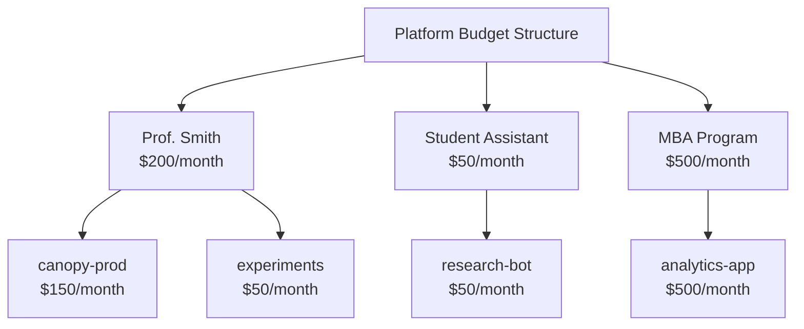

# WIP 

# 👩‍💼 Admin Configuration

> 👩‍💼 **Persona Focus: The Service Admin** — You're the friendly face of the MaaS platform. Users come to you when they need access, when something breaks, or when they've burned through their token budget watching the model write poetry about their cat. Your job: keep things running smoothly while making everyone feel supported.

---

## 🎯 What You'll Learn

In this lesson, you'll configure LiteMaaS as a service administrator:

* 👥 Manage users and assign roles
* 🤖 Configure which models are available to users
* 💰 Set up budgets to prevent runaway costs
* 🔑 Understand the API key lifecycle

---

## 👥 User Management

### Understanding Roles

LiteMaaS uses a three-tier role hierarchy:

| Role | Access Level | Typical Use |
|------|-------------|-------------|
| **admin** | Full access | Platform owners, IT leads |
| **adminReadonly** | View everything, modify nothing | Auditors, security team, managers |
| **user** | Self-service only | Developers, data scientists, end users |

[Image: Role hierarchy pyramid showing:
- Top: admin (crown icon) - "Full control over platform"
- Middle: adminReadonly (eye icon) - "Can see everything, change nothing"
- Bottom: user (person icon) - "Self-service: API keys, personal usage, playground"]

### Exercise: View Users

1. Log into LiteMaaS as an admin
2. Navigate to **Users** in the left sidebar
3. You should see yourself listed as an admin

[Image: Users list page showing a table with columns: Username, Email, Role, Status, Last Login, Actions]

### Exercise: Modify a User's Role

Let's say a colleague needs admin-level visibility but shouldn't be able to change settings. Perfect use case for `adminReadonly`:

1. Click on a user's row (or the edit icon)
2. In the role dropdown, select **adminReadonly**
3. Click **Save**

[Image: User edit modal showing:
- User info fields (readonly)
- Role dropdown with options: admin, adminReadonly, user
- Status toggle (Active/Inactive)
- Save/Cancel buttons]

> 💡 **Pro Tip:** Start users with the lowest privileges they need. You can always upgrade later!

---

## 🤖 Model Management

As a Service Admin, you control which models users can access. Not all models should be available to everyone — some might be:

* 🔒 Still in testing
* 💰 Very expensive to run
* 🎯 Intended for specific use cases only

### Viewing Available Models

1. Navigate to **Models** in the sidebar
2. You'll see all models that LiteLLM knows about

[Image: Models list showing a table with columns:
- Model Name (e.g., "granite-8b", "llama-3-70b")
- Status (green "Available" badge or gray "Disabled")
- Provider (e.g., "vLLM", "KServe")
- Token Pricing (input/output per 1K tokens)
- Actions (Enable/Disable, Configure)]

### Syncing Models from LiteLLM

If you've added new models to LiteLLM, you need to sync them to LiteMaaS:

1. Click the **Sync Models** button in the top right
2. LiteMaaS will query LiteLLM for the current model list
3. New models appear as "Disabled" by default

### Enabling/Disabling Models

To make a model available to users:

1. Find the model in the list
2. Toggle the **Status** switch to "Enabled"
3. The model will now appear in users' model selection

> ⚠️ **Important:** Disabling a model doesn't stop running requests — it just prevents new ones.

### Configuring Model Pricing

Token pricing helps with cost attribution and budgeting:

1. Click **Configure** on a model
2. Set the pricing per 1,000 tokens:
   - **Input tokens**: Cost for prompt/context
   - **Output tokens**: Cost for generated text (usually higher)

```
Example pricing for Granite 8B:
├── Input:  $0.0005 per 1K tokens
└── Output: $0.0015 per 1K tokens
```

[Image: Model configuration modal showing:
- Model name (readonly)
- Description (editable)
- Input token price field
- Output token price field
- Rate limits section
- Save button]

---

## 💰 Budget Management

Budgets are your secret weapon against the dreaded "surprise cloud bill." They let you:

* Set spending limits per user
* Set API key-level budgets for applications
* Prevent runaway API usage

### Budget Hierarchy

LiteMaaS currently supports budgets at the user and API key level:



> 💡 **Future Feature:** Team-level budgets are planned for a future LiteMaaS release. For now, you can achieve similar results by coordinating user budgets manually.

### Setting User Budgets

1. Navigate to **Users** → Click on a user
2. Find the **Budget** section
3. Set the budget parameters:

| Setting | Description |
|---------|-------------|
| **Monthly Limit** | Maximum spend per calendar month |
| **Alert Threshold** | Notify user when they hit this % (e.g., 80%) |
| **Hard Cap** | Stop requests when budget is exhausted? |

[Image: Budget configuration panel showing:
- Monthly Limit: $100.00 input field
- Alert Threshold: slider set to 80%
- Hard Cap toggle: ON
- Current Usage: $42.50 (42.5%)
- Progress bar visualizing usage]

### What Happens When Budget is Exhausted?

| Hard Cap Setting | Behavior |
|-----------------|----------|
| **Enabled** | API requests return 429 error: "Budget exhausted" |
| **Disabled** | Requests continue, but warnings are logged |

> 💡 **Best Practice:** Enable hard caps for shared/test accounts. Disable for production workloads where availability matters more than cost.

---

## 🔑 API Key Overview (Admin View)

As an admin, you can see all API keys in the system (but not their actual values — those are only shown once at creation).

### Viewing All API Keys

1. Navigate to **API Keys** in the sidebar
2. You'll see a list of all keys across all users

[Image: Admin API Keys view showing table with columns:
- Key Name
- Owner (user who created it)
- Created Date
- Last Used
- Models (which models can access)
- Budget ($X remaining)
- Status (Active/Revoked)
- Actions (View Details, Revoke)]

### Revoking API Keys

Sometimes you need to revoke a key immediately:

* 🚨 Suspected key leak
* 👋 User leaving the organization
* 🔄 Key rotation policy

To revoke:

1. Find the key in the list
2. Click the **Revoke** button
3. Confirm the action

> ⚠️ **Warning:** Revocation is immediate! Any applications using that key will start getting 401 errors.

### Key Best Practices for Admins

| Practice | Why |
|----------|-----|
| Encourage descriptive key names | "prod-canopy-backend" vs "key-1" helps debugging |
| Review inactive keys monthly | Keys not used in 90+ days might be orphaned |
| Set key-level budgets | Prevents a single runaway script from burning the whole user budget |
| Enable audit logging | Know who did what, when |

---

## 🎮 Hands-on Exercises

### Exercise 1: Create a Test User

1. Have a colleague log in to LiteMaaS for the first time
2. Find them in the Users list
3. Set their role to `user`
4. Set a monthly budget of $10

### Exercise 2: Configure Model Access

1. Navigate to Models
2. Ensure at least one Granite model is enabled
3. Set the token pricing:
   - Input: $0.0005 / 1K tokens
   - Output: $0.0015 / 1K tokens

### Exercise 3: Set a Budget Alert

1. Go to your own user profile
2. Set alert threshold to 50%
3. Have someone make a few API calls
4. Verify you receive an alert (email or in-app notification)

---

## 🧪 Knowledge Check

<details>
<summary>❓ When would you use the "adminReadonly" role?</summary>

✅ **Answer:** For users who need visibility into the platform (auditors, managers, security team) but shouldn't be able to modify settings. They can view users, usage, budgets, etc., but can't change anything.
</details>

<details>
<summary>❓ What's the difference between user budgets and API key budgets?</summary>

✅ **Answer:** User budgets limit an individual's total spending across all their API keys. API key budgets limit spending for a specific key, useful when you want to cap a particular application's usage. A user might have multiple API keys for different projects, each with its own budget.
</details>

<details>
<summary>❓ A key might have been leaked. What's your immediate action?</summary>

✅ **Answer:** Revoke the key immediately via the admin panel. Then investigate the leak, generate a new key for the affected user, and update any applications that were using the old key.
</details>

---

## 🎯 What You've Accomplished

As the Service Admin, you've now:

* ✅ Understood the role hierarchy (admin, adminReadonly, user)
* ✅ Configured model availability and pricing
* ✅ Set up budgets to control costs
* ✅ Learned to manage API keys from the admin perspective

[Image: Achievement badge with "👩‍💼 Service Admin" text and subtitle "The MaaS is running smoothly — users are happy, costs are controlled!"]

---

## 🎯 Next Steps

You've set everything up from the admin side. Now let's switch perspectives — it's time to experience LiteMaaS as a 👤 **Consumer** who just wants to get an API key and start building!

**Continue to [User Experience](./4-user-experience.md)** →
