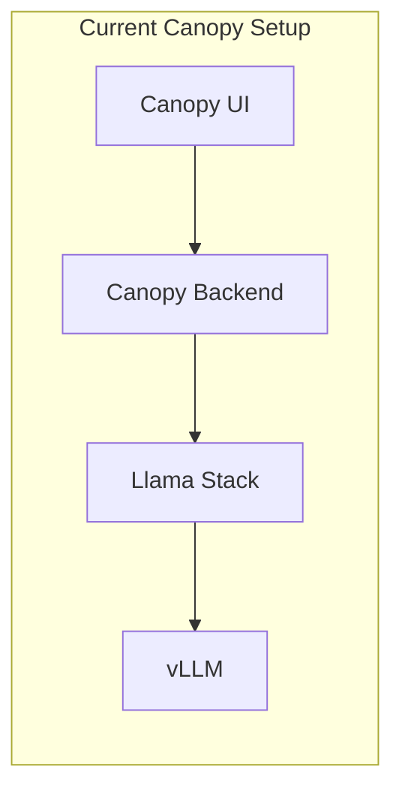
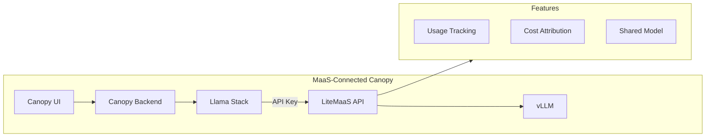
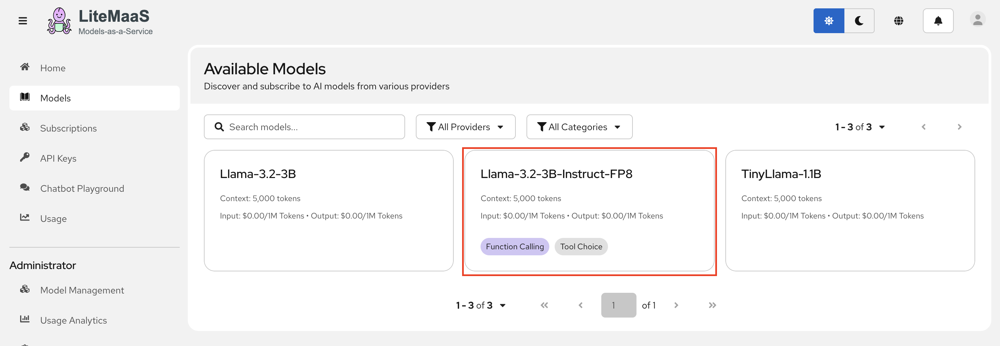
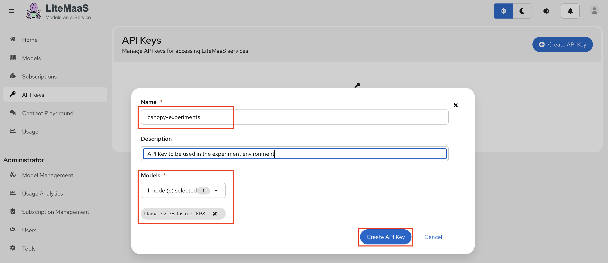
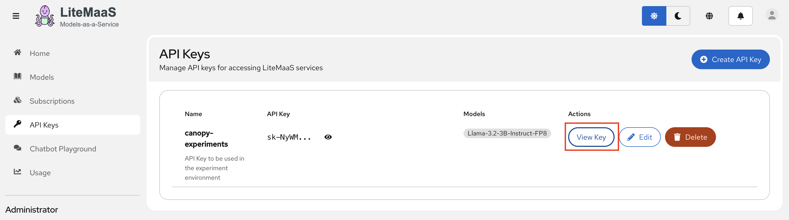
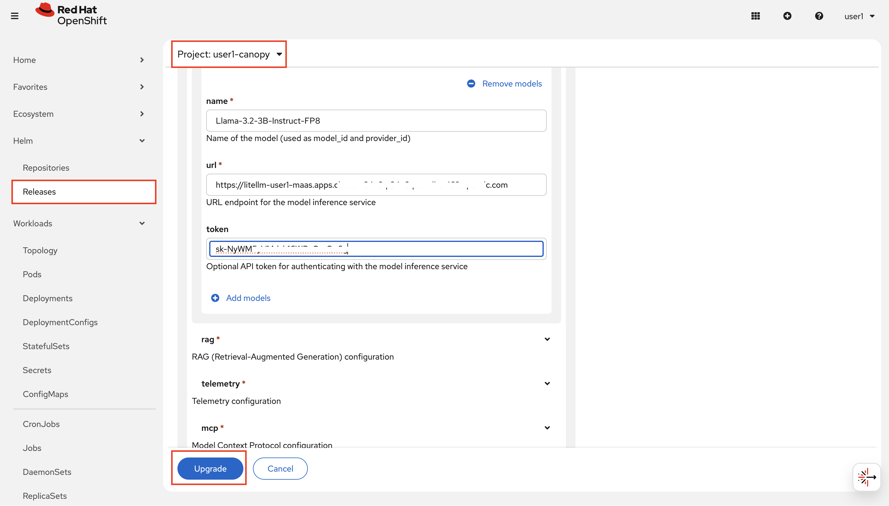
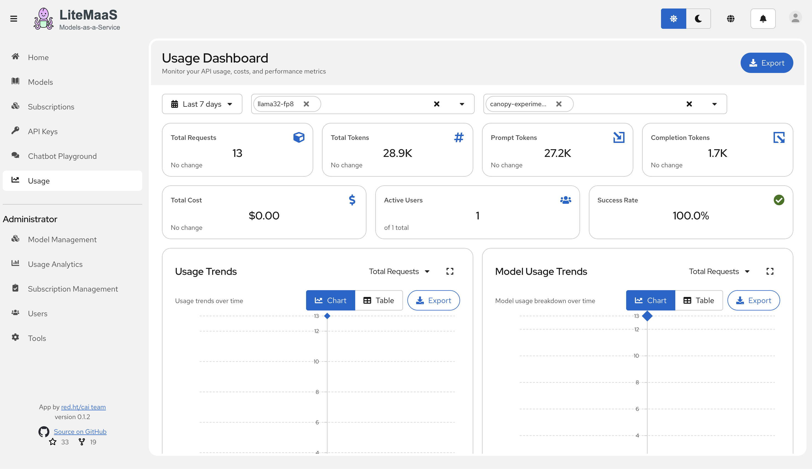

# 🌳 Canopy Integration

> 🌳 **Persona Focus: Everyone** — This is the moment where it all comes together! Canopy has been talking directly to your model endpoint. Time to upgrade it to use MaaS — and see the full lifecycle in action.

---

## 🎯 What You'll Learn

In this lesson, you'll:

* 🔀 Switch Canopy from direct model access to MaaS
* ⚙️ Configure the necessary environment variables
* 🧪 Test the integration end-to-end
* 📊 Verify usage tracking in LiteMaaS

---

## 🎬 The Before & After

Let's visualize what we're changing:

### Before (Modules 3-8)



### After (Module 11)



Now Canopy goes through LiteMaaS, which provides:
* ✅ Centralized usage tracking
* ✅ Cost attribution
* ✅ API key management
* ✅ Shared model access

---

## 🔐 Step 1: Create an API Key for Canopy

First, let's create a dedicated API key for Canopy.

### Why a Dedicated Key?

| Approach | Problem |
|----------|---------|
| Use personal key | Can't distinguish Canopy usage from your experiments |
| Share key with team | Who's using what? No accountability |
| **Dedicated app key** | ✅ Clean tracking, easy rotation, specific budget |

1. First, under `Models`, let's subscribe to `Llama-3.2-3B-Instruct-FP8` model. Click it and then hit `Subscribe`

  

2. After you successfully subscribed, move to `API Keys` and create an API key for the model you just subscribed!

  

  It should create a key something like `sk-abcdxxx` 

3. After copying the key, close the screen and click `View Key` to get more information about the API endpoint, and a usage example.

  If you click on `Show key`, the eye 👁️ icon on right corner, you'll seethat the usage example is updated with your key. Then copy that usage example and paste to your terminal to verify your access to the model endpoint with the generated key.

  


## ⚙️ Step 2: Update Canopy Configuration

Now we need to tell Llama Stack to use LiteMaaS instead of the direct endpoint.

1. From Llama Stack point of view, it's just another model endpoint that happens to be served via a gateway. Let's add this yet another model endpoint by upgrading the helm release as we've been doing. In `<USER_NAME>-canopy` namespace, go to `Helm` > `Release` > `llama-stack-operator-instance` > Upgrade. Under `models`, click `Add models` and add below info that you get from LiteMaaS:

  name: `Llama-3.2-3B-Instruct-FP8`

  url: `https://litellm-user1-maas.<CLUSTER_DOMAIN>/v1`

  token: `your-token-sk-xxxx`  

  

## 🌳 Step 3: Update Canopy Backend

Like we've done multiple times before, let's update Canopy backend configuration to use this newly added model to our Llama Stack configuration.

1. Find `canopy-backend` under **OpenShift Console** → **Helm** → **Releases** 


2.  We need to change every `llama32-fp8` into MaaS provided version of that model :) For example, for  `summarize`:

    ```yaml
    summarize:
      enabled: true
      max_tokens: 2048 
      model: vllm-Llama-3.2-3B-Instruct-FP8/Llama-3.2-3B-Instruct-FP8 # 👈 update this ❗️❗️❗️
      prompt: "<your prompt>"
    ```

3. Click **Upgrade** to apply the changes.

4. When everything is blue in Topology view, go to Canopy UI and verify everything works before we repeat this for `test` and `prod` environment, but through GitOps. 

  Actually, before that, let's quickly monitor your model usage based on this key.

---

### 📊 Step 4: Track Your Usage

As a responsible developer (and budget-conscious human), you'll want to know how much you're using. Go to Canopy UI and send more prompts, requests, and come back to the dashboard to observe the values.

  

---

## 🧪 Knowledge Check

<details>
<summary>❓ Why should each application have its own API key?</summary>

✅ **Answer:** Separate API keys provide:
- Clear usage tracking per application
- Individual budgets per application
- Easy key rotation without affecting other apps
- Ability to revoke one app's access without impacting others
</details>

<details>
<summary>❓ What's the benefit of seeing Canopy usage in LiteMaaS?</summary>

✅ **Answer:** You can now:
- Track how much Canopy costs to operate
- Compare usage across multiple applications
- Set budgets and alerts per API key
- Make data-driven decisions about scaling
- Attribute costs to specific applications and users
</details>

---

### 👩‍🏫 Step 5: Take it to the Prod!

Well, test first. 

1. Create an API key specifically for test environment, so that we can monitor test environment usage separately or make changes on other environments' keys without impacting this one.

  Since you already susbcribed to the Llama 3.2 3B FP8 before, you directly should go to `API Keys` and create one by giving it a specific name such as `Canopy Test API Key`. 

2. Go back to your workbench and open up `genaiops-gitops/canopy/test/llama-stack/config.yaml`. Again, we first need to make this model available in Llama Stack. Update it by adding the model to the list:

    ```yaml
    ---
    chart_path: charts/llama-stack-operator-instance
    models:
      - name: "llama32"
        url: "http://llama-32-predictor.ai501.svc.cluster.local:8080/v1"
      - name: "llama32-fp8"   
        url: "http://llama-32-fp8-predictor.ai501.svc.cluster.local:8080/v1" 
      - name: "Llama-3.2-3B-Instruct-FP8"     # 👈 Add this
        url: "https://litellm-user1-maas.<CLUSTER_DOMAIN>/v1" # 👈 Add this 
        token: `your-token-sk-xxxx`  # 👈 Update this 
    eval:
      enabled: true
    rag:                  
      enabled: true
    mcp:                
      enabled: true     
    ```

  Yes, you are very right to think _why we are pushing an API key to Git? I don't think this is right!_, and we totally agree with you. We'll come to secret management conversation, promise!

3. Push the changes:

    ```bash
    cd /opt/app-root/src/genaiops-gitops
    git pull
    git add .
    git commit -m "🎄 Add FP8 from MaaS 🎄"
    git push
    ```

4. Now let's update the `backend`. Open up `backend/chart/values-test.yaml` and update change every `llama32-fp8` to `Llama-3.2-3B-Instruct-FP8`.

    ```yaml

    LLAMA_STACK_URL: "http://llama-stack-service:8321"
    summarize:
      enabled: true
      model: vllm-Llama-3.2-3B-Instruct-FP8/Llama-3.2-3B-Instruct-FP8 # 👈 Update this 
      temperature: 0.9
      max_tokens: 4096
      prompt: |
        You are a helpful assistant. Summarize the given text please.
    information-search:
      enabled: true
      vector_db_id: latest
      model: vllm-Llama-3.2-3B-Instruct-FP8/Llama-3.2-3B-Instruct-FP8 # 👈 Update this 
      prompt: |
        You are a helpful assistant specializing in document intelligence and academic content analysis.
    student-assistant:         
      enabled: true
      model: vllm-Llama-3.2-3B-Instruct-FP8/Llama-3.2-3B-Instruct-FP8 # 👈 Update this 
      temperature: 0.1
      vector_db_id: latest
      mcp_calendar_url: "http://canopy-mcp-calendar-mcp-server:8080/sse"
      prompt: |
        You are ...
    ```

4. Now let's push the changes:

    ```bash
    cd /opt/app-root/src/backend
    git pull
    git add chart/values-test.yaml
    git commit -m "🎄 Add FP8 from MaaS 🎄"
    git push
    ```

    Do you remember what happens when we make a change in the backend? Yes! Evaluation pipeline kicks off! Navigate to OpenShift console > Pipelines > Pipeline Runs under `<USER_NAME>-toolings` namespace and observe the evaluations. 

5. You can follow the same steps for **prod** files to move production Canopy to MaaS as well!
