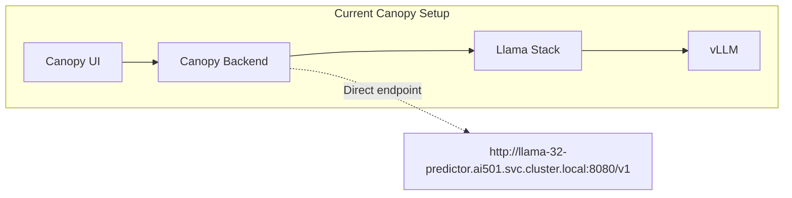
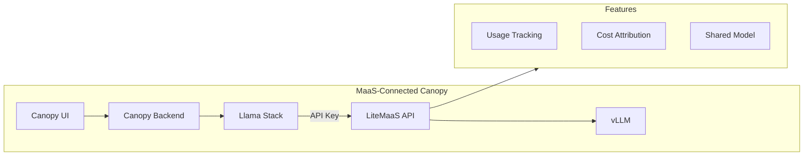
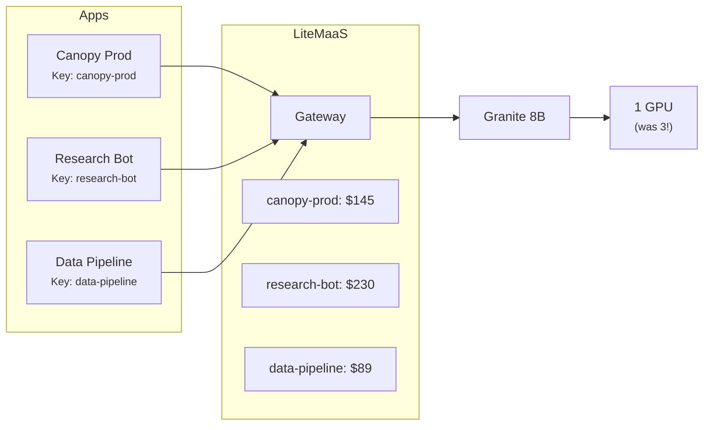

# 🌳 Canopy Integration

> 🌳 **Persona Focus: Everyone** — This is the moment where it all comes together! Remember your Canopy from Module 3? It's been talking directly to your model endpoint. Time to upgrade it to use MaaS — and see the full lifecycle in action.

---

## 🎯 What You'll Learn

In this lesson, you'll:

* 🔀 Switch Canopy from direct model access to MaaS
* ⚙️ Configure the necessary environment variables
* 🧪 Test the integration end-to-end
* 📊 Verify usage tracking in LiteMaaS

---

## 🎬 The Before & After

Let's visualize what we're changing:

### Before (Modules 3-8)



Your Canopy has its own dedicated model endpoint. It works great... for one Canopy.

### After (Module 11)



Now Canopy goes through LiteMaaS, which provides:
* ✅ Centralized usage tracking
* ✅ Cost attribution
* ✅ API key management
* ✅ Shared model access

[Image: Side-by-side architecture diagram with an arrow labeled "This Module" connecting the two configurations]

---

## 🔐 Step 1: Create an API Key for Canopy

First, let's create a dedicated API key for Canopy.

### Why a Dedicated Key?

| Approach | Problem |
|----------|---------|
| Use personal key | Can't distinguish Canopy usage from your experiments |
| Share key with team | Who's using what? No accountability |
| **Dedicated app key** | ✅ Clean tracking, easy rotation, specific budget |

### Create the Key

1. Log into LiteMaaS
2. Navigate to **API Keys**
3. Click **Create New Key**
4. Configure:

| Field | Value |
|-------|-------|
| **Name** | `canopy-<USER_NAME>-backend` |
| **Description** | `Production API key for Canopy application` |
| **Models** | Select `granite-8b` (or your preferred model) |
| **Budget** | `$25` (adjust as needed) |

5. Click **Create**
6. **Copy the key immediately!** You'll need it in the next step.

```
Your new API key:
sk-litemaas-canopy-xxxxxxxxxxxxxxxxxxxxxxxx
```

> 💾 **Pro Tip:** Store this somewhere safe temporarily. You'll add it to OpenShift secrets shortly.

---

## ⚙️ Step 2: Update Canopy Configuration

Now we need to tell Canopy to use LiteMaaS instead of the direct endpoint.

### 2.1 Identify Current Configuration

First, let's see how Canopy is currently configured:

```bash
# Check the current Canopy deployment
oc get deployment canopy-backend -n <USER_NAME>-canopy -o yaml | grep -A 20 "env:"
```

You'll see something like:

```yaml
env:
  - name: INFERENCE_SERVER_URL
    value: "https://canopy-llm-<USER_NAME>-canopy.apps.<CLUSTER_DOMAIN>/v1"
  - name: MODEL_ID
    value: "granite-8b"
```

### 2.2 Create a Secret for the API Key

First, let's securely store the API key:

```bash
oc create secret generic canopy-maas-credentials \
  -n <USER_NAME>-canopy \
  --from-literal=MAAS_API_KEY=sk-litemaas-canopy-xxxxxxxxxxxxxxxx
```

### 2.3 Update the Deployment

Update Canopy to use LiteMaaS:

```bash
# Patch the deployment with new environment variables
oc set env deployment/canopy-backend \
  -n <USER_NAME>-canopy \
  INFERENCE_SERVER_URL=https://litemaas-<USER_NAME>-maas.apps.<CLUSTER_DOMAIN>/v1 \
  --from=secret/canopy-maas-credentials
```

Or, if you prefer to edit directly:

```bash
oc edit deployment canopy-backend -n <USER_NAME>-canopy
```

Update the env section:

```yaml
env:
  - name: INFERENCE_SERVER_URL
    value: "https://litemaas-<USER_NAME>-maas.apps.<CLUSTER_DOMAIN>/v1"
  - name: MODEL_ID
    value: "granite-8b"
  - name: OPENAI_API_KEY  # Many frameworks use this name
    valueFrom:
      secretKeyRef:
        name: canopy-maas-credentials
        key: MAAS_API_KEY
```

### 2.4 Verify the Rollout

```bash
# Watch the rollout
oc rollout status deployment/canopy-backend -n <USER_NAME>-canopy

# Check the new pod is running
oc get pods -n <USER_NAME>-canopy -l app=canopy-backend
```

---

## 🔧 Step 3: GitOps Approach (Recommended)

If you're using GitOps (from Module 3), update your Helm values instead.

### Update values.yaml

Edit your Canopy Helm values file:

```yaml
# In your GitOps repo: environments/dev/canopy/values.yaml

backend:
  env:
    # Old direct endpoint (commented out)
    # INFERENCE_SERVER_URL: "https://canopy-llm-xxx.apps.cluster.domain/v1"

    # New MaaS endpoint
    INFERENCE_SERVER_URL: "https://litemaas-<USER_NAME>-maas.apps.<CLUSTER_DOMAIN>/v1"
    MODEL_ID: "granite-8b"

  # Reference the API key from a secret
  envFromSecrets:
    - name: canopy-maas-credentials
```

### Commit and Push

```bash
cd ~/gitops-repo
git add environments/dev/canopy/values.yaml
git commit -m "feat: switch Canopy to MaaS backend"
git push
```

### Wait for ArgoCD Sync

ArgoCD will detect the change and update Canopy automatically.

[Image: ArgoCD showing the Canopy application syncing with the new configuration]

---

## 🧪 Step 4: Test the Integration

Time to verify everything works!

### 4.1 Access Canopy

Open Canopy in your browser:

```
https://canopy-<USER_NAME>-canopy.apps.<CLUSTER_DOMAIN>
```

### 4.2 Send a Test Message

Try asking Canopy something:

```
You: Hello! Can you tell me a fun fact about trees?

Canopy: Sure! Here's a fun fact: The oldest known tree in the world
is a bristlecone pine named "Methuselah" in California, estimated
to be over 4,800 years old. It was alive when the Egyptian pyramids
were being built!
```

[Image: Screenshot of Canopy UI showing the conversation]

### 4.3 Check the Backend Logs

```bash
# Verify requests are going to LiteMaaS
oc logs deployment/canopy-backend -n <USER_NAME>-canopy --tail=20
```

You should see logs indicating requests to the LiteMaaS endpoint:

```
INFO: Sending request to https://litemaas-xxx.apps.cluster.domain/v1/chat/completions
INFO: Received response in 1.2s, tokens: 156
```

---

## 📊 Step 5: Verify Usage in LiteMaaS

This is the magic moment — your Canopy usage now appears in LiteMaaS!

### 5.1 Check Your Dashboard

1. Log into LiteMaaS as an admin
2. Navigate to **Analytics**
3. You should see new activity!

[Image: LiteMaaS analytics dashboard with a spike in usage corresponding to the Canopy test]

### 5.2 Find Canopy's Usage

1. Navigate to **API Keys**
2. Find `canopy-<USER_NAME>-backend`
3. Click to view details

```
API Key: canopy-<USER_NAME>-backend
├── Created: Today
├── Last Used: Just now!
├── Total Requests: 1
├── Total Tokens: 156
├── Estimated Cost: $0.0002
└── Models Used: granite-8b
```

### 5.3 Drill Down

Click on the key to see detailed usage:

[Image: API Key usage detail showing:
- Usage chart over time
- Request log with timestamps
- Token breakdown (input vs output)]

> 🎉 **This is the power of MaaS!** You now have full visibility into how Canopy uses AI resources.

---

## 🏢 Step 6: Multiple Applications

Remember the RDU story? Now imagine multiple AI applications all sharing the same model infrastructure:



Each application has its own API key, so:
* ✅ Usage is tracked separately per application
* ✅ Costs can be attributed to each API key
* ✅ Budgets can be set per application
* ✅ All share the same efficient model infrastructure

---

## 🔄 Production Considerations

Before going to production, consider these best practices:

### API Key Rotation

API keys should be rotated periodically:

```bash
# 1. Create a new key in LiteMaaS
# 2. Update the secret
oc create secret generic canopy-maas-credentials \
  -n <USER_NAME>-canopy \
  --from-literal=MAAS_API_KEY=sk-litemaas-NEW-KEY \
  --dry-run=client -o yaml | oc apply -f -

# 3. Restart the deployment to pick up the new key
oc rollout restart deployment/canopy-backend -n <USER_NAME>-canopy

# 4. Revoke the old key in LiteMaaS
```

### Budget Alerts

Set up alerts for Canopy's API key:

1. In LiteMaaS, navigate to **Settings → Alerts**
2. Create an alert for the `canopy-backend` key at 80% budget
3. Configure email notification to the ops team

### High Availability

For production workloads:

| Concern | Solution |
|---------|----------|
| LiteMaaS downtime | Deploy LiteMaaS with multiple replicas |
| Model availability | Configure multiple model backends in LiteLLM |
| API key compromise | Enable key rotation reminders |

### Fallback Configuration

Consider keeping the direct endpoint as a fallback:

```yaml
env:
  # Primary: MaaS
  INFERENCE_SERVER_URL: "https://litemaas-xxx/v1"

  # Fallback (documented, not active)
  # INFERENCE_SERVER_URL_FALLBACK: "https://direct-model-xxx/v1"
```

---

## 🎮 Hands-on Exercises

### Exercise 1: Send 10 Messages

1. Open Canopy
2. Have a conversation (at least 10 messages)
3. Go to LiteMaaS and find your usage
4. Calculate tokens per message average

### Exercise 2: Check Budget Consumption

1. Look at your `canopy-backend` API key
2. Note the budget remaining
3. Calculate how many messages you can send before budget exhaustion
4. Is your budget appropriately sized?

### Exercise 3: Compare Direct vs MaaS

1. Note the response time with MaaS
2. Temporarily switch back to direct endpoint
3. Note the response time
4. What's the latency overhead of MaaS? (Hint: it should be minimal!)

---

## 🧪 Knowledge Check

<details>
<summary>❓ Why should each application have its own API key?</summary>

✅ **Answer:** Separate API keys provide:
- Clear usage tracking per application
- Individual budgets per application
- Easy key rotation without affecting other apps
- Ability to revoke one app's access without impacting others
</details>

<details>
<summary>❓ What's the benefit of seeing Canopy usage in LiteMaaS?</summary>

✅ **Answer:** You can now:
- Track how much Canopy costs to operate
- Compare usage across multiple applications
- Set budgets and alerts per API key
- Make data-driven decisions about scaling
- Attribute costs to specific applications and users
</details>

<details>
<summary>❓ How would you handle API key rotation in production?</summary>

✅ **Answer:**
1. Create new key in LiteMaaS
2. Update the Kubernetes secret
3. Restart the deployment (or wait for pods to cycle)
4. Verify new key is working
5. Revoke old key in LiteMaaS
6. Document the rotation for audit trail
</details>

---

## 🎯 What You've Accomplished

You've now completed the full MaaS journey! In this lesson:

* ✅ Connected Canopy to LiteMaaS
* ✅ Configured API key authentication
* ✅ Verified end-to-end integration
* ✅ Observed Canopy usage in the analytics dashboard

[Image: Achievement badge showing all four personas (🎩🔧👩‍💼👤) combined with "🌳 Full MaaS Implementation Complete!"]

---

## 🏆 Module Complete!

Congratulations! You've completed Module 12: Models as a Service.

Let's recap your journey:

| Lesson | Persona | What You Learned |
|--------|---------|-----------------|
| 1. Understanding MaaS | 🎩 Owner | Why MaaS exists, the hardware hoarding problem |
| 2. Deploy LiteMaaS | 🔧 AI Engineer | How to set up MaaS infrastructure |
| 3. Admin Configuration | 👩‍💼 Service Admin | Managing users, models, and budgets |
| 4. User Experience | 👤 Consumer | Creating keys, making API calls |
| 5. Usage & Observability | 📊 Owner | Tracking costs and ensuring accountability |
| 6. Canopy Integration | 🌳 Everyone | Connecting real applications to MaaS |

### The RDU Outcome

Remember where we started? RDU had multiple teams, each deploying their own Granite model, wasting GPUs.

Now?
- **1 shared model** instead of 3 duplicates
- **Full visibility** into who uses what
- **Cost attribution** by user and application
- **Canopy** works exactly the same — just better managed!

[Image: "Before and After" meme format:
- BEFORE: Stressed IT person surrounded by GPU bills and "no resources" tickets
- AFTER: Calm IT person looking at organized LiteMaaS dashboard with coffee]

---

## 🚀 What's Next?

You've built a complete GenAI Operations platform! Consider exploring:

* **Scaling LiteMaaS** for larger organizations
* **Adding more models** to expand the catalog
* **Integrating with external observability** (Prometheus, Grafana)
* **Implementing advanced routing** (A/B testing, canary deployments)

Welcome to the world of Models as a Service! 🎉
