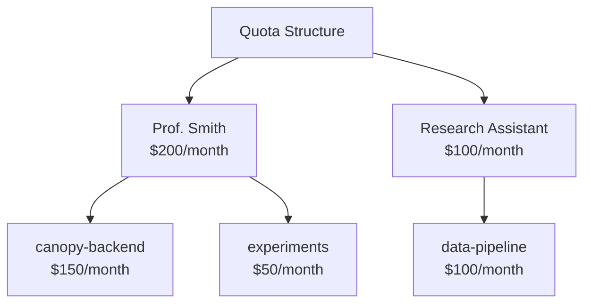

# WIP 

# 📊 Usage & Observability

> 📊 **Persona Focus: The Owner / Accountant** — "With great GPU costs comes great cost tracking responsibility." You're the one who gets the cloud bill and has to explain to leadership why AI costs went from $0 to $50,000 in three months. This lesson is your survival guide.

---

## 🎯 What You'll Learn

In this lesson, you'll explore the observability and cost management side of MaaS:

* 📈 View system-wide usage metrics
* 💰 Implement cost tracking and chargeback
* 🚨 Set up quotas and alerts
* 📋 Review audit logs for compliance

---

## 🤔 Why Observability Matters

Let's paint a picture:

**Month 1:** "AI costs are $500. That's nothing!"

**Month 3:** "AI costs are $15,000. Wait, what happened?"

**Month 6:** "AI costs are $50,000. WHO IS DOING THIS?!"

[Image: Chart showing exponential AI cost growth with panicked stick figure at each milestone]

Without observability, AI adoption is a black hole for budget. With observability, you can:

* ✅ Know *who* is using *what*
* ✅ Attribute costs to users and applications
* ✅ Spot runaway usage before it's a problem
* ✅ Make data-driven decisions about model investments

---

## 📈 System-Wide Metrics Dashboard

As an admin, you have access to the Analytics dashboard.

### Accessing Analytics

1. Log in as an admin
2. Navigate to **Analytics** in the sidebar

[Image: Analytics dashboard showing:
- Header with date range picker
- Summary cards: Total Requests (152.4K), Total Tokens (8.2M), Active Users (47), Est. Cost ($1,247)
- Large line chart: "Usage Over Time" with toggles for Requests/Tokens/Cost
- Bar chart: "Top Users" showing top 10 by usage
- Pie chart: "Usage by Model" showing distribution]

### Key Metrics

| Metric | What It Shows | Why It Matters |
|--------|---------------|----------------|
| **Total Requests** | API calls made | Activity level, adoption tracking |
| **Total Tokens** | Input + Output tokens | Actual resource consumption |
| **Active Users** | Unique users in period | Adoption breadth |
| **Estimated Cost** | $ based on token pricing | Budget impact |
| **Avg. Latency** | Response time | Service quality |
| **Error Rate** | Failed requests % | Service reliability |

### Filtering and Drill-Down

The dashboard supports powerful filtering:

```
Filter by:
├── Date Range: Last 7 days, 30 days, custom
├── Model: granite-8b, llama-3-70b, all
├── User: Specific user or all
└── API Key: Specific key or all
```

[Image: Filter panel showing dropdown selections for each filter type]

---

## 👥 Usage by User

Want to know who's using the most tokens?

### Top Users Report

Navigate to **Analytics → Users**:

[Image: Users analytics table showing:
- Columns: Username, Requests, Tokens, Est. Cost, Avg. per Request, Trend
- Sortable columns (click to sort by any column)
- Sparkline charts in Trend column showing usage pattern
- "Export" button for CSV download]

### User Deep Dive

Click on any user to see their detailed usage:

```
Prof. Smith
├── Total Requests: 12,345
├── Total Tokens: 2.1M
├── Estimated Cost: $145.67
├── Top Model: granite-8b (89%)
├── Peak Usage Time: 2-4 PM (office hours?)
├── Trend: ↑ 23% vs last month
└── API Keys: canopy-prod, research-experiments
```

### Identifying Anomalies

Look for patterns that might indicate issues:

| Pattern | Possible Cause | Action |
|---------|---------------|--------|
| 🚀 Sudden spike | New project or runaway script | Investigate with user |
| 📈 Steady growth | Adoption = good! | Plan capacity |
| 🌙 Night usage | Scheduled jobs or... mining? | Verify it's authorized |
| ⚠️ High error rate | Integration problems | Offer support |

---

## 🤖 Usage by Model

Understanding which models are popular helps with capacity planning.

### Model Usage Report

Navigate to **Analytics → Models**:

[Image: Models analytics showing:
- Table: Model Name, Requests, Tokens, Cost, Avg Latency
- Bar chart comparing model usage
- Trend lines for each model over time]

### Model Economics

For each model, you can see the "unit economics":

```
granite-8b:
├── Total Requests: 89,234
├── Total Tokens: 5.2M
├── Revenue (internal chargeback): $867
├── GPU Cost (estimated): $200
└── Margin: $667 (77%)

llama-3-70b:
├── Total Requests: 12,456
├── Total Tokens: 3.0M
├── Revenue (internal chargeback): $1,245
├── GPU Cost (estimated): $800
└── Margin: $445 (36%)
```

> 💡 **Insight:** Bigger models cost more to run. If users don't need the extra capability, guide them to smaller models.

---

## 💰 Cost Tracking & Chargeback

If your organization uses internal cost allocation, MaaS provides the data you need.

### What is Chargeback?

**Chargeback** = billing internal departments for their usage of shared resources.

Instead of AI costs sitting in "IT General," you can attribute costs. LiteMaaS tracks usage per user and per API key, which you can aggregate for cost allocation:

```
Monthly AI Costs: $1,500

Breakdown by User:
├── Prof. Smith:           $145 (10%)
├── Research Bot (API):    $380 (25%)
├── Canopy Prod (API):     $650 (43%)
├── Dev Team Users:        $325 (22%)
```

> 💡 **Tip:** Use descriptive API key names (like `cs-dept-canopy` or `library-assistant`) to make manual department attribution easier. Team-level grouping is planned for a future LiteMaaS release.

This makes users think twice about unnecessary usage! 💸

### Generating Usage Reports

1. Navigate to **Analytics → Reports**
2. Select **Usage Report**
3. Choose the billing period (month, quarter)
4. Select grouping (by user or by API key)
5. Click **Generate**

[Image: Usage report showing:
- Period: November 2024
- Table with columns: User/API Key, Total Tokens, Cost, % of Total
- Pie chart visualization
- "Export to PDF" and "Export to CSV" buttons]

### Chargeback Best Practices

| Practice | Why |
|----------|-----|
| Use descriptive API key names | Makes attribution clearer (e.g., `cs-dept-canopy`) |
| Include in monthly reports | Keep stakeholders informed |
| Set user budgets | Creates accountability |
| Review quarterly | Catch trends early |

---

## 🚨 Quotas and Alerts

Proactive cost control is better than reactive budget panic.

### Setting Quotas

LiteMaaS supports quotas at user and API key levels:



> 💡 **Note:** Organization-wide and team-level quotas are planned for a future release.

### Configuring Alerts

Navigate to **Settings → Alerts**:

| Alert Type | Trigger | Action |
|------------|---------|--------|
| **Usage Warning** | 80% of budget | Email notification |
| **Usage Critical** | 95% of budget | Email + in-app banner |
| **Budget Exceeded** | 100% of budget | Optional: block requests |
| **Anomaly Detected** | 3x normal usage | Email to admin |

[Image: Alert configuration page showing:
- Table of alert rules
- Each row: Alert Type, Threshold, Recipients, Status (enabled/disabled)
- "Add Alert" button]

### Setting Up a Budget Alert

1. Navigate to **Settings → Alerts**
2. Click **Add Alert**
3. Configure:
   - **Name:** "Prof Smith 80% Warning"
   - **Scope:** User → Prof. Smith
   - **Threshold:** 80% of monthly budget
   - **Action:** Email user
4. Click **Save**

### Quota Enforcement Options

When a budget is exhausted, you have choices:

| Mode | Behavior | Best For |
|------|----------|----------|
| **Soft Quota** | Log warning, allow requests | Production workloads |
| **Hard Quota** | Block requests, return 429 | Test environments, shared accounts |
| **Grace Period** | Allow 10% overage, then block | Balance of both |

---

## 📋 Audit Logs

For compliance and security, LiteMaaS logs everything.

### What Gets Logged

| Event Type | Example |
|------------|---------|
| **Authentication** | User login, logout, failed attempts |
| **API Key Management** | Creation, revocation, regeneration |
| **Admin Actions** | Role changes, budget modifications |
| **API Requests** | Model, user, timestamp (not content!) |
| **Configuration Changes** | Model enable/disable, pricing updates |

### Viewing Audit Logs

Navigate to **Settings → Audit Logs**:

[Image: Audit logs table showing:
- Columns: Timestamp, User, Action, Target, Details, IP Address
- Filter bar for date range and event type
- Example entries showing various actions
- "Export" button for compliance reports]

### Compliance Use Cases

| Requirement | How MaaS Helps |
|-------------|----------------|
| **Who accessed what?** | Audit log shows all API key usage |
| **What changed?** | Configuration changes are logged |
| **User offboarding** | Verify keys are revoked, access removed |
| **Cost attribution** | Full trail of who spent what |

---

## 🎮 Hands-on Exercises

### Exercise 1: Generate a Usage Report

1. Navigate to Analytics → Reports
2. Generate a usage report for the past 7 days
3. Identify the top 3 users by token consumption
4. Export the report to CSV

### Exercise 2: Set Up a Budget Alert

1. Go to Settings → Alerts
2. Create an alert for your user when you hit 50% of your budget
3. Make a few API calls to trigger the alert
4. Verify you receive the notification

### Exercise 3: Review Audit Logs

1. Navigate to Settings → Audit Logs
2. Filter to show only "API Key" events
3. Find when your API key was created
4. Export the audit log for the past 24 hours

### Exercise 4: Create a Chargeback Simulation

1. Imagine you have three departments using MaaS
2. Based on the usage data, calculate what each would owe at:
   - $0.01 per 1K tokens (budget pricing)
   - $0.10 per 1K tokens (enterprise pricing)
3. Which department needs a budget conversation?

---

## 🧪 Knowledge Check

<details>
<summary>❓ Why is chargeback important for AI platform sustainability?</summary>

✅ **Answer:** Chargeback creates accountability. When departments pay for their usage (even if it's internal), they:
- Think twice about unnecessary usage
- Optimize their applications
- Invest in what actually provides value
- Can't blame "IT" for high costs they created
</details>

<details>
<summary>❓ What's the difference between soft and hard quotas?</summary>

✅ **Answer:**
- **Soft quota:** Logs a warning but allows requests to continue. Good for production where availability matters.
- **Hard quota:** Blocks requests with a 429 error when budget is exhausted. Good for test/dev environments.
</details>

<details>
<summary>❓ A user complains their API calls suddenly stopped working. How do you investigate?</summary>

✅ **Answer:** Check in order:
1. **Audit logs:** Is there a revocation event for their key?
2. **Budget status:** Did they hit their quota?
3. **Model status:** Is the model they're using still enabled?
4. **Error logs:** What error code are they getting?
</details>

---

## 📊 The Accountant's Toolkit: Summary

Here's your quick reference for MaaS cost management:

| Task | Where to Go |
|------|-------------|
| See overall usage | Analytics → Dashboard |
| Find top consumers | Analytics → Users |
| Generate cost report | Analytics → Reports → Chargeback |
| Set spending limits | Settings → Budgets |
| Get proactive alerts | Settings → Alerts |
| Investigate issues | Settings → Audit Logs |

---

## 🎯 What You've Accomplished

As the Owner/Accountant, you've now:

* ✅ Explored system-wide usage metrics
* ✅ Understood cost tracking and chargeback
* ✅ Set up quotas and alerts for proactive control
* ✅ Reviewed audit logs for compliance

[Image: Achievement badge with "📊 Cost Controller" text and subtitle "No more surprise cloud bills — you're in control!"]

---

## 🎯 Next Steps

You've seen MaaS from all angles: Owner, AI Engineer, Service Admin, and Consumer. Now it's time to put it all together!

Let's connect your Canopy application to LiteMaaS and see the full picture come to life.

**Continue to [Canopy Integration](./6-canopy-integration.md)** →
