# 🧠 Understanding MaaS: The Origin Story

> 🎩 **Persona Focus: The Owner** — In this lesson, you'll think like the person who pays the bills and asks "why are our GPUs always at 0% utilization while people complain they can't get any?"

---

## 🏫 The RDU Problem

Let's set the scene at Redwood Digital University...

Canopy was a hit! What started as a simple AI chatbot for the Computer Science department has become the talk of the campus. Now:

* 🖥️ **CS Department**: "We need Canopy for our intro programming courses!"
* 📊 **Business School**: "We need Canopy for our analytics curriculum!"
* 📚 **Library**: "We need Canopy to help students navigate research databases!"

Being good citizens, each department follows the same pattern you learned in Module 3: deploy your own model using KServe/vLLM, connect your application, done!

**The result?**

```mermaid
flowchart LR
    subgraph RDU AI Infrastructure
        CS[CS Canopy] --> G1[Granite Model] --> GPU1["GPU #1 💤 3%"]
        BIZ[Biz Canopy] --> G2[Granite Model] --> GPU2["GPU #2 💤 2%"]
        LIB[Lib Canopy] --> G3[Granite Model] --> GPU3["GPU #3 💤 1%"]
    end
    STUDENT["Student 😭"] -. NO GPUS AVAILABLE .-> GPU1
```

Three identical models. Three GPUs. Combined utilization: 6%.

And yet when a student tries to spin up a GPU for their machine learning project? **"No resources available."**

[Image: The "This is Fine" meme dog sitting in a burning room, but the flames are labeled "Wasted GPUs", "Budget Overruns", "User Complaints", and "IT Tickets"]

---

## 🏢 Scale This to the Enterprise

If this sounds bad at a university level, imagine what happens at enterprise scale.

Let's say a large company (totally not Red Hat 😉) decides to democratize AI by giving all 19,000 employees access to OpenShift AI. "Everyone can deploy their own models! Innovation for all!"

**What actually happens:**

| Day | Event | GPU Count |
|-----|-------|-----------|
| Monday | 7 developers discover they can deploy Granite 3-8B | 7 GPUs allocated |
| Tuesday | All 7 GPUs sit at 0% utilization (devs are in meetings) | 7 GPUs... waiting |
| Wednesday | Marketing asks for access | "No GPUs available" |
| Thursday | Finance submits urgent AI project request | "No GPUs available" |
| Friday | Someone opens a ticket: "Why can't we get any GPUs?" | 7 devs: "Mine!" 🐿️ |

This is the **Hardware Hoarding** anti-pattern:

> When everyone can deploy their own model instance, they will — and they won't give it up, even when they're not using it.

It's like everyone in an apartment building buying their own washer/dryer instead of sharing a laundry room. Expensive, inefficient, and leaves no room for actual... laundry.

---

## 🚫 Ideas That Don't Work

The Owner might think: "Surely there's an easy fix?" Let's explore the options:

### ❌ Option 1: "Just Buy More GPUs!"

| Approach | Problem |
|----------|---------|
| Increase auto-scaling max | GPUs cost $10K-$40K each. 19K employees × even 0.1 GPUs = 💸💸💸 |
| Add more nodes | Still doesn't solve duplication — now you have 14 Granite instances |

**Result:** You've made the cloud bill team very unhappy.

### ❌ Option 2: "Set Quotas!"

| Approach | Problem |
|----------|---------|
| OpenShift quotas per user | Doesn't prevent duplication — 7 users with small quotas still = 7 models |
| Time-based limits | Users just re-deploy when their limit expires |

**Result:** You've added bureaucracy but not efficiency.

### ❌ Option 3: "Use MIG to Slice GPUs!"

| Approach | Problem |
|----------|---------|
| NVIDIA MIG partitioning | Slices are too small for modern LLMs (Granite 3-8B needs ~16GB VRAM) |
| Smaller models | Defeats the purpose — users want the good models |

**Result:** You've made everyone unhappy AND the models don't fit.

---

## 💡 The MaaS Solution: The Lightbulb Moment

What if... instead of giving everyone access to *GPUs*, we gave them access to *models*?

[Image: A lightbulb moment illustration showing:
- LEFT: Cloud labeled "Everyone deploys their own model" with chaos icons
- MIDDLE: A lightbulb labeled "MaaS!"
- RIGHT: Cloud labeled "Everyone uses shared models via API" with order icons]

The MaaS approach:

| Before (Self-Service GPUs) | After (Models as a Service) |
|---------------------------|----------------------------|
| 7 users deploy 7 Granite instances | 1 expert team deploys 1 Granite instance |
| 7 GPUs at 3% utilization each | 1 GPU at 70%+ utilization |
| "No GPUs available" errors | Everyone gets instant API access |
| No visibility into usage | Full usage tracking per user/team |
| No cost attribution | Chargeback by department |

**The Architecture:**

```mermaid
flowchart LR
    subgraph Apps
        CS[CS Canopy]
        BIZ[Biz Canopy]
        LIB[Lib Canopy]
    end
    subgraph MaaS["MaaS Gateway (LiteMaaS)"]
        GW[API Gateway]
        TRACK[Usage Tracking]
        KEYS[API Keys]
        BUDGETS[Budgets]
    end
    CS --> GW
    BIZ --> GW
    LIB --> GW
    GW --> GRANITE[Granite Model]
    GRANITE --> GPU["GPU #1 🎉 70%"]
```

---

## 🎯 The MaaS Principles

MaaS isn't just a technical solution — it's a mindset shift:

### 1️⃣ Become the Provider of Private AI

Instead of everyone fending for themselves, a dedicated team provides AI as an internal service. They become the "private AI provider" for the organization.

### 2️⃣ Don't Just Throw GPUs at the Problem

More GPUs without a strategy = more waste. MaaS focuses on *utilization*, not just *capacity*.

### 3️⃣ Deploy Each Model Once, Serve Many

A team of experts deploys and optimizes each model. Users consume via API. Everyone wins.

### 4️⃣ Replicate the Public AI Provider Model

AWS Bedrock, Azure OpenAI, Google Vertex — they all work this way. MaaS brings the same pattern to your private infrastructure.

### 5️⃣ With Great GPU Costs Comes Great Cost Tracking

If you can't measure it, you can't manage it. MaaS provides full visibility into who's using what.

---

## 🏗️ Introducing LiteMaaS

For this module, we'll use **LiteMaaS** — a lightweight MaaS implementation built by Red Hat AI Services.

**Key Components:**

| Component | Technology | Purpose |
|-----------|------------|---------|
| **Frontend** | React + PatternFly 6 | Beautiful, accessible admin & user UIs |
| **Backend** | Fastify + Node.js | Fast, modern API server |
| **Database** | PostgreSQL | Users, API keys, usage data, audit logs |
| **Proxy** | LiteLLM | OpenAI-compatible API across different backends |
| **Auth** | OAuth2/JWT | OpenShift integration, seamless SSO |

**Why LiteMaaS?**

* ✅ Open source and extensible
* ✅ OpenAI-compatible API (works with existing tools)
* ✅ Three-tier role hierarchy: admin → adminReadonly → user
* ✅ Built-in usage tracking and budgets
* ✅ Designed for OpenShift environments

---

## 🧪 Knowledge Check

Before moving on, let's make sure the key concepts are clear:

❓ Why is "giving everyone access to GPUs" problematic at scale?

✅ **Answer:** When everyone can deploy their own model instances, they do — leading to duplicate deployments, low utilization, and resource exhaustion. Seven people with seven identical Granite instances = seven GPUs at 3% utilization, while others can't get any GPU access at all.

❓ What's the core difference between GPU access and model access?

✅ **Answer:** GPU access lets users deploy whatever they want (leading to duplication). Model access lets users *consume* pre-deployed models via API (leading to sharing and efficiency). Users don't need GPUs — they need model capabilities.

❓ Who are the key personas in a MaaS implementation?

✅ **Answer:**
- 🎩 **Owner** — Cares about cost and efficiency
- 🔧 **AI Engineer** — Deploys and manages infrastructure
- 👩‍💼 **Service Admin** — Manages users, access, budgets
- 👤 **Consumer** — Uses the API to build applications

---

## 🎯 Next Steps

Now that you understand *why* MaaS exists, it's time to build one!

In the next lesson, you'll put on your 🔧 **AI Engineer** hat and deploy LiteMaaS on OpenShift.

**Continue to [Deploy LiteMaaS](./2-deploy-litemaas.md)** →
