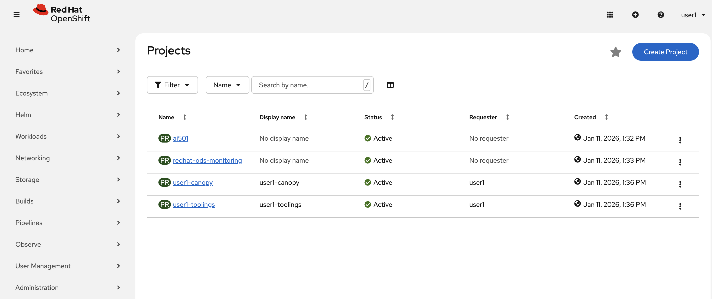
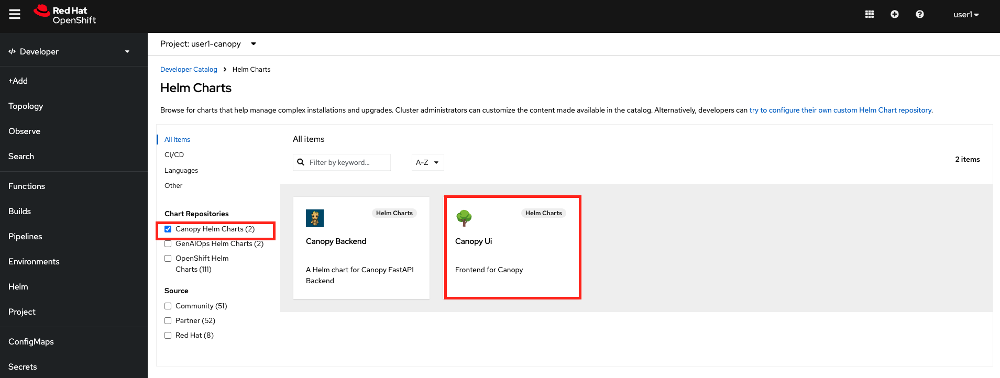
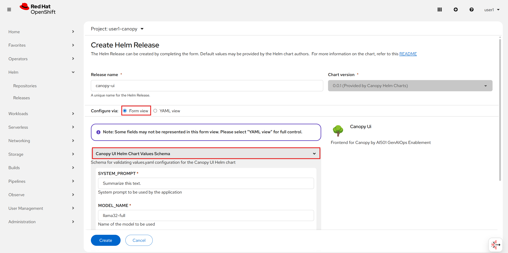
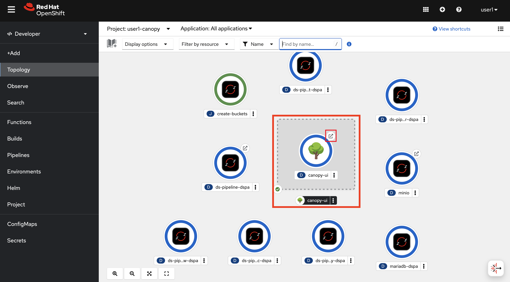

# 🌿 What is Canopy?

<div class="terminal-curl"></div>

**Canopy** is an intelligent, leafy little assistant designed to support teaching and learning at **Redwood Digital University**. From summarizing texts to generating quizzes and scoring assignments — it’s your educational AI lab in action.

This frontend gives you a clean, playful UI built in Streamlit, powered by your choice of LLMs. Whether hosted in OpenShift or running locally, it’s built for experimentation and enablement.

## 🎯 Why This Frontend Matters for Prompt Engineering

Just like a good prompt shapes a great model response, **a good user interface shapes great exploration**.

In GenAI applications, **how people interact with the model often matters more than which model you use**.

You can have the smartest LLM in the world, but if the UI doesn’t help users guide or understand it — the value is lost.

This first iteration of **Canopy** is built to support:

- System prompts 🧠 to define model behavior.

- User prompts 💬 to define what you ask.

- Live streaming output 🌱 so you see each token bloom.

In future modules, this same interface will evolve to handle content creation, grading, and personalized feedback.

## 🚀 Getting Started with Canopy on OpenShift

Follow these instructions to get your own instance of Canopy up and running in just a few minutes.

### 📦 1. Deploy the Frontend to OpenShift

In OpenShift, you have an experimentation environment which is called `<USER_NAME>-canopy`. You'll use this environment to iterate over Canopy, bring in new features, update the frontend when new capabilities arrive, and so on. 

1. Go to [OpenShift Console](https://console-openshift-console.<CLUSTER_DOMAIN>) and use `Students` login. You'll find yourself in the Developer view of Openshift Console.

    User: `<USER_NAME>`  
    Password: `<PASSWORD>`

    

2. Click `Add`, select `<USER_NAME>-canopy` namespace from the dropdown menu on the top, and select `Helm Charts`. 

    

3. Select `Canopy Helm Charts` and click on `Canopy UI` helm chart to deploy.

    

4. Hit `Create` and fill out the values as below:

    - SYSTEM_PROMPT: Do you remember the great prompt you came up with in the previous section. Let's paste that here!
    - MODEL_NAME: `llama32`
    - LLM_ENDPOINT: `https://llama32-ai501.<CLUSTER_DOMAIN>`
  
    Leave the rest as it is for now.

    

    ✅ This will create:

    - A UBI9-based Streamlit app
    - A service exposing port 8501
    - A secure OpenShift route (TLS termination: edge)

5. Once the application is successfully running, click on the arrow on the side of the circle to access the Canopy UI 🌳🌳🌳

    


### 🧪 2. Try the Summarization UI

1. Inside the app, you can paste the following text to let it summarize, taken from Wikipedia on Canopy: https://en.wikipedia.org/wiki/Canopy_(biology):
   
    ```
    Tea preparation involves the controlled extraction of bioactive compounds from processed Camellia sinensis leaves. Begin by heating water to near 100°C to optimize solubility. Introduce a tea bag to a ceramic vessel, then infuse with hot water to initiate steeping—typically 3–5 minutes to allow for the diffusion of polyphenols and caffeine. Upon removal of the bag, optional additives like sucrose or lipid-based emulsions may be introduced to alter flavor profiles. The infusion is then ready for consumption.
    ```

    Press `Summarize` and then watch the model generate a summary in real-time ✨

    

---

✅ What you have accomplished

- Deployed the Canopy frontend on OpenShift

- Connected it to your own LLM endpoint

- Used the system prompt to shape the assistant's behavior

- Understood the relationship between prompting and summarization style