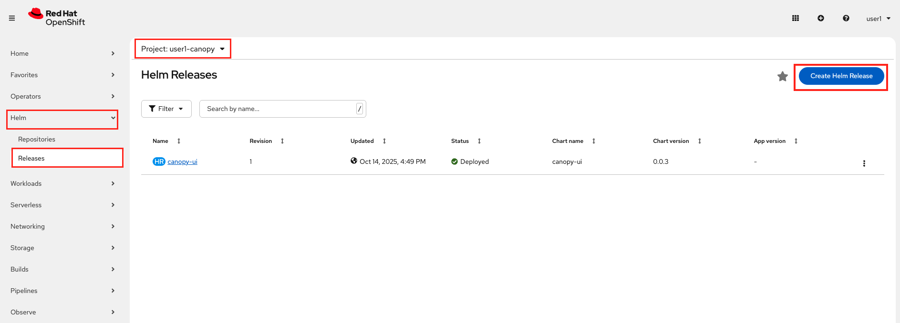
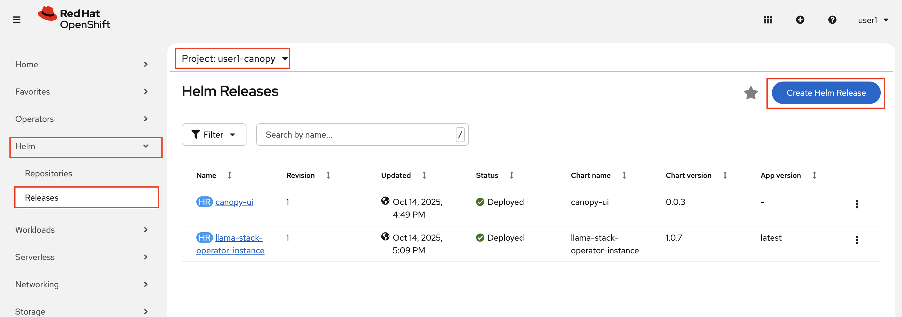
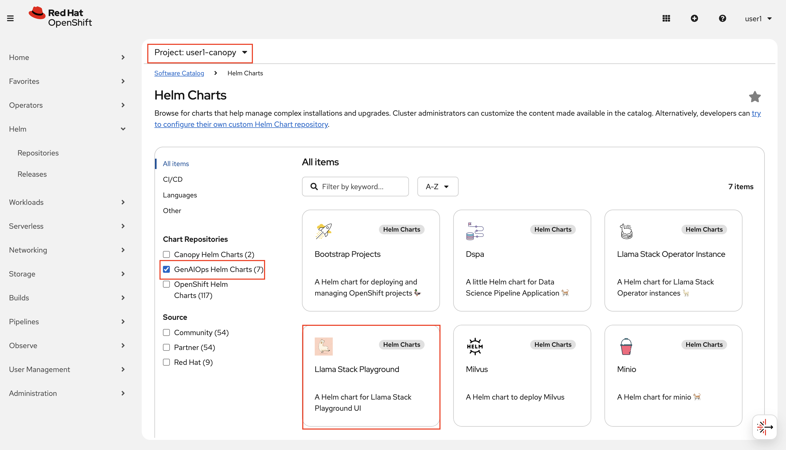

# 🦙 Why Llama Stack?

In previous section, you've interacted directly with an LLM through a custom frontend. While this gave us quick insights into how prompts affect behavior, it's only the beginning of what a full GenAI application needs.

As we start adding more capabilities—like prompt templating, RAG pipelines, evaluations, or user feedback loops—we need a **unified, consistent interface** that can grow with us.

That’s where **Llama Stack** comes in.

Llama Stack provides a modular foundation for building LLM applications with:

* 🔌 **Consistent APIs** for interacting with models (local or remote)
* 📦 **Support for prompt templates**, vector databases, and agentic workflows and tools
* 🧠 **Built-in observability** and hooks for evaluation
* 🔐 **On-prem friendly** deployment patterns

By introducing it early, we’re setting a stable baseline that can support **every new capability** we add—without having to rewire our application each time.

In short: Llama Stack helps us move from *experimentation* to *production readiness*, while keeping things flexible and composable.


## Deploy Llama Stack

1. Let's quickly deploy it to our experimentation environment the same way we deployed Canopy UI. In Openshift console, again expand `Helm` section from the left menu, click `Releases` and make sure you are on `<USER_NAME>-canopy` project. Then from the top right select `Create Helm Release`. 

    

2. Select `GenAIOps Helm Charts` from the Chart Repositories list and choose `Llama Stack Operator Instance`

    

3. We need to provide our LLM endpoint to Llama Stack, the same way we did to Canopy frontend. The helm chart already comes with good default values. Check if the below values are like below:

    - Model Name: `llama32`
    - Model URL: `http://llama-32-predictor.ai501.svc.cluster.local:8080/v1`

..and click `Create`.

3. Observe that the Llama Stack is running in your environment:

    

## Deploy Llama Stack Playground

The Llama Stack Playground is your interactive lab for exploring what the Llama Stack can do—before wiring it into a full application.

Think of it as your control room for:

- 🔧 Trying out different models behind the same interface

- 🧵 Testing system and user prompts

- 🌐 Experimenting with RAG systems and different tools

- 📊 Previewing evaluation hooks or guardrails

In another word, all the cool stuff we will get to later on!

It’s built to help you prototype quickly and standardize early, so you quicker can implement new LLM functionality.

Let’s deploy the Playground to verify the integration between Llama Stack and your LLM before we deep dive into what’s going on under the hood and how we’ll update the frontend.

1. At this point you know the drill! Go to Openshift console, expand `Helm` section from the left menu, click `Releases` and make sure you are on `<USER_NAME>-canopy` project. Then from the top right select `Create Helm Release`.

    

2. Select `GenAIOps Helm Charts` from the Chart Repositories list and choose `Llama Stack Playground` and click `Create`.

    

2. You do not need to change any value here. Just hit `Create` and wait to be up and running. 

    

    Then you can click the little arrow on the side of the circle/icon and access to the playground.

    

3. If you scroll on the left menu, there is a `System Prompt` area. We can continue experimenting and iterating on our prompts here. So feel free to bring your latest System prompt to the playground.

    Here is a user prompt from previous chapters:
    ```
    Tea preparation involves the controlled extraction of bioactive compounds from processed Camellia sinensis leaves. Begin by heating water to near 100°C to optimize solubility. Introduce a tea bag to a ceramic vessel, then infuse with hot water to initiate steeping—typically 3–5 minutes to allow for the diffusion of polyphenols and caffeine. Upon removal of the bag, optional additives like sucrose or lipid-based emulsions may be introduced to alter flavor profiles. The infusion is then ready for consumption.
    ```

    

You have a few more options than in previous exercises. Alongside `Temperature`, you’ll also see `Top P` and `Repetition Penalty`. Try them out on the summarize task and observe how they change the output. (If you are not sure what they are, just ask the model 😁)

What values work well and what do they do? 🧠 🤓

---

Now, let’s look at how we can interact with Llama Stack programmatically and what changes we need to make to the frontend.
