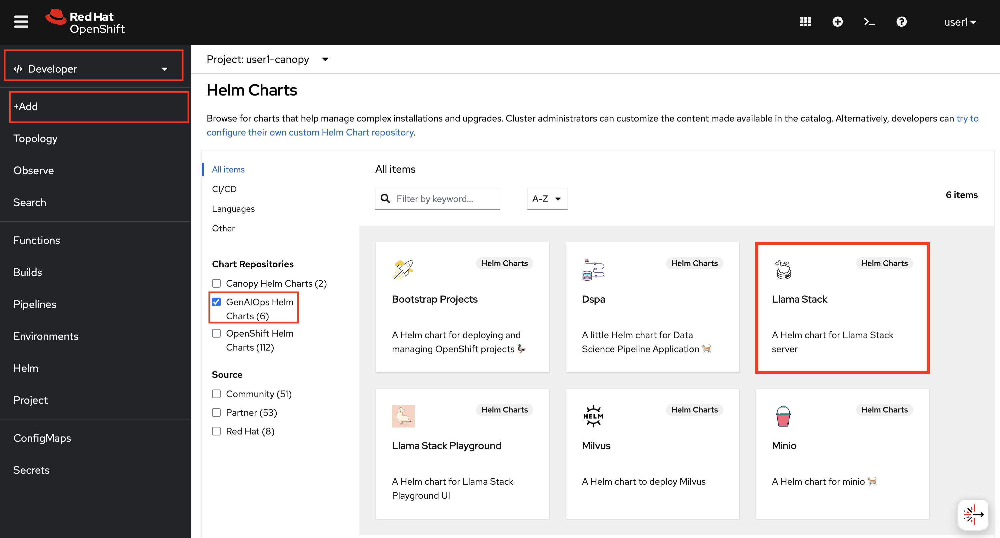
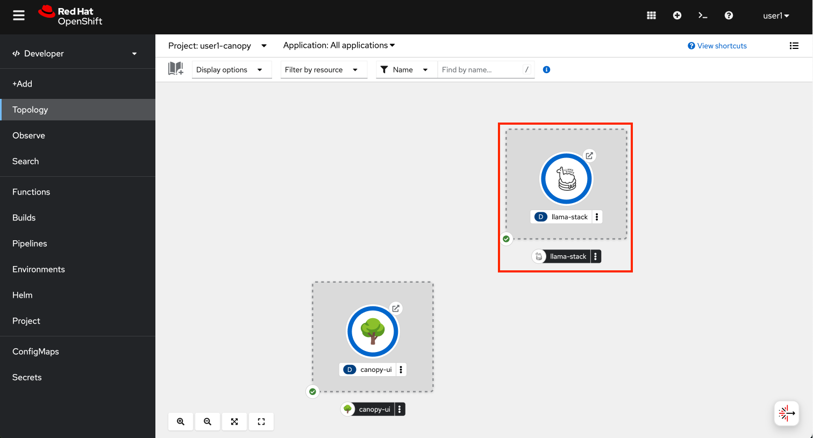
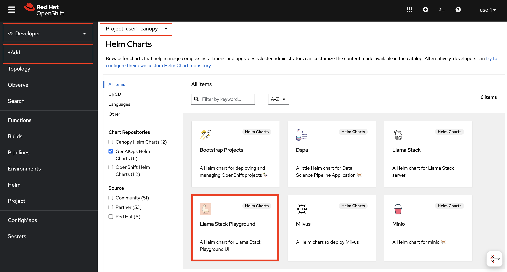
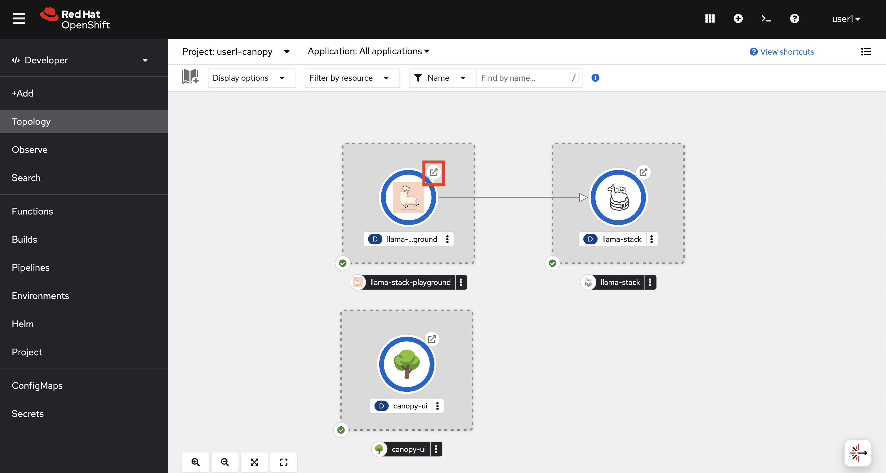
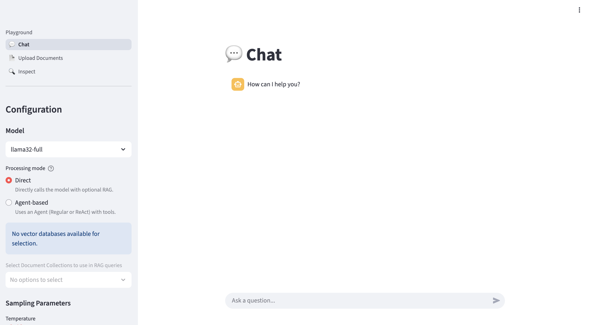
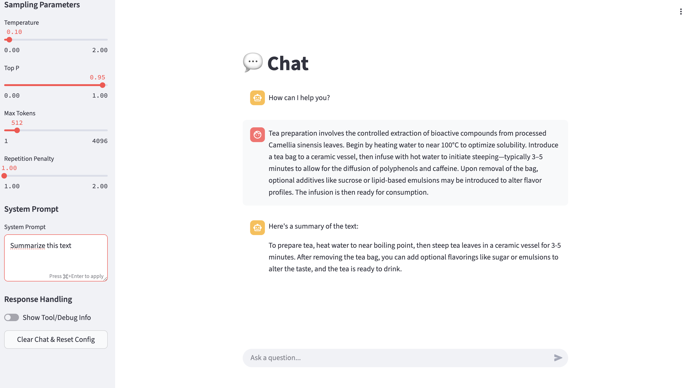

# 🦙 Why Llama Stack?

In previous section, you've interacted directly with an LLM through a custom frontend. While this gave us quick insights into how prompts affect behavior, it's only the beginning of what a full GenAI application needs.

As we start adding more capabilities—like prompt templating, RAG pipelines, evaluations, or user feedback loops—we need a **unified, consistent interface** that can grow with us.

That’s where **Llama Stack** comes in.

Llama Stack provides a modular foundation for building LLM applications with:

* 🔌 **Consistent APIs** for interacting with models (local or remote)
* 📦 **Support for prompt templates**, vector databases, and agentic workflows and tools
* 🧠 **Built-in observability** and hooks for evaluation
* 🔐 **On-prem friendly** deployment patterns

By introducing it early, we’re setting a stable baseline that can support **every new capability** we add—without having to rewire our application each time.

In short: Llama Stack helps us move from *experimentation* to *production readiness*, while keeping things flexible and composable.

## Deploy Llama Stack

1. Let's quickly deploy it to our experimentation environment the same way we deployed Canopy UI. Go to OpenShift Console, click `+Add` and select `Helm Charts`. You'll see `GenAIOps Helm Charts`. Select `Llama Stack` > `Create`.

    

2. Now we need to provide our LLM endpoint to Llama Stack, the same way we did to Canopy frontend.

    - Model Name: `llama32`
    - Model URL: `https://llama32-ai501.<CLUSTER_DOMAIN>`

    ..keep the rest the same.

3. Observe that the Llama Stack is running in your environment:

    

## Deploy Llama Stack Playground

The Llama Stack Playground is your interactive lab for exploring what the Llama Stack can do—before wiring it into a full application.

Think of it as your control room for:

- 🔧 Trying out different models behind the same interface

- 🧵 Testing prompt templates stored in Git or locally

- 🌐 Experimenting with RAG systems and different tools

- 📊 Previewing evaluation hooks, even before automating them in pipelines

It’s built to help you prototype quickly and standardize early, so you quicker can implement new LLM functionality.

Use it to validate your prompts, compare responses, and debug model behavior—before anything hits production.

Let’s deploy the Playground to verify the integration between Llama Stack and your LLM before we deep dive into what’s going on under the hood and how we’ll update the frontend.

1. Just like we did with Llama Stack; Go to OpenShift Console, click `+Add` and select `Helm Charts`. You'll see `GenAIOps Helm Charts`. Select `Llama Stack Playground` > `Create`.

    

2. You do not need to change any value here. Just hit `Create` and wait to be up and running. 

    

    Then you can click the little arrow on the side of the circle/icon and access to the playground.

    

3. If you scroll on the left menu, there is a `System Prompt` area. We can continue experimenting and iterating on our prompts here.

    

You have a few more options than in previous exercises. Alongside `Temperature`, you’ll also see `Top P` and `Repetition Penalty`. Try them out on the summarize task and observe how they change the output. 

What values work well and what do they do?

#TODO: update playground and use top_k instead

---

Now, let’s look at how we can interact with Llama Stack programmatically and what changes we need to make to the frontend.
