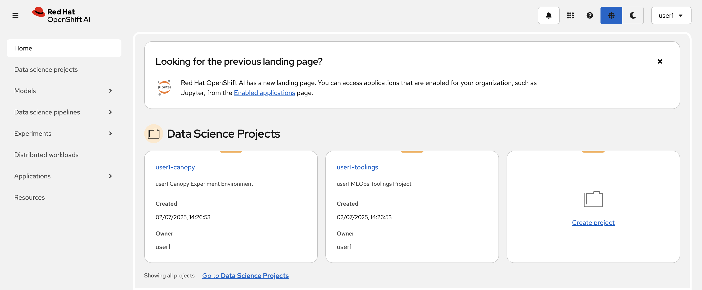
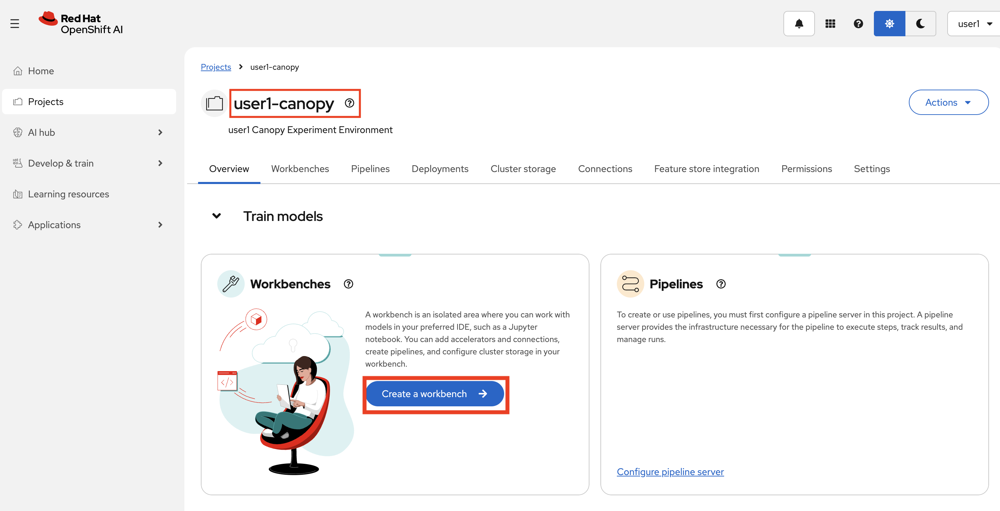
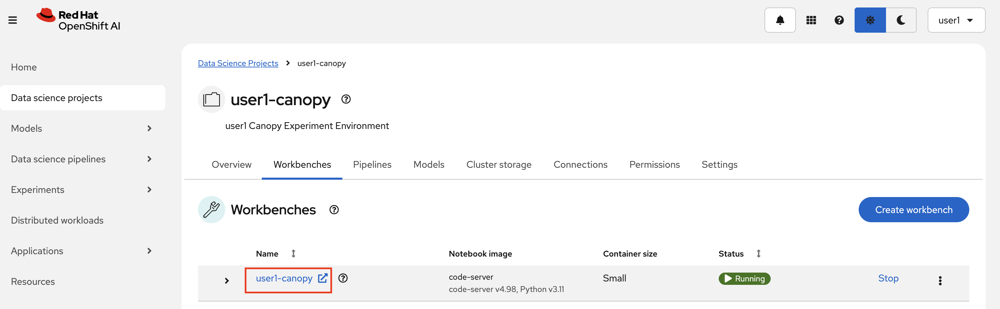
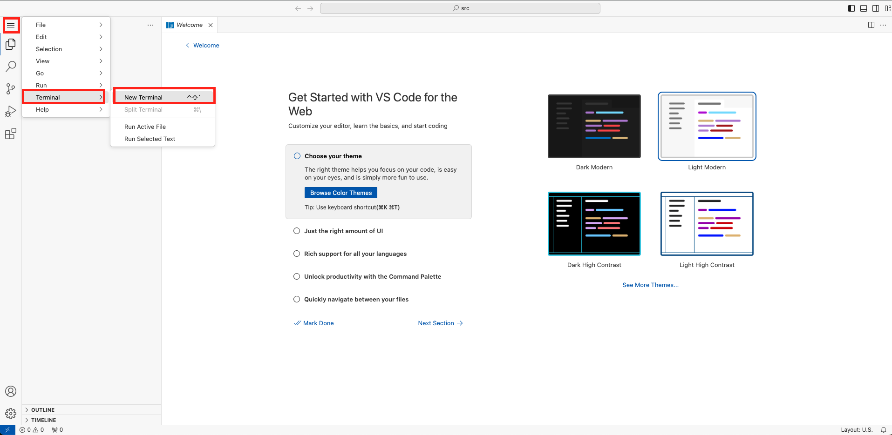
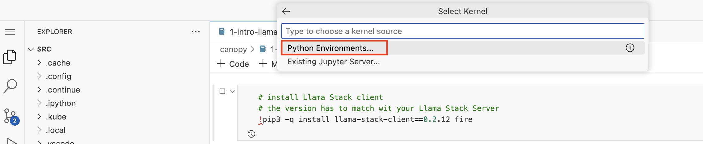
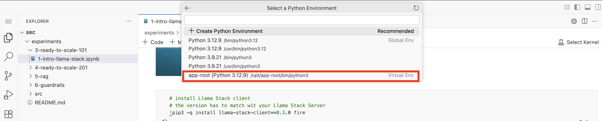

# 📘 Interacting with Llama Stack via Workbench

Now that we’ve deployed the Llama Stack and verified it’s up and running, it’s time to get more hands-on.

In this section, we’ll launch a Workbench on Red Hat OpenShift AI to spin up a Code Server environment. This gives us a browser-based IDE where we can run Python notebooks and start interacting with the Llama Stack programmatically.

You’ll use this environment to:

- Explore Llama Stack’s API
- Send test prompts directly from code
- Build a backend that connects Llama Stack and handle requests from our frontend

By the end of this section, you'll have a better grasp of how to integrate Llama Stack into your own workflows and applications — and set the stage for more advanced use cases.

1. Login to [OpenShift AI](https://rhods-dashboard-redhat-ods-applications.<CLUSTER_DOMAIN>/). You’ll see your `<USER_NAME>-canopy` project there too!

   

2. Let's create a workbench!   

   Click on the `<USER_NAME>-canopy` project, then click `Create a Workbench`. OpenShift AI Dashboard is pretty intuitive, isn't it? :)
   
   

3. Select a name you want, could be something like `<USER_NAME>-canopy` 🌳

    **Notebook Image:** 

    - Image selection: `AI501 - Custom Code Server` (at the end of the list😌)
  
    **Deployment size**
    - Container size: `Small`

    **Environment variables**
    - No need to add one at the moment.

    **Cluster storage**
    - Leave it as max 20 GiB.

    **Connections**
    - Leave it as it is. We don't need any connection definition at the moment.

    And finally, hit `Create workbench`.

When it is in running state, open it by clicking its name and use your credentials to access it.

   

4. Open a new terminal by hitting the hamburger menu on top left then select `Terminal` > `New Terminal` from the menu.

   

5. Let's clone our Canopy repository that has some Notebooks in it and learn more about Llama Stack!

   ```bash
   git clone https://<USER_NAME>:<PASSWORD>@gitea-gitea.<CLUSTER_DOMAIN>/<USER_NAME>/experiments.git
   ```

6. Open up the notebook called `3-ready-to-scale-101/1-intro-llama-stack.ipynb` and follow the instructions. When you run the first code cell, it will ask you to choose a kernel. Select the first option. That means it will run the code within this workbench locally.

   

   Then it will ask you to choose which Python environment to use. Go with the `Recommended` one.

   

   And now, feel free to experiment! Read and run the cells in the notebook! When you are done, come back here:)

   


Now that we understand why a backend is necessary to communicate with the Llama Stack, let’s implement those changes and introduce a backend into the architecture.

