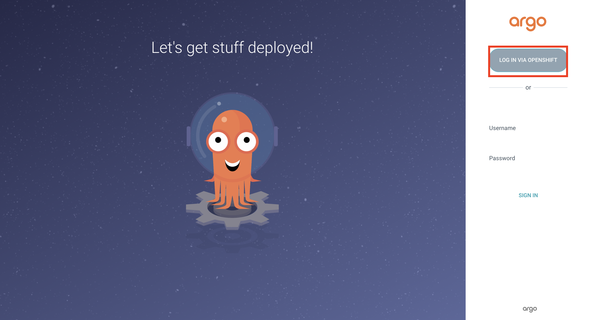
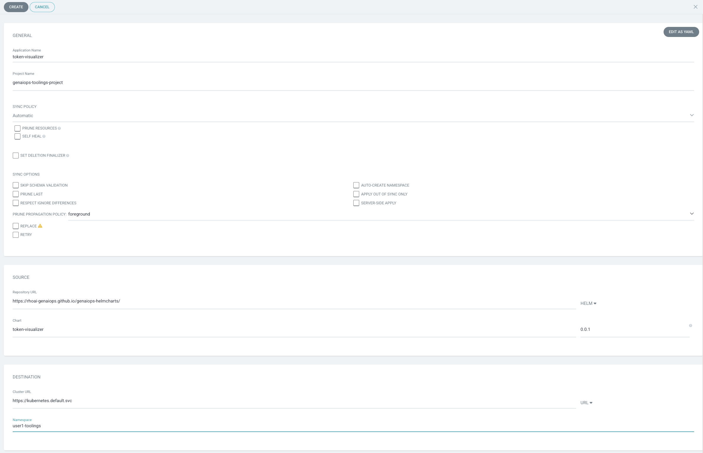
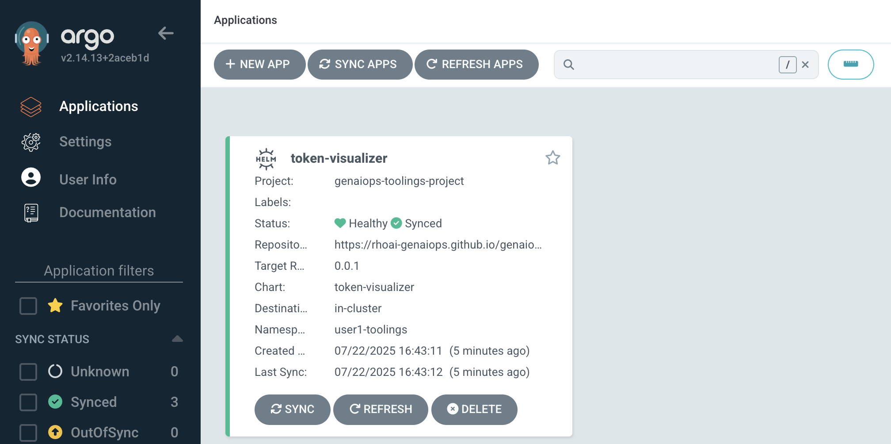
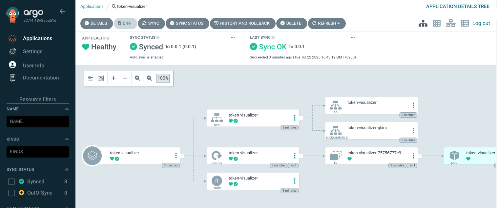
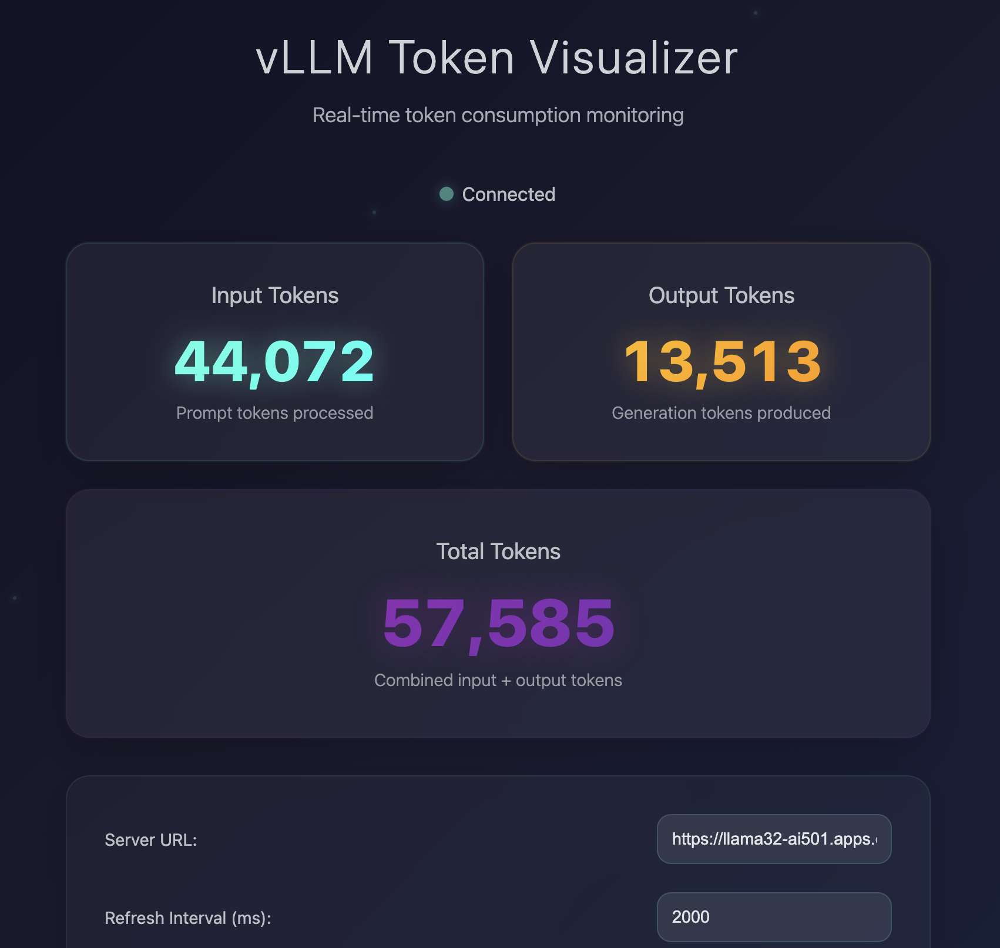
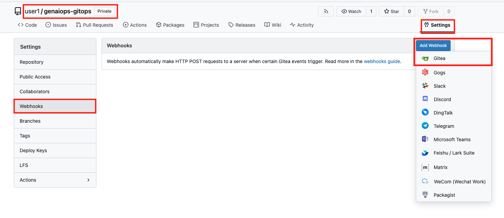
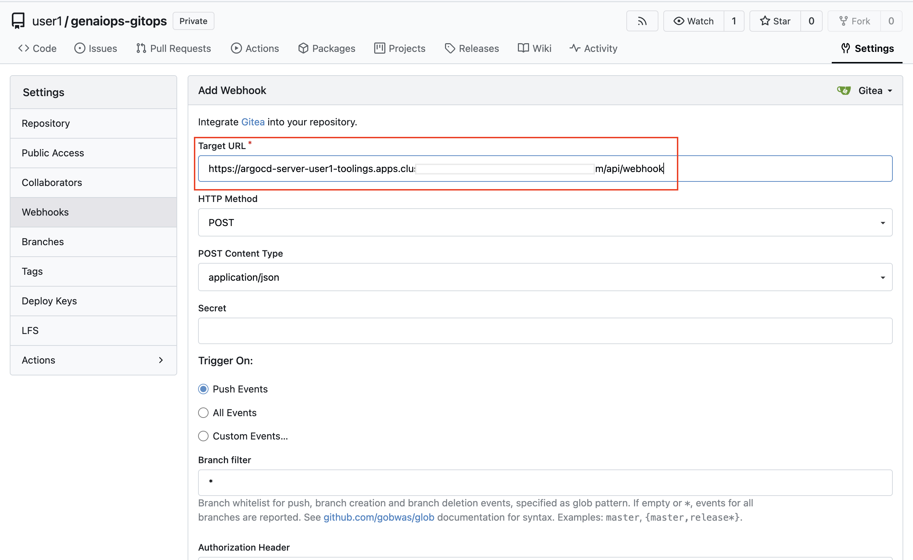

# 🐙 Argo CD - GitOps Controller 

GitOps is important because it provides a consistent, automated way to manage development workflows and model & app deployments, ensuring that everything is versioned, traceable, and reproducible. By using Git as the single source of truth, teams can easily track changes, manage configurations, and ensure that models and applications are always deployed in the correct state.

To put GitOps into action, we’ll use Argo CD as our GitOps engine.

## Argo CD Applications
Argo CD is one of the most popular GitOps tools. It keeps the state of our OpenShift applications synchronized with our git repos. It is a controller that reconciles what is stored in our git repo (desired state) against what is live in our cluster (actual state). 

In the context of GenAIOps, we’ll leverage Argo CD to deploy our applications, tools and models in a repeatable and reproducible manner. By storing configuration definitions in Git, Argo CD will automatically apply those definitions, making the deployment process more efficient and consistent. This means we’ll be working with YAML files :)

Let's setup the foundation of our GitOps system and deploy all the components we used so far via Argo CD to `<USER_NAME>-test` and `<USER_NAME>-prod` environments.

1. Let's get your hands warm with GitOps and Argo CD first. An Argo CD instance is already installed to your `<USER_NAME>-toolings` environment. You can either get the URL from the above `Quick Links` tile or simply by running the below command on the terminal of your workbench.

  First log in to the cluster:

  ```bash
    export CLUSTER_DOMAIN=<CLUSTER_DOMAIN>
    oc login --server=https://api.${CLUSTER_DOMAIN##apps.}:6443 -u <USER_NAME> -p <PASSWORD>
  ```

  Then get the URL (or you can use the `Quick Links` from top right corner) and connect to your Argo CD.

  ```bash
    echo https://$(oc get route argocd-server --template='{{ .spec.host }}' -n <USER_NAME>-toolings)
  ```

2. Login to Argo CD by clicking `Log in via OpenShift` and use the OpenShift credentials provided.

  

3. Select `Allow selected permissions` for the initial login.

4. You just logged into Argo CD 👏👏👏! Lets deploy a sample application through the UI. It'll be just to give you a taste of Argo CD's magic before we use it for our GenAIOps reasons. On Argo CD - click `CREATE APPLICATION`. You should see an empty form. Let's fill it out by setting the following:

   * On the "GENERAL" box
      * Application Name: `token-visualizer` 
      * Project Name: `default`
      * Sync Policy: `Automatic`
   * On the "SOURCE" box
      * Repository URL: `https://rhoai-genaiops.github.io/genaiops-helmcharts/`
      * Select `Helm` from the right GIT/HELM drop down menu
      * Chart: `token-visualizer`
      * Version: `1.0.1`
   * On the "DESTINATION" box
      * Cluster URL: `https://kubernetes.default.svc`
      * Namespace: `<USER_NAME>-toolings`
   * Change the `Directory` dropdown to `Helm` and set
      * Values Files: `values.yaml`

    Your form should look like this:
    
    

5. After you hit create, you’ll see `token-visualizer` application is created and started deploying in your `<USER_NAME>-toolings` namespace.

  

6. If you drill down into the application you will get Argo CD’s amazing view of all of the Openshift resources that were generated. These resources are defined in the Helm chart you selected.

  

7. You can verify the little token-visualizer application is running and behaving as expected by navigating to its URL.  
   Token visualizer lives in this URL: [https://token-visualizer-<USER_NAME>-toolings.<CLUSTER_DOMAIN>/](https://token-visualizer-<USER_NAME>-toolings.<CLUSTER_DOMAIN>/)
  
  Alternatively, you can get the same URL by running the following command in the terminal:

    ```bash
    echo https://$(oc get route/token-visualizer -n <USER_NAME>-toolings --template='{{.spec.host}}')
    ```
  
  Enter the URL of the LLM we are using, hit Enter and visualize how many token we've been sending and generating since start of the enablement :)

  ```bash
  https://llama32-ai501.<CLUSTER_DOMAIN>
  ```

  
  
🪄🪄 Magic! You now have a GitOps controller - Argo CD - and made it to manually deploy an application for you. Next up, we’ll make Argo CD deploy Canopy🌳 into `test` and `prod` environments 🪄🪄


## ApplicationSets

### Get Gitea Ready for GitOps

> In this exercise we'll connect Argo CD (our GitOps controller) to our Git repository to enable the GitOps workflow. We will be storing definitions of toolings and application deployments in the `genaiops-gitops` repository and make Argo CD aware of that repo.

Gitea is a lightweight, self-hosted Git server that allows teams to manage repositories, track issues, and collaborate on code efficiently. It is open-source, easy to deploy, and supports various version control operations. Gitea serves as our central repository in this workshop where your `genaiops-gitops` configurations will reside for seamless integration with Argo CD.

1. Log into Gitea with your credentials. Gitea URL:

    ```bash
    https://gitea-gitea.<CLUSTER_DOMAIN>
    ```

    You will see a `genaiops-gitops` repository already created for you. It is the git repository that we are going to use for <span style="color:purple;" >GIT</span>Ops purposes. It will serve as a mono-repo holding both our tooling configuration and the application deployment definitions. In the real world, you may want to separate these into different repos! Anyways, let's get started!

2. Let's go back to the `code-server` terminal and clone the repository.

    ```bash
    cd /opt/app-root/src
    git clone https://<USER_NAME>:<PASSWORD>@gitea-gitea.<CLUSTER_DOMAIN>/<USER_NAME>/genaiops-gitops.git
    ```

   With our git project cloned - let's start our GitOps Journey 🧙‍♀️🦄!

3. This `genaiops-gitops` repository holds Argo CD `ApplicationSet` definitions to create any application we define here. An `ApplicationSet` is a resource that enables dynamic creation and management of multiple Argo CD applications. We have three `ApplicationSet` definitions: one for tooling, one for the test environment, and one for the production environment.

  Let’s get started with tooling - open the `genaiops-gitops/appset-toolings.yaml` file in your IDE. Update the `CLUSTER_DOMAIN` and `USER_NAME` placeholders with your values. Then, do the same for the `toolings/bootstrap/config.yaml` file. Alternatively, you can run the commands below to automatically apply the changes.

    ```bash
      sed -i -e 's/CLUSTER_DOMAIN/<CLUSTER_DOMAIN>/g' /opt/app-root/src/genaiops-gitops/appset-toolings.yaml
      sed -i -e 's/USER_NAME/<USER_NAME>/g' /opt/app-root/src/genaiops-gitops/appset-toolings.yaml
      sed -i -e 's/USER_NAME/<USER_NAME>/g' /opt/app-root/src/genaiops-gitops/toolings/bootstrap/config.yaml
    ```

4. This is GITOPS - first we need to commit things! Let's get the configuration into git 👇

    ```bash
    cd /opt/app-root/src/genaiops-gitops
    git config --global user.email "<USER_NAME>@genaiops-wizard.com"
    git config --global user.name "<USER_NAME>"
    git add .
    git commit -m  "🦆 ADD - ApplicationSet definition 🦆"
    git push
    ```

5. This `appset-toolings.yaml` file refers to the `toolings` folder which contains all the definitions needed for tools to support automation, observability, security and more. For now, we’ll start small with only two applications. Within the `toolings` folder, you'll find two subfolders: one named `bootstrap`, which handles bootstrapping the cluster with necessary namespaces and permissions (`test` and `prod` to start), and another named `minio`, which defines our storage environment. This setup means that we’re storing both the storage and environment definitions in Git. As we’ve discussed, this is GitOps, so our desired state must be stored in ✨Git✨. 

  All we need to do is create the ApplicationSet object, and then Argo CD will take care of the rest.

    ```bash
      oc apply -f /opt/app-root/src/genaiops-gitops/appset-toolings.yaml -n <USER_NAME>-toolings
    ```
6. Now check the Argo CD to see if ApplicationSet was able to see the subfolders under `toolings` and deploy the applications for us!

7. As Argo CD sync's the resources we can see them in the cluster as well. In the `code-server` run the following:

    ```bash
    oc get projects | grep <USER_NAME>
    ```

  You should see something like this if everything went well:

    <div class="highlight" style="background: #f7f7f7; overflow-x: auto; padding: 8px;">
    <pre><code class="language-bash"> 
      $ oc get projects | grep <USER_NAME>
      <USER_NAME>-canopy     <USER_NAME>-canopy     Active
      <USER_NAME>-prod       <USER_NAME>-prod       Active
      <USER_NAME>-test       <USER_NAME>-test       Active
      <USER_NAME>-toolings   <USER_NAME>-toolings   Active
    </code></pre>
    </div>

  You can also check the pods running in your `<USER_NAME>-toolings` namespace:

  ```bash
  oc get pods -n <USER_NAME>-toolings
  ```

8. Argo CD has a cycle time of about 3ish mins - this is too slow for us, so we can make ArgoCD sync our changes AS SOON AS things hit the git repo. Let’s add a webhook to connect Argo CD to our `genaiops-gitops` and `canopy-be` projects. Get the ArgoCD URL with following:
  
  ```bash
  echo https://$(oc get route argocd-server --template='{{ .spec.host }}'/api/webhook  -n <USER_NAME>-toolings)
  ```

  or just copy this value:

  ```bash
  https://argocd-server-<USER_NAME>-toolings.<CLUSTER_DOMAIN>/api/webhook
  ```

9. Go to Gitea > `genaiops-gitops` > Settings > Webhooks > Add Gitea type webhook.

  

10. Paste the value as `Target URL` and hit `Add Webhook`.

  

11. And now do the same thing for `backend` repo. It is going to save us waiting Argo CD's cycle time 😌

🪄🪄 Magic! You've now deployed an `ApplicationSet` to scaffold our tooling and projects in a repeatable and auditable way (via git!). Now, let's deploy Canopy the same way! 🪄🪄

