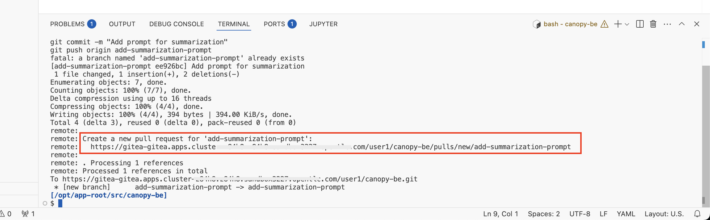
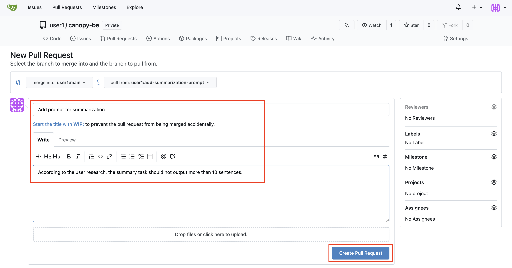
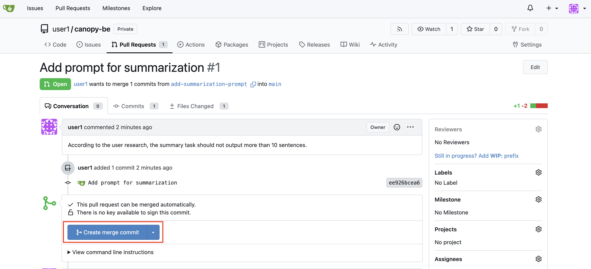
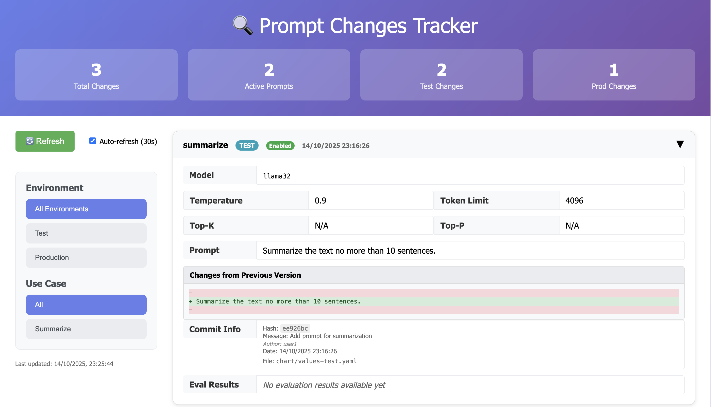
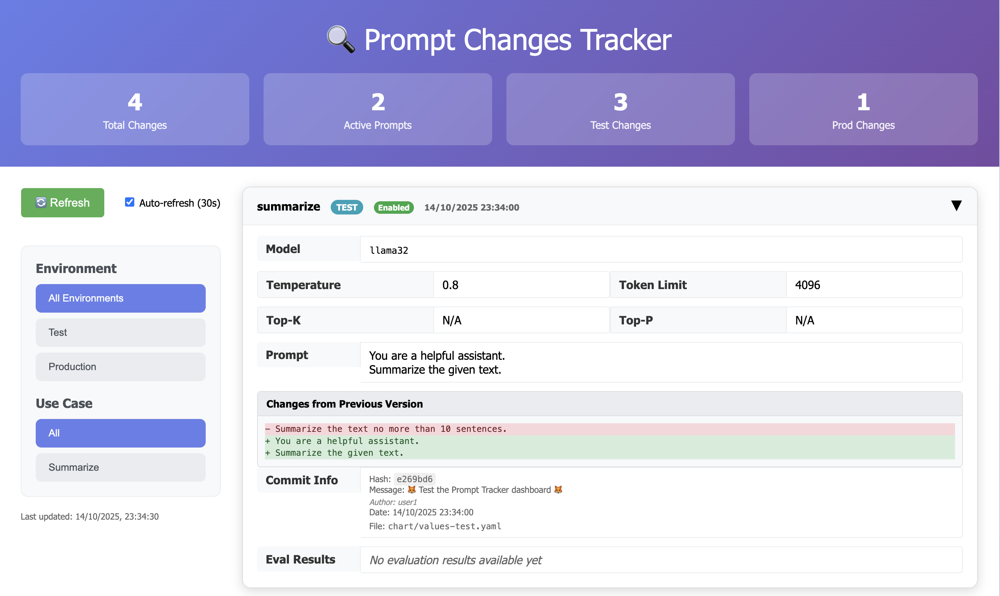

# 🗂️ Prompt Versioning

> *Organizing ideas into repeatable, structured formats.*

You’ve explored how prompt design can dramatically shape model behavior, it’s time to **bring order to your creativity**.

And you've already laid the foundation for prompt versioning by keeping the prompts in Git. With this module, we'll dive a bit deeper on why and how to move from one-off prompt experiments to versioned, auditable, reusable prompt templates.

### 🎯 Why Prompt Versioning Matter

Think of a good prompt like a well-written function or component. Once you get it right, you want to **reuse it** across different apps and users.

But in GenAI workflows, we face a big challenge: Prompt experiments are often **invisible**, **untracked**, and **not reusable**.

This makes collaboration hard and reproducibility nearly impossible—especially at scale.

That’s where **prompt versioning** and a **prompt registry** concept come in. And we know that Git provides traceability, visibility, auditability so why not using Git as the prompt registry, right?

## 🧱 Storing a Prompt

You already standardized your prompts using a simple format that captures:

<div class="highlight" style="background: #f7f7f7">
<pre><code class="language-yaml">
LLAMA_STACK_URL: "http://llama-stack-service:8321"
summarize:
  enabled: true
  model: vllm-llama32/llama32
  prompt: |
    Give me a good summary of the following text.
</code></pre>
</div>

There are a variety of different strategies here on where to store your prompts and how to load them into the backend.  
In our case, we store this inside the Canopy backend repo, as the person who develops the backend is likely the same persona who iterates on the prompts.

More specifically, we load them into a ConfigMap which then gets mounted to our backend pod. This way, we can make sure that when the `values.yaml` file changes, Argo CD updates the ConfigMap, and the pod automatically is restarted with the latest prompt.


## 🧪 Updating a prompt

1. Go to your `backend` folder in your workbench and update the `values-test.yaml` file to have a new prompt. Perhaps something like `Summarize the text no more than 10 sentences.` 

2. Then commit & push the changes:

    ```bash
    cd /opt/app-root/src/backend
    git checkout -b add-summarization-prompt
    git add chart/values-test.yaml
    git commit -m "Add prompt for summarization"
    git push origin add-summarization-prompt
    ```

3. When you run the above commands, the output gives you a link to open a Pull Request as below.

    

    Open up that link and document why you picked this prompt. Perhaps your user research revealed that people need summary not longer than 10 sentences. This adds narrative and visibility to prompt decisions. And then click `Create Pull Request`.  

    

4. When your Pull Request is accepted, the new prompt lands in test environment with all the necessary audit and traces.
   So hit `Create merge commit` and accept the incoming change.

    

5. If you go and chat with Canopy now you can see how it reacts differently as it uses the new prompt.  
    If you are really curious you can also see how the config which the backend is reading from has changed: [https://console-openshift-console.<CLUSTER_DOMAIN>/k8s/ns/<USER_NAME>-test/configmaps/canopy-config](https://console-openshift-console.<CLUSTER_DOMAIN>/k8s/ns/<USER_NAME>-test/configmaps/canopy-config)

## Prompt Tracker

We use Git to track our changes and able to tell which prompts and settings are at the moment effective in Canopy, or _were_ at a given time. But going through a Git commit history and figure out such answer can be tedious. For that reason we built and deploy a tracker for you to visualize your changes. 

You can find the link in the Quick Link drop down or simply clicking [here](https://prompt-tracker-ai501.<CLUSTER_DOMAIN>/<USER_NAME>/<CLUSTER_DOMAIN>). 

It helps us to visualize and track changes to model and prompt configurations in Git repositories.




### Testing the Prompt Tracker

To test the prompt tracker, try making another change to your model configuration and/or prompt:

1. First let's pull the changes after merging the previous PR.

    ```bash
    cd /opt/app-root/src/backend
    git checkout main
    git pull
    ```

2. Edit your prompt in the `chart/values-test.yaml` file in the `backend` repository. 

3. Let's commit and push these changes (directly pushing `main` for simplicity)

    ```bash
    cd /opt/app-root/src/backend
    git add .
    git commit -m  "🦊 Test the Prompt Tracker dashboard 🦊"
    git push origin main
    ```

4. Watch the dashboard update with your new changes or hit `Refresh` if you don't want to wait.

    

The dashboard will automatically detect this push and display it in a new card with the changes, the commit information and author details. 

---

## 🌿 Using the New Prompt

Since we already set up the backend before, every change you make to your prompts will now automatically be used in the backend.

This makes your prompts dynamic and auditable, any changes to prompts go through Git. You don't have to rebuild the backend for prompt changes.

You can now go to your Canopy UI and try out your new prompt!
