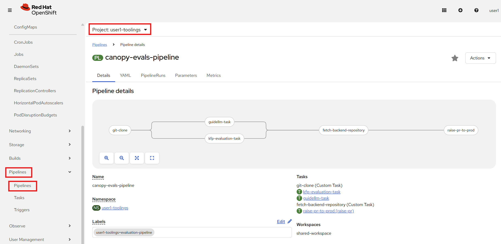
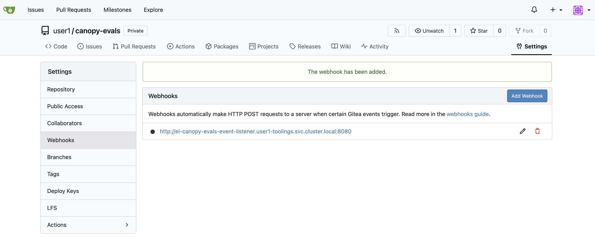
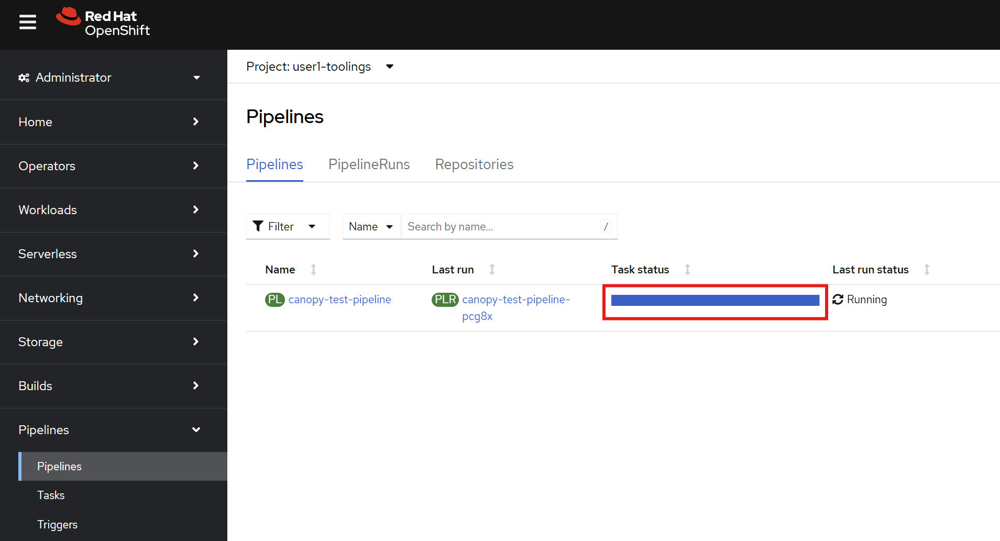

# Automatically trigger on git changes

Now that we have successfully ran our evaluation pipeline (🎉), we would like it to run automatically everytime we make a change to our tests, prompts, or backend.  
To do this, we can create a Tekton pipeline with a git hook to the relevant repos. This Tekton pipeline will then trigger our evaluation kubeflow pipeline. 🔗

## Update Llama Stack in test

Just like we enabled evaluations for Llama Stack in our `experimentation` envirionment, we need to enable it for our `test` environment.

1. Open up your workbench in the `<USER_NAME>-canopy` namespace.

2. Inside of `genaiops-gitops/canopy/test/llama-stack/config.yaml` add this line:
    ```yaml
    eval:
        enabled: true
    ```

    Your final `config.yaml` should look something like this:

    ```yaml
    chart_path: charts/llama-stack-operator-instance
    eval:
        enabled: true
    ```

3. Let's push the changes for Argo CD to pick it up.

    ```bash
    cd /opt/app-root/src/genaiops-gitops
    git add .
    git commit -m  "🤔 enable evaluation 🤔"
    git push 
    ```

## Install Pipeline Server

We also need to set up our pipeline server for our `toolings` namespace, but this time we will do it with ArgoCD.

1. Like before, open your workbench in the `<USER_NAME>-canopy` namespace.

2. Let's add a dspa (which stands for DataSciencePipelineApplication, and is our pipeline server) folder and config.yaml under `genaiops-gitops/canopy/toolings`, you can do that by running these commands:
    ```bash
    mkdir /opt/app-root/src/genaiops-gitops/toolings/dspa
    touch /opt/app-root/src/genaiops-gitops/toolings/dspa/config.yaml
    ```
    We don't have any specific settings inside for our dspa, so we can leave the config.yaml blank

3. Inside of `genaiops-gitops/canopy/toolings/dspa/config.yaml` add this:
    ```yaml
    ---
    chart_path: charts/dspa
    ```

4. Let's push the changes for Argo CD to pick it up.

    ```bash
    cd /opt/app-root/src/genaiops-gitops
    git add .
    git commit -m  "🪈 Set up our pipeline server 🪈"
    git push 
    ```

Great, now you are all set up!  

## Trigger our Kubeflow pipeline through a Tekton pipeline

Now we are ready to set up automatic runs of our Kubeflow pipeline!  
We will be triggering it from a Tekton Pipeline, where we both will have a step for our Llama Stack Evals and for GuideLLM.  
If you want to take a look at the Tekton Pipeline yamls, you can find them under `canopy-evals/test-pipeline/canopy-tekton-pipeline`.

1. Let's deploy the Tekton pipeline through ArgoCD. Start by running: 

    ```bash
    mkdir /opt/app-root/src/genaiops-gitops/toolings/evaluation-pipeline
    touch /opt/app-root/src/genaiops-gitops/toolings/evaluation-pipeline/config.yaml
    ```
    This will create a config file inside `genaiops-gitops/toolings/evaluation-pipeline`.

2. Open up the `evaluation-pipeline/config.yaml` file and paste the below yaml to config.yaml.

    ```yaml
    repo_url: https://gitea-gitea.apps.<CLUSTER_DOMAIN>/<USER_NAME>/canopy-evals.git
    chart_path: test_pipeline/canopy-tekton-pipeline
    USER_NAME: <USER_NAME>
    kfp:
        baseUrl: http://llama-stack.<USER_NAME>-test.svc.cluster.local:80
        backendUrl: http://canopy-backend.<USER_NAME>-test.svc.cluster.local:8000
    ```

    As you may have noticed, we are pointing our base (Llama Stack) url and backend url to our test namespace, as that's what we want to run our tests on.

3. And finally commit and push it to git, as it only counts if it's in git 😉

    ```bash
    cd /opt/app-root/src/genaiops-gitops
    git add .
    git commit -m "🚄 Evaluation Pipelines 🚄"
    git push
    ```

4. Now let's look at it by going to the OpenShift Dashboard -> Pipelines -> user<USER_NAME>-toolings -> `canopy-test-pipeline`. You can see that all it does is a simple git clone followed by starting the kubeflow pipeline.  

    

5. Great, we have our pipeline! However, so far we would still need to trigger it manually, the only difference from before is that we now trigger a Tekton pipeline that then triggers our Kubeflow pipeline and nothing more...

    

    To get some use of our Tekton pipeline, let's make it trigger automatically from our git repos.  
    Start by going to Gitea.

6. Inside of Gitea, navigate to your `canopy-evals` repository.

7. Go to Settings -> Webhooks

8. Click `Add` and choose Gitea

9. Enter `http://el-canopy-test-event-listener.<USER_NAME>-toolings.svc.cluster.local:8080` -> click Add

    

10. Now we can test if this worked by clicking on `Test webhook connection`.  
    You can go to the pipeline view in OpenShift to see if the pipeline started properly.  

    

11. Now do the same for `canopy-backend`.   
    Here we also have a filter in our Trigger so that only changes to the Values.yaml file (in other words the prompts) will trigger the pipeline. If you are interested, you can take a look in `canopy-eval/test_pipeline/canopy-tekton-pipeline/templates/triggers/triggers.yaml`.

12. Whenever the pipeline is ran it produces and saves the results in a MinIO bucket called `test-results`. Go there and see how well your tests performed: `https://minio-ui-<USER_NAME>-toolings.<CLUSTER_DOMAIN>/browser/test-results` 

Congratulations! 🎉  
You have now added testing pipelines to your backend and eval repos, so whenever you update your evaluations or prompts, you will run through the tests.  
In practice we would also run the tests whenever we build a new backend, but since we are using pre-built backend images we are skipping that for now.

## Try updating your evaluations

So far, we have only ran the pipeline with predefined tests, let's go and add some useful tests on our own 🧪

1. Go to your workbench and enter the `canopy-evals/Summary` folder.  
    In there you can find all the tests related to our Summary usecase, specifically inside the file `summary_tests.yaml` which should look something like this:
    ```yaml
    name: summary_tests
    description: Tests for the summary prompts of the Llama 3.2 3B model.
    endpoint: /summarize
    scoring_params:
        "llm-as-judge::base":
            "judge_model": llama32
            "prompt_template": judge_prompt.txt
            "type": "llm_as_judge"
            "judge_score_regexes": ["Answer: (A|B|C|D|E)"]
        "basic::subset_of": null
    tests:
    - prompt: "Llama 3.2 is a state-of-the-art language model that excels in various natural language processing tasks, including summarization, translation, and question answering."
        expected_result: "Llama 3.2 is a top-tier language model for NLP tasks."
    - dataset: "huggingface:small-canopy-qa"
    ```
    Add a couple more tests, here is one example to get you started:
    ```yaml
     - prompt: "Artificial intelligence and machine learning have revolutionized numerous industries in recent years. From healthcare diagnostics that can detect diseases earlier than human doctors, to autonomous vehicles that promise safer transportation, to recommendation systems that personalize our digital experiences, AI technologies are becoming increasingly sophisticated. However, these advances also bring challenges including ethical concerns about bias in algorithms, job displacement due to automation, and the need for robust data privacy protections."
        expected_result: "AI and ML have transformed industries through healthcare diagnostics, autonomous vehicles, and recommendation systems, but also raise concerns about bias, job displacement, and privacy."
    ```

2. After you have finished adding your new tests, commit them to git, watch the pipeline run, and see how the results turn out:
    ```bash
    cd /opt/app-root/src/canopy-evals
    git add .
    git commit -m "📖 New Evals 📖"
    git push
    ```