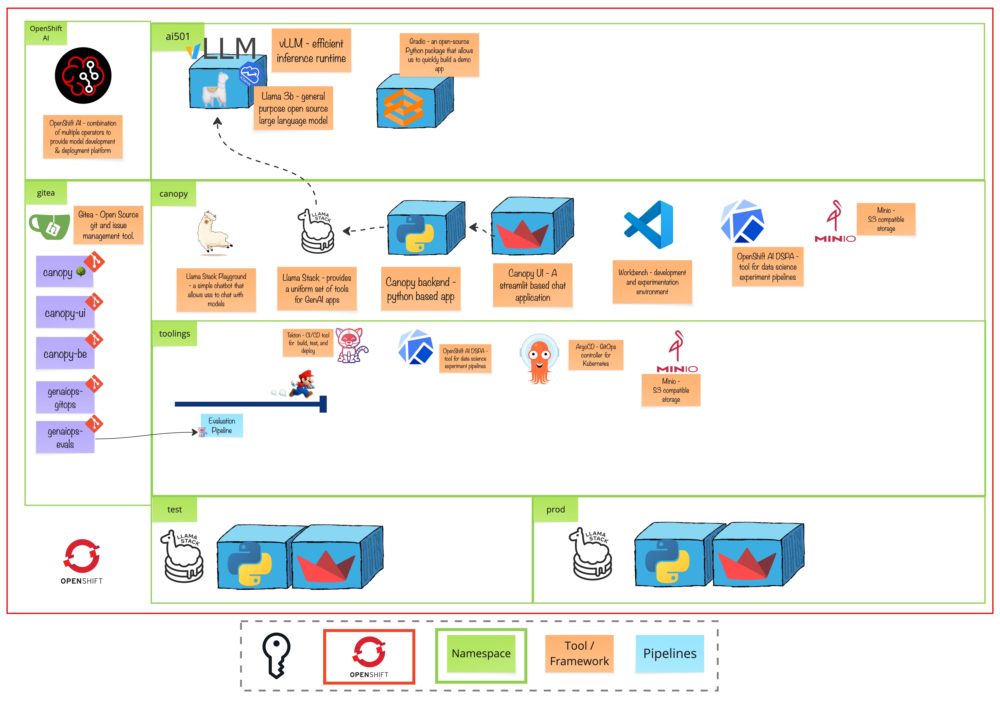

# Module 4 - Ready to Scale 201

> Elevate your AI applications from deployment to production-grade quality with prompt versioning, evaluation frameworks, and automated pipelines.

# 🧑‍🍳 Module Intro

This module takes your GenAI application to the next level by introducing essential production practices. You'll learn how to version and track prompts systematically, evaluate application quality using automated frameworks, and build CI/CD pipelines that ensure your AI system remains reliable and performant as it scales.

# 🖼️ Big Picture

# 🔮 Learning Outcomes

* Learn how to version and manage prompts as code using Git and GitOps practices
* Understand evaluation strategies for GenAI applications and implement automated testing
* Build evaluation pipelines using Kubeflow to systematically measure application quality
* Automate evaluation workflows with Tekton for continuous integration and deployment

# 🔨 Tools used in this module

* [Llama Stack Eval API](https://llama-stack.readthedocs.io/en/latest/) - Framework for evaluating LLM responses against expected outputs
* [GuideLLM](https://github.com/neuralmagic/guidellm) - Performance testing tool for measuring LLM throughput and latency
* [Kubeflow Pipelines](https://www.kubeflow.org/docs/components/pipelines/) - Platform for building and orchestrating machine learning workflows
* [Tekton](https://tekton.dev/) - Cloud-native CI/CD framework for automating build, test, and deployment pipelines
