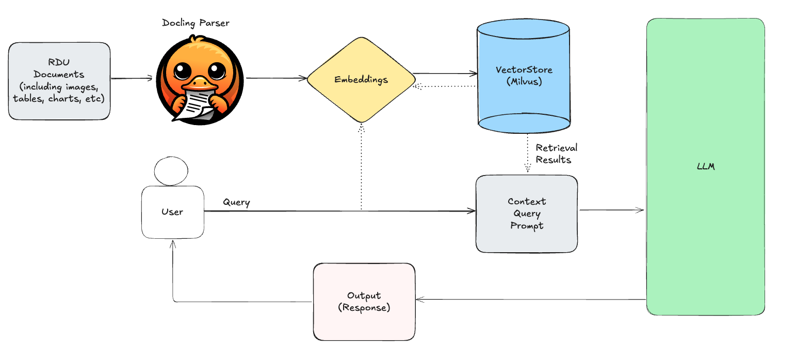
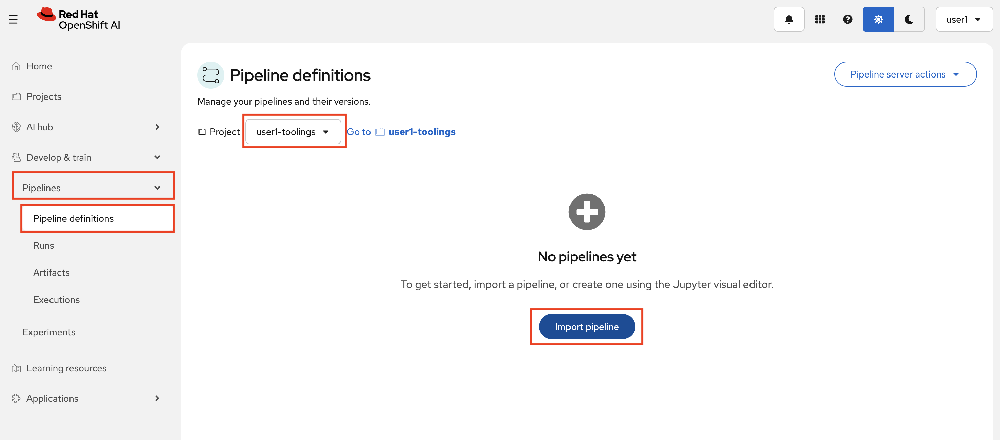
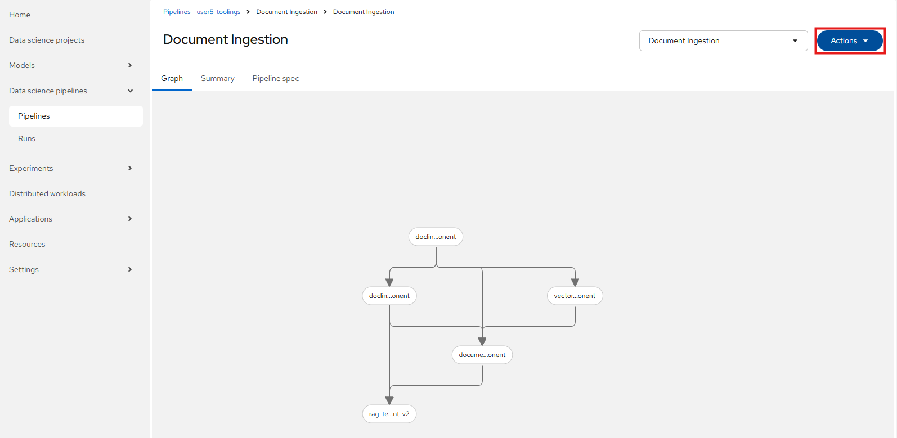
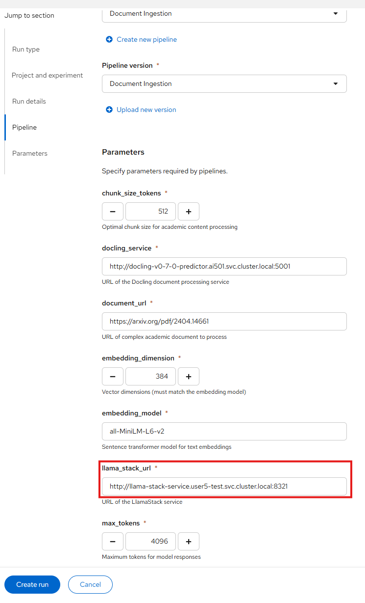
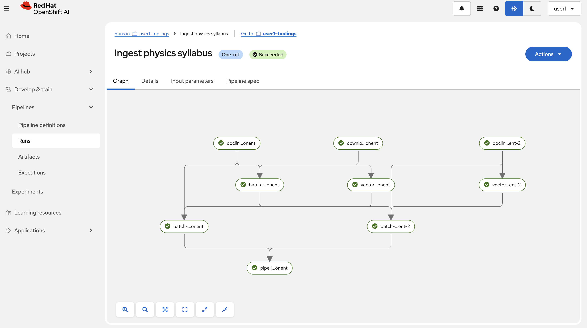
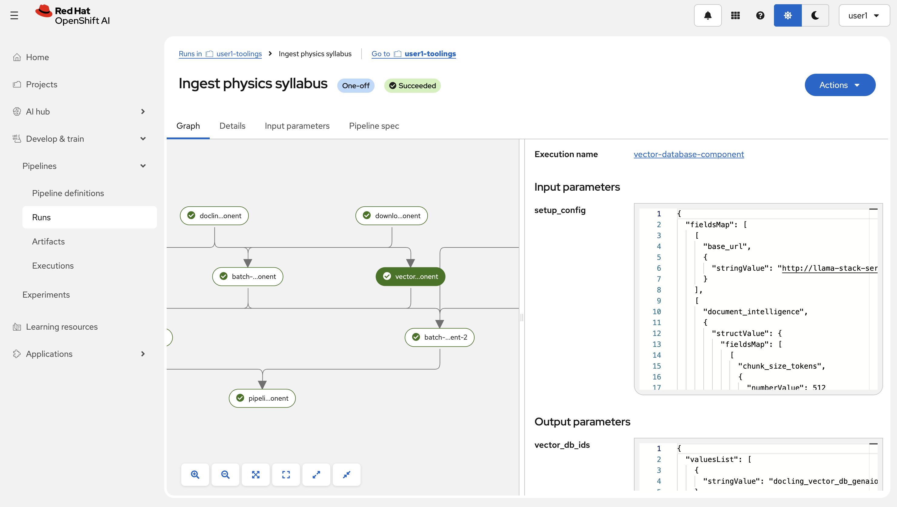

# 🌳 Automating RAG with KFP Pipelines

Your document intelligence RAG system works brilliantly in notebooks, but what happens when you need to process hundreds of research papers for your educational platform? 
Manual execution doesn't scale, and RDU needs reliable, always-available intelligent document processing.

## 🔍 Introducing (Again) KFP Pipelines

Now we'll use **Kubeflow Pipelines (KFP)** to transform your experimental RAG system into a production-grade platform that can handle complex academic documents automatically and at scale.

## 🏗️ Document Intelligence RAG Pipeline Architecture

Here is the current architecture we are working with and want to automate.  
We are specifically looking to automate the top part, how new documents go into our vector database.



## 🎯 Running Your Production Pipeline

Time to deploy your document intelligence RAG system in production!

1. First, set up persistent storage for content transfer between pipeline stages. One stage might download the documents, the next stage might transform them, and later stage might process them further. Persistent storage ensures each stage can access the outputs of the previous one.

   ```bash
   oc apply -f canopy/5-rag/4-kfp-pipeline-pvc.yaml -n <USER_NAME>-prod
   ```

   This creates a `canopy-workspace-pvc` that allows pipeline components to share processed document content efficiently.

2. Open `canopy/5-rag/6-kfp_pipeline.py`, this is your document processing pipeline. It will:
   - Set up Docling
   - Process the documents
   - Connect to your vector database
   - Add the processed documents to the database
   - And finally, run a test to make sure everything worked well


   Much of this processed is based on these settings/arguments you can find close to the bottom of the pipeline code, review them quick to see that we are doing the same thing as before, now just automated:

   ```python
   arguments = {
       "document_url": "https://arxiv.org/pdf/2404.14661",        # Research paper URL
       "test_queries": [
           "What is the PRFXception mentioned in the document?",   # Academic concept query
       ],
       "embedding_model": "all-MiniLM-L6-v2",                     # Optimized for education
       "embedding_dimension": 384,                                 # Performance-balanced
       "chunk_size_tokens": 512,                                   # Academic content chunks
       "vector_provider": "milvus",                                # Production vector DB
       "docling_service": "http://docling-v0-7-0-predictor.ai501.svc.cluster.local:5001",
       "processing_timeout": 180,                                  # 3 min for complex docs
       "llama_stack_url": "http://llama-stack-service:8321",      # AI inference service
       "model_id": "llama32",                                      # Educational LLM
       "temperature": 0.0,                                         # Deterministic responses
       "max_tokens": 4096                                          # Comprehensive answers
   }
   ```

3. If we were to just run the pipeline here we would run it against our `<USER_NAME>-canopy` namespace, but we want to run it against test and prod instead.  
   To do that, let's export it, run it on a schedule in our `toolings` namespace and point it to test and prod. This way we could ingest new documents on a schedule.
   To export our pipeline, compile it by running
   ```bash
   cd /opt/app-root/src/canopy/5-rag
   python 4-kfp_pipeline.py
   ```
   And then download the file `canopy/5-rag/document-intelligence-rag.yaml` to your local machine.
   

4. Go to OpenShift AI and enter your `user5-toolings` project. In there, go to `Pipelines` and click `Import pipeline`.

   

5. Give the pipeline a good name, like `Document Ingestion`, and the upload the yaml file you just downloaded.

6. Let's start by running it ad-hoc to make sure it works, press on `Actions` in the pipeline view and `Create run`

   

7. Give the run a name, like `Ingest research article`, and then change the Llama Stack url to `http://llama-stack-service.<USER_NAME>-test.svc.cluster.local:8321` to point it to the Llama Stack in our test environment. It should look something like this:

   

8. Press `Create run` to start running the pipeline 🏃‍♀️

9. We can monitor the progress of our pipeline in OpenShift AI.

   

   The run should take about 5-6 minutes to finish.

10. Click on one of the steps to access information about inputs, outputs, and logs:

   

11. After this is done you will see a new collection in Attu, check it out: 
   ```
   https://milvus-test-attu-<USER_NAME>-test.<CLUSTER_DOMAIN>
   ```

### What You've Built

🎉 **Congratulations!** You now have a production-ready document processing pipeline that we can use to ingest documents into our test and producion databases at scale.

Continue to **[🌳 Integrating RAG within Canopy](5-rag-Canopy.md)** to enable our RAG feature inside our application! 🚀 