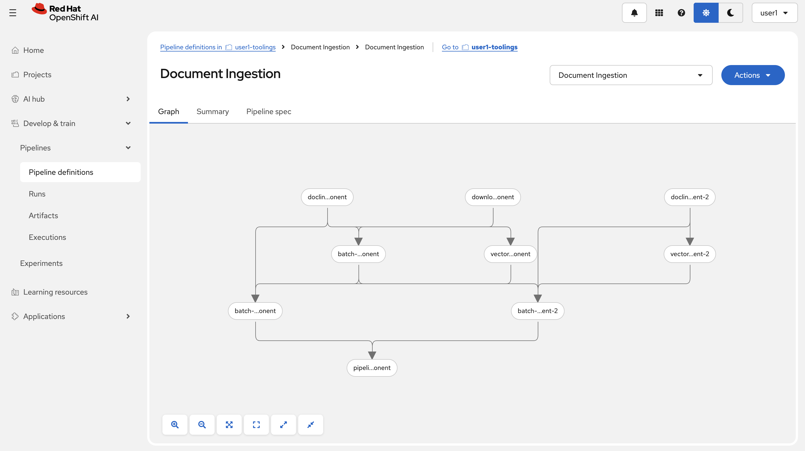
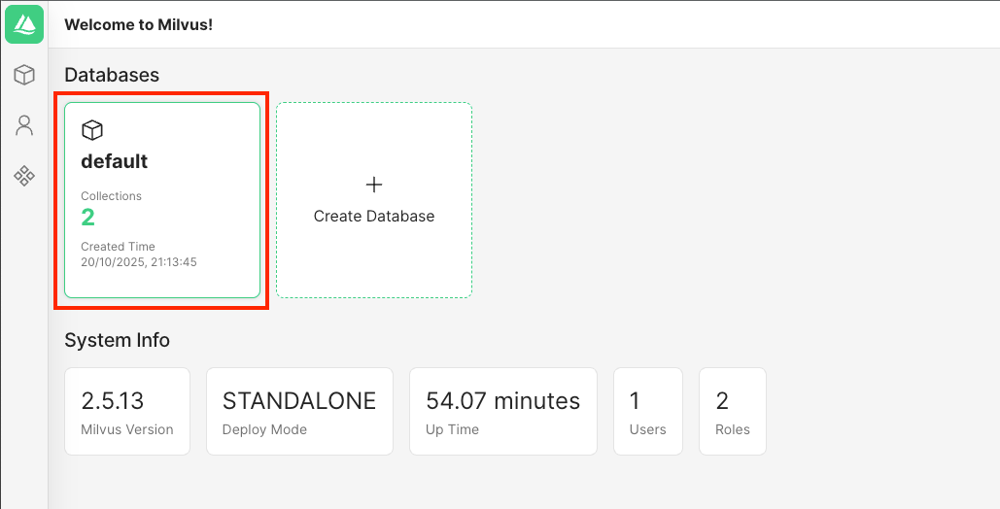

# 🌳 Automating RAG with KFP Pipelines

Your document intelligence RAG system works in notebooks, but what happens when you need to process many documents? 
Manual execution doesn't scale, and RDU needs reliable, always-available intelligent document processing.

## 🔍 Introducing (Again) KFP Pipelines

Now we'll use **Kubeflow Pipelines (KFP)** to transform your experimental RAG system into a production-grade platform that can handle complex academic documents automatically and at scale.

## 🏗️ Document Intelligence RAG Pipeline Architecture

Here is the current architecture we are working with and want to automate.  
We are specifically looking to automate the top part, how new documents go into our vector database.


## Prepare the Storage Environment

1. We are going to use the existing MinIO as our document storage, but we need one extra bucket for the documents. Let's update `genaiops-gitops/toolings/minio/config.yaml` as below:

   ```yaml
   ---
   chart_path: charts/minio
   buckets:
   - name: pipeline
   - name: test-results
   - name: documents # 👈 add this one
   ```

2. Let's commit this change!

   ```bash
   cd /opt/app-root/src/genaiops-gitops
   git add .
   git commit -m  "🪣 ADD - document bucket 🪣"
   git push
   ```

3. But which document we are going to ingest, you asked! We are going to ingest RDU's syllabus for different programs! Let's head to the RDU's website (what? you didn't think we had a website 😒). 

   [🌲 Redwood Digital University website](https://rdu-website-ai501.<CLUSTER_DOMAIN>)

   Head over to the webpage, look through the programs and download the syllabus from your favourite program! Save it locally, we are going to upload it to `documents` bucket in MinIO. 

4. Go to your [MinIO instance](https://minio-ui-<USER_NAME>-toolings.<CLUSTER_DOMAIN>) and login with your credentials.

5. Under `Object Browser`, go to `documents` bucket and drop the PDF you downloaded. 

   

   

6. Now that we have the documents to ingest, let's create a document ingestion pipeline to move them into our vector database!

## 🎯 Running the Document Ingestion Pipeline

Time to run yet another pipeline!

1. Open `backend/rag-pipeline/kfp_pipeline.py`, this is your document processing pipeline. It will:
   - Connects to Docling
   - Process the documents
   - Connect to your vector database
   - Add the processed documents to the database

   Much of this processed is based on these settings/arguments you can find close to the bottom of the pipeline code, review them quick to see that we are doing the same thing as before, now just automated:

    <div class="highlight" style="background: #f7f7f7; overflow-x: auto; padding: 8px;">
    <pre><code class="language-python"> 
   arguments = {
        "minio_secret_name": "documents", 
        "minio_bucket_name": "documents",  
        "embedding_model": "all-MiniLM-L6-v2",
        "embedding_dimension": 384,
        "chunk_size_tokens": 512,
        "vector_provider": "milvus",
        "docling_service": "http://docling-v0-7-0-predictor.ai501.svc.cluster.local:5001",
        "processing_timeout": 180,
        "llama_stack_url": "http://llama-stack-service:8321",            # We will update these values later
        "prod_llama_stack_url": "http://llama-stack-service-prod:8321",  # We will update these values later
        "model_id": "llama32",
        "temperature": 0.0,
        "max_tokens": 4096,
        "vector_db_id": "docling_vector_db_genaiops",  
        "test_vector_db_alias": "latest" 
    }
   </code></pre>
   </div>

2. Let's export it to run it in our `<USER_NAME>-toolings` namespace and point it to test and prod.
   To export our pipeline, compile it by running
   ```bash
   cd /opt/app-root/src/backend/rag-pipeline
   python kfp_pipeline.py
   ```
   It should generate a file called `document-intelligence-rag.yaml`. Download it to your local machine.
   

3. Go to OpenShift AI and enter your `<USER_NAME>-toolings` project. In there, go to `Pipelines` and click `Import pipeline`.

   

4. Give the pipeline a good name, like `Document Ingestion`, and the upload the yaml file you just downloaded.

   

5. Let's start by running it ad-hoc to make sure it works, press on `Actions` in the pipeline view and `Create run`

6. Give the run a name, like `Ingest physics syllabus`, and then change the Llama Stack values as below:

   `llama_stack_url`: http://llama-stack-service.<USER_NAME>-test.svc.cluster.local:8321

   `prod_llama_stack_url`: http://llama-stack-service.<USER_NAME>-prod.svc.cluster.local:8321


   It should look something like this:

   

7.  Press `Create run` to start running the pipeline 🏃‍♀️

8.  We can monitor the progress of our pipeline in OpenShift AI.

   

   The run should take about 5-6 minutes to finish.

9.  For the curious ones, click on one of the steps to access information about inputs, outputs, and logs:

   

10. After this is done you will see a new collection in Attu, check it out: 
   ```
   https://milvus-test-attu-<USER_NAME>-test.<CLUSTER_DOMAIN>
   ```

   

### What You've Built

🎉 **Congratulations!** You now have a production-ready document processing pipeline that we can use to ingest documents into our test and producion databases at scale.

Continue to the next section to enable our RAG feature inside our application! 🚀 