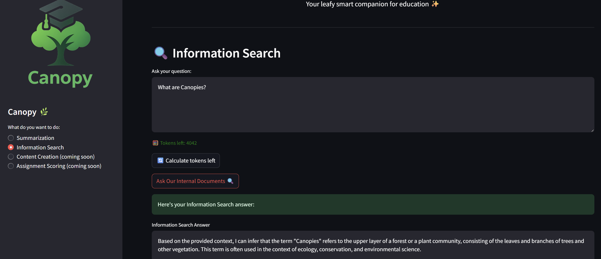

# 🌐 Powering Canopy with RAG Capabilities

Now that you have a production-ready document intelligence RAG pipeline processing academic papers automatically, it's time to bring this powerful capability directly to your students through an intuitive web interface.

**Canopy** transforms your automated RAG system into an interactive educational platform where students ask intelligent questions, and receive comprehensive answers backed by document intelligence.

Your production pipeline handles the heavy lifting in the background, while Canopy provides the user-friendly frontend that makes document intelligence accessible to everyone.

## Integrate RAG into Canopy

The Canopy application we deployed already has RAG built-in as you may have seen from the feature list on the left, we just need to enable the feature flag.

1. Go to your workbench and open the file `canopy-be/chart/values-test.yaml`

2. Edit the file to contain the `informatino-search` feature flag. Feel free to change the prompt, this is the system prompt just like before.

    ```yaml
    LLAMA_STACK_URL: "http://llama-stack-service:8321"
    summarize:
     enabled: true
     model: llama32
     temperature: 0.9
     max_tokens: 4096
     prompt: |
       You are a helpful assistant. Summarize the given text please.
    information-search:
     enabled: true
     model: llama32
     prompt: |
       You are a helpful assistant specializing in document intelligence and academic content analysis.
    ```

3. Push the change to git:

    ```bash
    cd /opt/app-root/src/canopy-be/chart
    git add values-test.yaml
    git commit -m "🔨 RAG feature added 🔨"
    git push
    ```

4. Open the Canopy UI (https://canopy-ui-<USER_NAME>-test.<CLUSTER_DOMAIN> if you have closed it since last time), change to the Information Search feature in the left menu and ask something like `What are Canopies?`

    

Congratulations! 🎉  
You now have a fully functioning RAG system where you can ingest complex documents as needed.