## Automate the Flow with Tekton

1. Let's automate this whole flow when there is a new document uplaoded to MinIO! For that we need to deploy a Tekton pipeline to handle triggering the kfp as well as some surrounding ops tasks (very similar to what we did in Ready to Scale 201).
    In the end, the whole flow will look like this:

    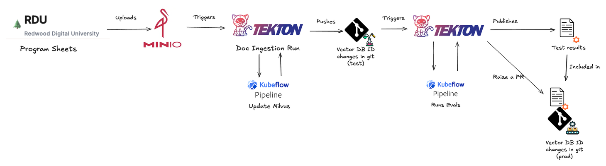


Let's deploy the Tekton pipeline by creating a folder under `genaiops-gitops/toolings` as below:

  ```bash
  mkdir -p /opt/app-root/src/genaiops-gitops/toolings/doc-ingestion-pipeline
  touch /opt/app-root/src/genaiops-gitops/toolings/doc-ingestion-pipeline/config.yaml
  ```

2. Update the `config.yaml` file:

    ```yaml
    chart_path: charts/canopy-doc-ingestion-pipeline
    username: <USER_NAME>
    cluster_domain: <CLUSTER_DOMAIN>
    ```

3. Commit and push changes as always.

    ```bash
    cd /opt/app-root/src/genaiops-gitops
    git add .
    git commit -m "🦁 RAG doc ingestion pipeline added 🦁"
    git push
    ```

4. This pipeline will give you a webhook to add to MinIO so that when we upload a file, MinIO can trigger the Tekton pipeline.  
Go to MinIO ([https://minio-ui-<USER_NAME>-toolings.<CLUSTER_DOMAIN>](https://minio-ui-<USER_NAME>-toolings.<CLUSTER_DOMAIN>)) > Events and click on `Add Event Destination` on the right top. Select `Webhook`:

    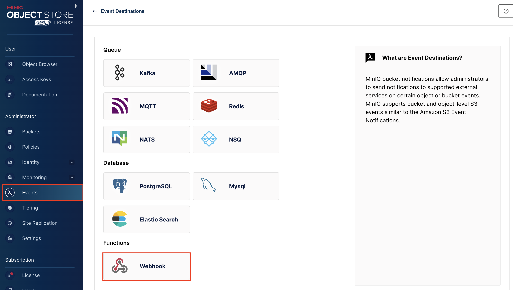

5. Fill out the form with these two information:

    Identifier: `doc-ingestion-webhook`

    Endpoint: `http://el-canopy-doc-ingestion-event-listener.<USER_NAME>-toolings.svc.cluster.local:8080`

    ..and hit `Save Event Destination`.

    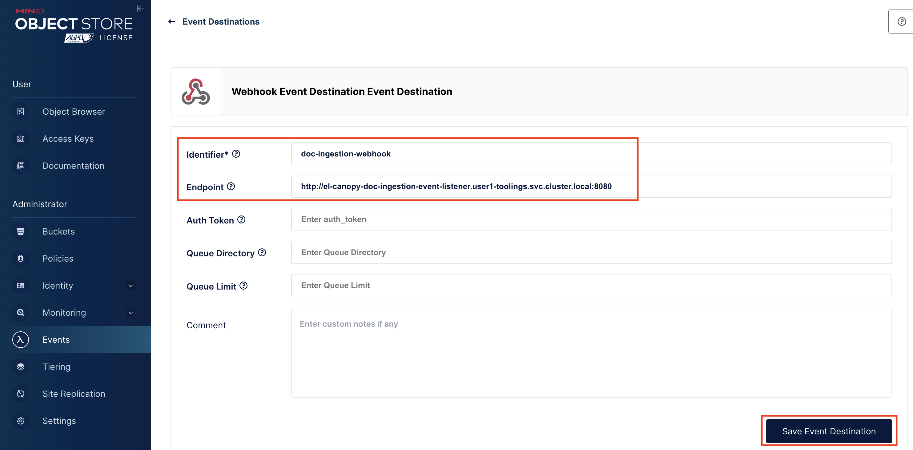

6. Strangely on top, MinIO will ask you to restart it to make the configuration takes effec. Click `Restart` and just refresh the page 🤷

    

7. Now, let's associate this webhook with `documents` bucket. Go to Buckets > `documents` > Events and click `Subscribe to Event`. Select your newly created webhook from the dropdown menu of ARN, and check `PUT - Object Uploaded` as the event. `Save` your changes. You don't have to restart it again :)

    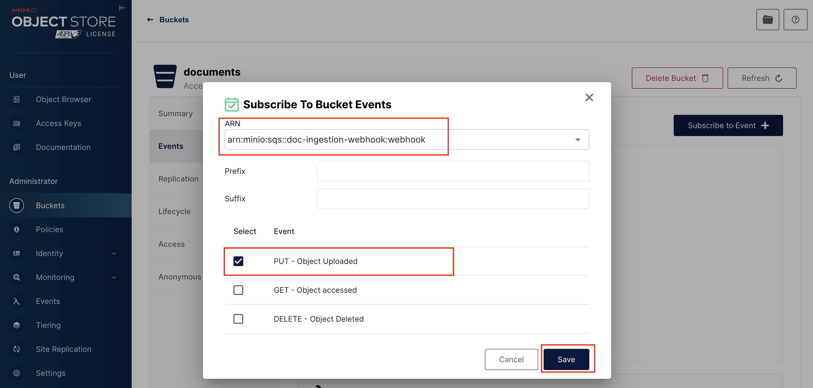

8. Now, you can download yet another syllabus that your choice from [RDU website](https://rdu-website-ai501.<CLUSTER_DOMAIN>) and upload it to `documents` bucket. You need to go to `Object Browser` > `documents` for it.

    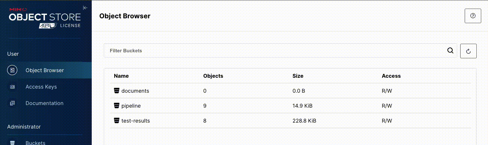

9. After you upload the PDF, go to `OpenShift console` > `Pipelines` and observe that a pipeline is triggered.

    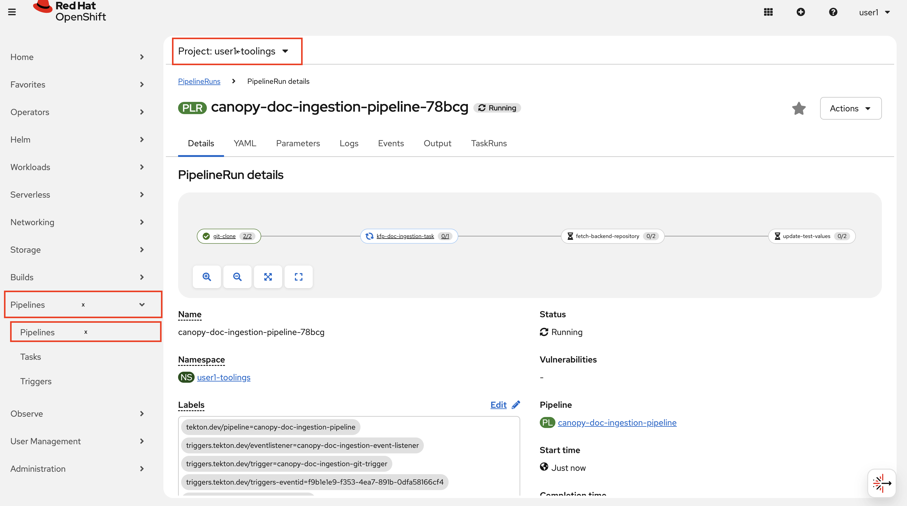

10. And if you go back to the OpenShift AI console, you'll see that doc-ingestion Kubeflow Pipeline is running:

    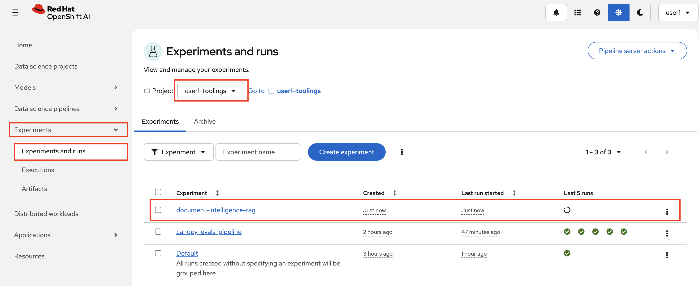

11. After the pipeline finish, you'll see a automated push happened in `backend` repository. 

    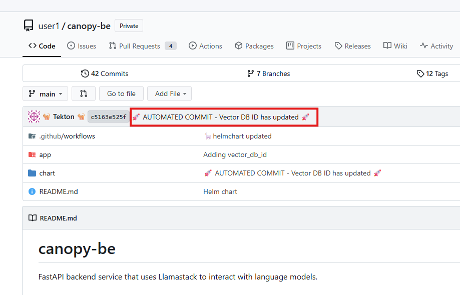

    And what happens when we see an update in `backend`?
    You guessed it, we trigger the evals pipeline! 

    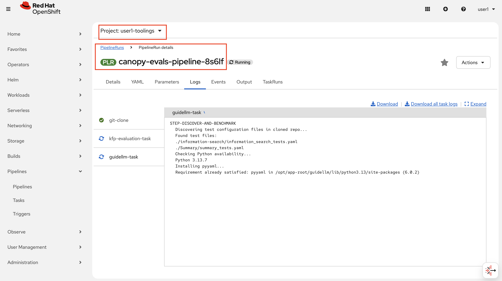

    After the eval pipeline finishes, you can find a PR in `backend` repository to update vector DB ID in production.   
    In the description, you'll see a link to evaluation results. You need to check the results and decide whether to accept this change or go back and do some more test, more data ingestions etc.   
    You are the human in the loop here :)

    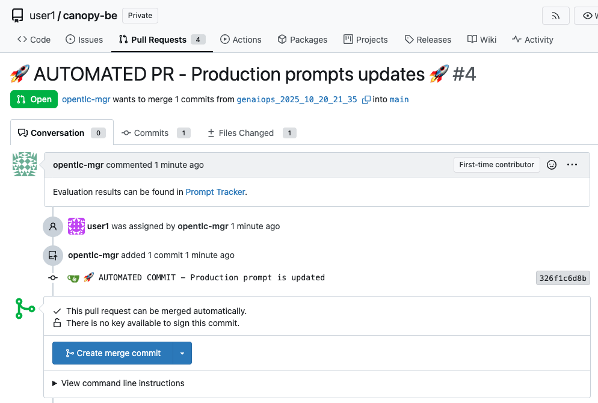

    And your evals doesn't cover anything related to the last PDF you uploaded?  
    Feel free to update your evals, add more prompt & expected result pairs (Prompt Engineering Yay!). 

    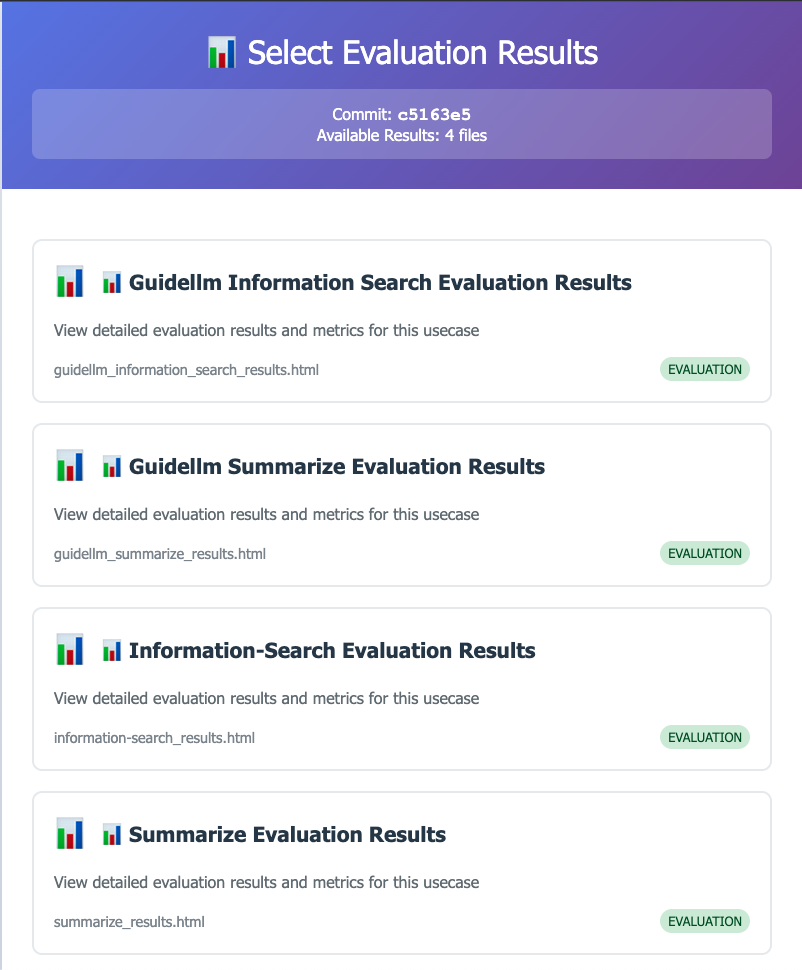
