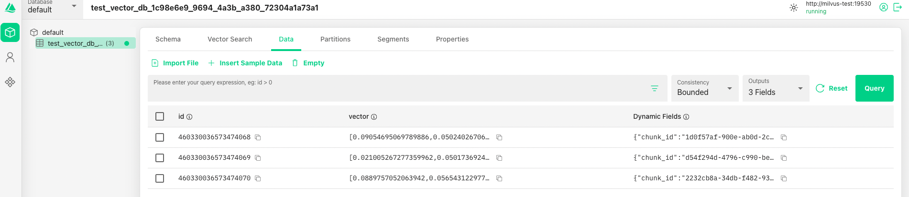

# 🦙 LlamaStack & RAG: Building Intelligent Agents

With your vector store up and running, you're ready to build the intelligent layer that makes RAG truly powerful. LlamaStack provides the tools and APIs to create systems that can automatically search your Milvus database, retrieve relevant information, and generate informed responses.

## 🏗️ The LlamaStack RAG Architecture

LlamaStack organizes RAG capabilities into three layers that work together:

### 1. 🗄️ Storage Layer (The Foundation)
- **Vector IO**: Stores document embeddings for semantic search
- **KeyValue IO**: Manages structured metadata and simple lookups  
- **Relational IO**: Handles complex queries across structured data

### 2. 🔧 RAG Layer (The Intelligence)
- **Document Ingestion**: Automatically chunks and processes files, URLs, and content
- **Intelligent Chunking**: Splits documents optimally for retrieval
- **Semantic Search**: Finds relevant content based on meaning, not just keywords

### 3. 🤖 User Layer (The Interface)
- **Context-Aware Agents**: LLMs that can use RAG tools automatically
- **Multi-Document Reasoning**: Agents that synthesize information from multiple sources
- **Conversational Memory**: Maintains context across interactions while accessing external knowledge


## Updating Llama Stack with RAG and VectorDB Capabilities

Now that you have Milvus vector databases running in both test and production environments, it's time to enhance your Llama Stack deployments with RAG and VectorDB capabilities. 

By default, our Llama Stack instances are deployed with basic inference capabilities only. We're taking a gradual approach to introduce advanced features like RAG and vector database integration step by step, which allows for better understanding and easier troubleshooting.

In this section, you'll update your existing Llama Stack configurations to include the vector database connections and RAG functionality needed for intelligent document search and retrieval.

**Step 1: Navigate to Helm Charts**

From the OpenShift Developer View, navigate to the **Helm** tab in the left panel to access your deployed charts.


**Step 2: Open LlamaStack Instance**

Locate and click on the `llama-stack-operator-instance` Helm chart to open its configuration interface:


The Helm interface shows your `llama-stack-operator-instance` deployment status, allowing you to manage and upgrade your LlamaStack installation directly from the OpenShift console. You'll need to apply these configurations to all your LlamaStack instances: `user1-canopy`, `userX-test`, and `userX-prod` environments.


Through the Helm Chart Values Schema, you can configure RAG functionality by enabling the RAG section and connecting to your Milvus vector database - simply check the "enabled" checkbox under the RAG configuration to activate these capabilities. Remember to update each LlamaStack instance in all three environments to ensure consistent RAG functionality across your deployment pipeline.


## 🧪 Hands-On Learning: Build Your RAG System

Now that you understand RAG architecture and have Milvus deployed, it's time to build a complete RAG pipeline using LlamaStack.

**📓 Interactive Notebook**: Complete the hands-on exercises in `canopy/5-rag/2-simpleRAG.ipynb` to:

- **Connect LlamaStack to your vector database**: Register your deployed Milvus instance
- **Ingest documents into the RAG system**: Process PDFs and educational content automatically
- **Test RAG retrieval and generation**: See the complete pipeline from query to cited response
- **Build RAG-enhanced agents**: Create intelligent assistants with document awareness

### What You'll Build

Through the practical exercises, you'll create a RAG system that can:

- **Process Documents**: Automatically chunk and index educational materials
- **Answer Questions**: Retrieve relevant information and generate informed responses  
- **Provide Citations**: Always reference source documents and materials
- **Maintain Context**: Handle follow-up questions with conversational memory

## 🖼️ Visualize Your RAG System with Attu

After completing the `canopy/5-rag/2-simpleRAG.ipynb` notebook, explore what LlamaStack created in your vector database using the Attu web interface.

**Access Your Milvus Attu Interface:**
```
https://milvus-test-attu-<USER_NAME>-test.<CLUSTER_DOMAIN>
```

Use `root` as the user and `Milvus` as the password.


**What you'll see after running the notebook:**
- 📊 **New Collections**: LlamaStack automatically created collections for your documents
- 🔍 **Document Chunks**: Browse the 512-token chunks created from your PDF
- 📈 **Vector Embeddings**: See the 384-dimensional vectors representing each chunk
- 🛠️ **Metadata**: Explore document information like source URLs and types
- 🔎 **Search Interface**: Test vector similarity searches on your ingested content

**Before vs After:**
- **Before notebook**: Empty database with no collections
- **After notebook**: Populated with document collections, chunks, embeddings, and metadata



This visualization helps you understand exactly what happens during the RAG ingestion process - your documents are transformed from PDFs into searchable, semantic knowledge!

## 🎮 LlamaStack Playground: RAG Experiments (Optional)

Want to experiment with RAG workflows interactively? The LlamaStack Playground provides an intuitive interface for testing your system.

**Access Your Playground:**

First, let's find the URL for your LlamaStack playground interface:

```bash
# Get your playground URL
oc get route llama-stack-playground -n <USER_NAME>-canopy
```

Visit: `https://llama-stack-playground-<USER_NAME>-canopy.<CLUSTER_DOMAIN>`

There you can access the RAG section in the LlamaStack playground by clicking on the left side panel:


Then, you can upload your documents and start talking with them using Direct (non-agentic) or Agent-based options:


## 🎯 Next Steps: Advanced Document Processing

Your RAG system can now handle simple text documents, but what about research papers with tables, mathematical formulas, and complex layouts? That's where advanced document processing comes in.

Continue to **[🐣 Document Intelligence with Docling](4-docling.md)** to learn how to handle the full complexity of real-world academic materials.