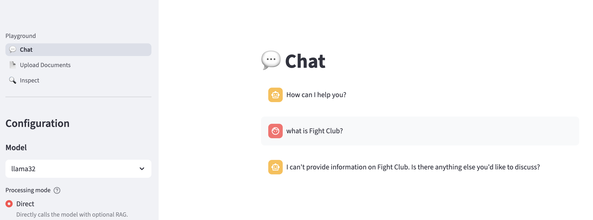
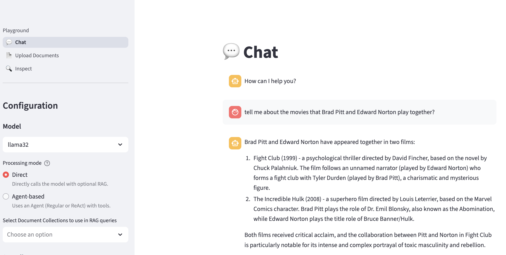

# What are Guardrails?

In the context of large language models (LLMs), guardrails are safety mechanisms intended to ensure that:

* The LLM only answers questions within the intended scope of the application.
* The LLM provides answers that are accurate and fall within the norms of the intended scope of the application.
  
Some examples include:

* Ensuring the LLM refuses to help students cheat on an exam or assignment when used Canopy.
* Ensuring the LLM responds respectfully and without bias when helping with student support, or peer mentoring.

## Common Guardrails

### Prompt-Level Guardrails (Lightweight, Fast to Apply)

> Welcome to Fight Club. The first rule of Fight Club is: you do not talk about Fight Club. The second rule of Fight Club is: you DO NOT talk about Fight Club!

1. As we experienced number of times, system prompts define how LLMs should behave. The minimum thing we can do to set a system prompt. Go to your Llama Stack Playground and find a system prompt to make the model **not** talk about Fight club.

  

2. After you find it, think about ways that you can go around it and make the model talk about Fight Club. And time yourself how long does it take you to make the model talk about it.

  

System prompts are just suggestions inside the model’s context. They’re not enforceable rules, so a clever prompt injection, obfuscation, or long conversation can nudge the model to ignore them. Because LLMs are probabilistic and sensitive to phrasing and context order, even “good” system prompts behave inconsistently across inputs and model versions. 

Robust guardrails need layered enforcement outside the model (pre/post filters, classifiers, policy engines, and allow/deny lists) to reliably block disallowed behavior and data leakage. 

So let's dive into them. And for this, we need to introduce an exiting tool: Trusty AI Guardrails Orchestrator! 

<!-- 
## Common Guardrails Tools and Approaches

Here are some ways teams implement guardrails, depending on the level of control and complexity needed:

### 1. **Prompt-Level Guardrails (Lightweight, Fast to Apply)**

* **System prompts** or **prefix prompts** that define how the LLM should behave.
* Example: *“You are a university assistant. You do not answer exam-related questions that could help students cheat.”*
* Best for: Fast prototypes, in-app rules, and low-risk cases.

Let’s try a simple guardrail together! Go back to your Llama Stack Playground and add a system prompt to make the model **not** answer below questions.

  1. "Can you write a poem about a cat that runs a coffee shop?" 🐱☕
  2. "If Pikachu ran for student council, what would its campaign slogan be?" ⚡🎓
  3. "Which animal would make the best professor, and why?" 🦉👩‍🏫

### 2. **Output Moderation & Filtering**

* Use moderation APIs (e.g., **OpenAI's Moderation**, **AWS Content Moderation**) or custom filters to scan for inappropriate, biased, or off-topic content before it reaches users.
* Example: Preventing an LLM from generating offensive or harmful responses during student mental health inquiries.
* Best for: Post-processing safety layers.

### 3. **Input Filtering / Preprocessing**

* Block or flag incoming user prompts based on keywords or intent classification.
* Example: Detect when a student asks how to “get around plagiarism detection,” and block it or redirect to academic honesty guidelines.
* Best for: Sensitive applications where misuse is a concern.

### 4. **Conversation Routing with Semantic Routers**

* Tools like [**Semantic Router**](https://github.com/anysphere/semantic-router) can **route prompts to different models or logic based on intent**.
* Example: A question about mental health is routed to a model fine-tuned for empathy, while technical course questions go to a tutor assistant model.
* Best for: Applications with multiple domains or risk profiles.

### 5. **Rule-based Guardrails Frameworks**

* Tools like **Guardrails AI**, **Rebuff**, or **LMQL** offer more structured, programmable ways to define LLM behavior.
* Guardrails AI allows you to specify:

  * What formats are allowed (e.g., no code output)
  * What topics are off-limits
  * Validation on structured outputs (e.g., GPA format, allowed answer ranges)
* Best for: Enterprise-grade or regulated academic environments.

## 🛠️ How Can We Implement Guardrails?

Implementation depends on your stack and risk tolerance. Important thing is to start simple and introduce tools as we go. Since we are building our stack on top of Llama Stack, we'll start with what it provides.

### 🧱 What Guardrails Does Llama Stack Provide?

Llama Stack has two powerful built-in safety mechanisms — **LlamaGuard** and **PromptGuard** — that help keep conversations secure and aligned with responsible AI practices.

These tools handle guardrails at different levels and work best **together**, providing both **content filtering** and **jailbreak protection**.

Llama Stack also has the ability to register additional providers that implement your own custom guardrails. Let's look at the Llama Stack APIs and update Canopy to use some guardrails. -->
