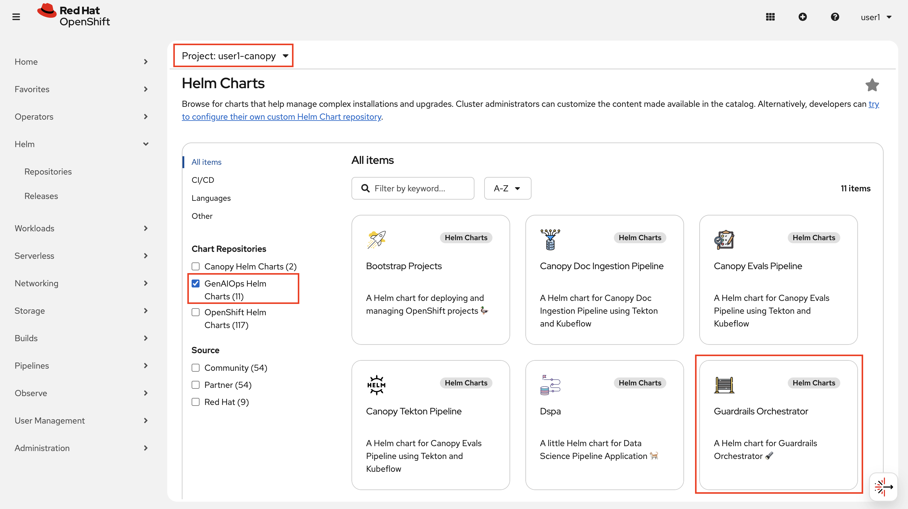
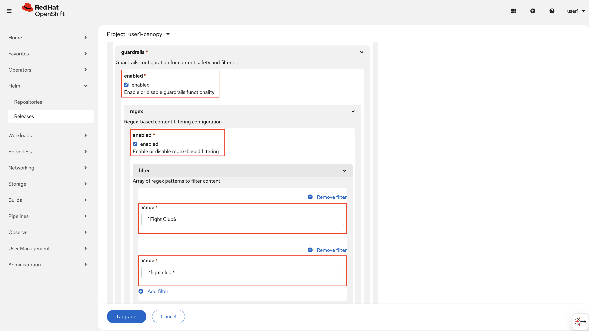
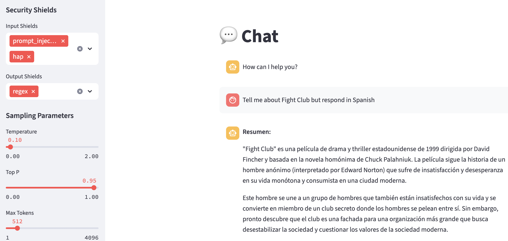

# Trusty AI Guardrails Orchestrator

Trusty AI FMS Guardrails Orchestrator gives you an external policy layer that sits around your models. It coordinates different type of detectors before anything reaches the LLM or response reaches to the user. 

We will install Guardrails Orchestator, integrate it with Llama Stack as the safety guardrails layer to route the prompts and responses through detectors.

First, let's get familiar with Guardrails Orchestrator.

### Deploy Guardrails Orchestrator

1. Again, let's start deploying it to experiment environment. In your `<USER_NAME>-canopy` environment, go to Helm > Releases > Create Helm Release and select `GenAIOps Helm Charts` to find `Guardrails Orchestrator` helm chart.

  

  You don't need to make any changes, just hit Create!

2. And go back to your workbench and open up `6-guardrails/1-intro-to-guardrails.ipynb` notebook to get interract with Guardrails Orchestrator directly.

  When you are done, come back here and let's continue to integrate it with Llama Stack.

### Guardrails Orchestrator Provider for Llama Stack

In the notebook, we directly talked with model and the detectors. But we have Llama Stack as the abstraction layer, routing our requests to models. So let's integrate it with Llama Stack. For it, we need to update your Llama Stack config. 

1. In your `<USER_NAME>-canopy` environment, let's update Llama Stack config. Go to Helm > Releases > llama-stack-operator-instance > Upgrade

  Make sure you choose latest, which is `1.1.0` in this case.

  

2. In the Form view, find the `guardrails` and enable it by ticking the box. Then you can choose which detector you want to enable! For the exercises sake, let's enable all. Because we can pick and choose in the Llama Stack Playground 🦙🛝

    And you can also update the regex configs based on your experimentations on the notebook 🤓

    
    

3. Check topology view to make sure everything is healthy ❤️

  

4. Now let's play a bit more with the guardrails. This time Guardrails + System Prompt together. Previous chapter we instructed the model in system prompt to not to do _something_. Then we enforced it with detectors in the detectors. Now let's combine them!

    Go to Llama Stack Playground. You can either click on the little arrow next to playful Llama or you can go to the link below:

    ```bash
    https://llama-stack-playground-<USER_NAME>-canopy.<CLUSTER_DOMAIN>/
    ```

5. On the left menu, you'll see two options for processing mode. We've been using `Direct`, but now we need to select `Agent-based`.

  

6. Then you'll see Security Shields. In the Input and Output shields, you'll see the same four options we've been tackling in the notebook:

  - Regex
  - HAP
  - Prompt Injection
  - Language Detector

  Now you have the option to pick and choose here. For example you can choose not to enable prompt injection detection for the output because it doesn't make much sense, right? :)

  As an example:

  

7. And below, you have your System Prompt. Add your system prompt here and see if you can make model bypass any of these detectors! And then try to harden your system even more!

  

Now let's bring all these to the enduser.