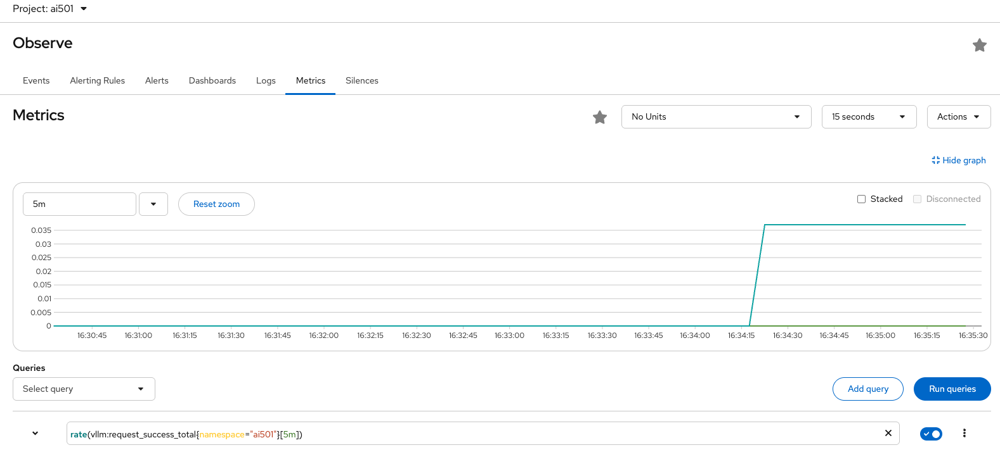
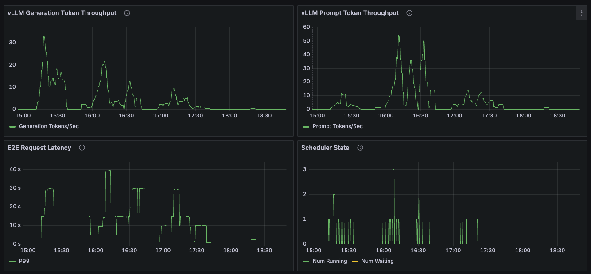
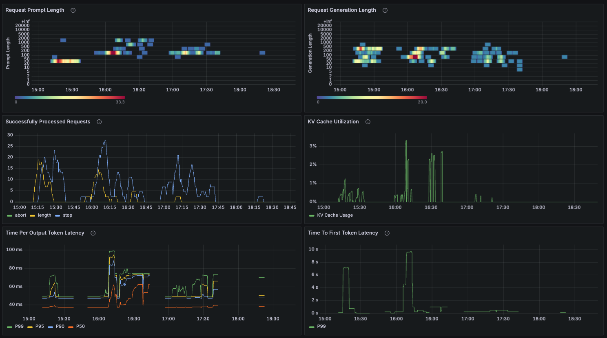
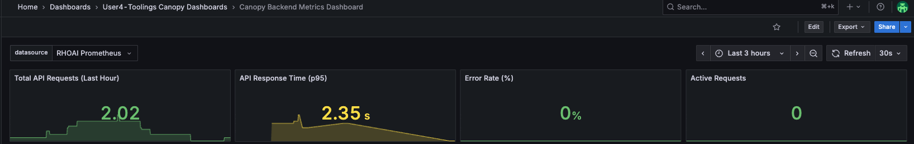

# 📊 Metrics: Measuring What Matters

Think of metrics like a teacher's gradebook combined with attendance records. A gradebook doesn't just tell you "students learned something" - it shows **how much**, **how consistently**, and **how the trend changes over time**.

Metrics do the same for Canopy: not just "is it working?" but "how well is it working, and is that improving or degrading?".

In the previous section, you learned how OpenTelemetry instruments your AI stack to emit telemetry data. Now let's explore what that data reveals about your application's performance.

## Exploring vLLM Metrics in RHOAI Observability Stack

Before deploying visualization tools, it's valuable to query metrics directly in Prometheus. This helps you understand the raw data before abstracting it into dashboards.

In this lab environment, **all users share a single llama-3.2 model** deployed in the `ai501` namespace. This shared model serves as the LLM backend for everyone's CanopyUI applications.

<!-- Why share a model? Running large language models requires significant GPU resources. By deploying one shared inference service, the lab environment can support many students simultaneously without requiring dedicated GPUs for each user. Your Canopy application sends requests to this shared vLLM endpoint, which processes them and returns generated text. -->

The vLLM inference engine powering this shared model automatically exports metrics about token generation, request processing, and model performance. These metrics flow into Prometheus automatically as the model is part of OpenShift AI's managed infrastructure.

> If you're curious about the technical details, you can see the InferenceService configuration [here](https://github.com/rhoai-genaiops/deploy-lab/blob/main/student-content/templates/cloud-model/inferenceservice.yaml#L33) - this defines how the llama-3.2 model is deployed and exposed.

### Exploring vLLM Metrics in RHOAI Prometheus

Prometheus has been collecting metrics from the shared vLLM model since it was deployed. Let's query them directly to understand what raw metrics look like before we visualize them in Grafana.

1. Open the OpenShift Metrics Dashboard for the `ai501` namespace directly [here](https://console-openshift-console.<CLUSTER_DOMAIN>/dev-monitoring/ns/ai501/metrics).

2. In the query box, enter this PromQL query and hit Enter (or click "Run Queries") to see the total tokens generated by the shared model:

   ```promql
   vllm:generation_tokens_total{namespace="ai501"}
   ```

   

   This shows cumulative tokens the shared llama-3.2 model has generated across all users - a proxy for how much AI assistance the entire lab is providing.

   _Note: You may see an "Access restricted" warning - this is cosmetic and doesn't affect the metric query._

3. Check the shared model's request success rate with this query:

   ```promql
   rate(vllm:request_success_total{namespace="ai501"}[5m])
   ```

   

   This shows successful requests per second for the shared inference service. A sudden drop indicates something's wrong with the model or infrastructure affecting all users.

## Visualizing Metrics in Grafana

While Prometheus queries are powerful for investigation, Grafana dashboards make metrics accessible to everyone on your team. No one wants to write PromQL just to check if the system is healthy!

The RHOAI Observability stack collects platform-wide metrics, but these are generic infrastructure signals that don't reveal application-specific insights about your Canopy deployment. To visualize what matters for your AI assistant - token usage patterns, LLM latency, backend API performance - you need custom Grafana dashboards that query Prometheus with filters specific to your namespace and components.

### Deploy Grafana

Let's deploy a Grafana instance in your toolings namespace to support the end-to-end observability journey for Canopy. Install it through your GitOps workflow in `genaiops-gitops/toolings/`:

1. Create `grafana` folder under `toolings`. And then create a file called `config.yaml` under `grafana` folder. Or simply run the below commands:

    ```bash
    mkdir /opt/app-root/src/genaiops-gitops/toolings/grafana
    touch /opt/app-root/src/genaiops-gitops/toolings/grafana/config.yaml
    ```

2. Open up the `grafana/config.yaml` file and paste the below line to let Argo CD know which chart we want to deploy.

    ```yaml
    chart_path: charts/grafana
    ```

3. Commit the changes to the repo as you've done before.

    ```bash
    cd /opt/app-root/src/genaiops-gitops
    git pull
    git add .
    git commit -m "📈 Grafana added 📈"
    git push
    ```

4. Once this change has been sync'd (you can check this in Argo CD), let's login to Grafana by clicking [here](https://canopy-grafana-route-<USER_NAME>-toolings.<CLUSTER_DOMAIN>) and view the predefined dashboards for canopy. Alternatively, you can use the run the below command in your code-server workbench terminal:

    ```bash
    # get the route and open it in your browser
    echo https://$(oc get route canopy-grafana-route --template='{{ .spec.host }}' -n <USER_NAME>-toolings)
    ```

    Use your OpenShift credentials and click `Allow selected permissions` to log in.

5. To view the dashboards, navigate to **Dashboards** → **Browse** and look for the `<USER_NAME>-toolings Canopy Dashboards` folder.

   

### Exploring Pre-configured Dashboards

The Grafana instance you deployed includes several pre-configured dashboards for monitoring your complete AI stack: the shared vLLM model, your Canopy UI, your Canopy Backend and LlamaStack.

### Dashboard 1: vLLM Shared Model Performance

This dashboard shows the health and performance of the shared llama-3.2 inference service that all users depend on. Unlike traditional web applications that focus on request count and response time, LLM systems require specialized metrics that reflect the unique characteristics of AI workloads.

1. Navigate to Grafana - you can use the Quick Links dropdown in OpenShift, or run this command to get the URL:

   ```bash
   echo https://$(oc get route canopy-grafana-route --template='{{ .spec.host }}' -n <USER_NAME>-toolings)
   ```

2. Log in with your OpenShift credentials and click **Allow selected permissions**.

3. Go to **Dashboards → Browse** and look for dashboards in the `<USER_NAME>-toolings Canopy Dashboards` folder.

4. Open the **vLLM AI501 Metrics Dashboard** to see AI-specific performance metrics:

> This dashboard update in real-time. Since the vLLM model is shared, you'll see activity from all users in the lab. This is normal - you're observing the collective workload on the inference service.

   

   **Token Throughput Metrics:**
   - **Generation Token Throughput (TPS)**: How many tokens per second the model is generating. This measures how fast the response streams - higher TPS means faster completion of answers. During peak hours, you want to ensure TPS doesn't degrade. This is fundamentally different from traditional "requests per second" because it measures the model's text generation speed, not just API throughput.
   - **Prompt Token Throughput**: How many prompt tokens per second are being processed (indicates request volume and context size trends)
   - **Scheduler State**: Number of requests running, waiting, or swapped. High wait queues indicate the shared model is overloaded - a critical signal that doesn't exist in traditional stateless APIs.

   

   **Request Characteristics - Understanding Context:**
   - **Request Prompt Length**: Heatmap showing distribution of prompt sizes. How much conversation history are we maintaining? Longer contexts provide better answers but consume more memory and slow down inference.
   - **Request Generation Length**: Heatmap showing distribution of response sizes

   **Resource and Scheduler Metrics:**
   - **KV Cache Utilization**: Memory usage for attention caching (high values may slow inference). This is unique to transformer models where the "K" (key) and "V" (value) matrices from the attention mechanism are cached to avoid recomputation.
   - **Successfully Processed Requests**: Breakdown by finish reason (EOS token vs max length reached)

   **Latency Metrics - The AI User Experience:**
   - **E2E Request Latency**: End-to-end time from request to completion (p50, p90, p95, p99 percentiles). Traditional web apps might measure this alone, but for LLMs we need to break it down further.
   - **Time To First Token (TTFT)**: How quickly the model starts responding. This affects perceived responsiveness
   - **Time Per Output Token**: Inter-token latency during generation (affects streaming speed and determines how smoothly text appears)

<!-- **Why These AI-Specific Metrics Matter:** Beyond basic infrastructure metrics (CPU, memory), these measurements reflect the unique characteristics of LLM workloads. They distinguish monitoring an AI system from monitoring a traditional web application - your Canopy backend might have great API response times, but if the underlying model has poor TTFT or low TPS, the user experience suffers. -->

### Dashboard 2: Canopy-UI Metrics

Your Canopy UI is the student-facing interface - the web application where users ask questions and receive answers. This dashboard shows how well the frontend is performing.

> For your Canopy application components ([UI](https://github.com/rhoai-genaiops/frontend/blob/main/chart/templates/deployment.yaml#L21) and [Backend](https://github.com/rhoai-genaiops/backend/blob/main/chart/templates/deployment.yaml#L17)), metrics collection requires an additional label. The Canopy Helm charts have already been configured with `monitoring.opendatahub.io/scrape: 'true'` in their deployment templates, which tells Prometheus to scrape metrics from these workloads. This label is essential for custom applications, without it, Red Hat OpenShift AI Observability stack won't collect their metrics even if they expose them.

<!-- TODO: Add autoinstrumentation explanation also here. Canopy UI/Backend relies also in the auto-instrumentation to publish some metrics -->

1. In Grafana, navigate to **Dashboards → Browse → `<USER_NAME>-toolings Canopy Dashboards`**

2. Open the **Canopy UI Metrics Dashboard**:

   > **Tip**: Expand the time range to 1-3 hours if metrics appear sparse. The time picker is located in the upper right corner of the dashboard.

   

3. **Generate Traffic to See Metrics**: If the dashboard is empty, open your Canopy UI and interact with it:

   ```bash
   # Get your Canopy UI URL
   oc get route canopy-ui -n <USER_NAME>-canopy -o jsonpath='https://{.spec.host}{"\n"}'
   ```

   Open the URL in your browser and click the **Summarize** button 3-5 times. This generates traffic through the entire stack (UI → Backend → LlamaStack) and populates all panels including "Backend Request Duration".

   Wait 10-15 seconds for Prometheus to scrape the metrics, then refresh the Grafana dashboard.

4. The dashboard displays:

   

   **High-Level Stats (Top Row):**
   - **Total Requests (Last Hour)**: How many HTTP requests your UI has served
   - **Average Response Time**: p50 latency for UI responses (should be < 500ms for good UX)
   - **Error Rate (%)**: Percentage of failed requests (should be < 1%)
   - **Active Requests**: Number of requests currently being processed

   **Request Patterns:**
   - **Request Rate (req/sec)**: Real-time view of traffic to your UI
   - **Response Time Percentiles**: p50, p95, p99 latencies over time (watch for spikes)

   **Health Indicators:**
   - **HTTP Status Codes**: Distribution of 2xx, 4xx, 5xx responses
   - **Backend Request Duration**: How long calls from UI to backend are taking (p95)

The UI dashboard helps you understand the student experience. High latencies or error rates here mean students are having a poor experience, even if the backend and model are healthy.

### Dashboard 3: Canopy-Backend Metrics

Your Canopy Backend is the API layer that orchestrates calls between the UI and LlamaStackThis dashboard reveals backend performance and bottlenecks.

1. In the same Grafana folder, open the **Canopy Backend Metrics Dashboard** to see:

   **High-Level Stats (Top Row):**
   - **Total API Requests (Last Hour)**: Volume of backend API calls
   - **API Response Time (p95)**: 95th percentile latency for backend endpoints
   - **Error Rate (%)**: Percentage of failed API calls
   - **Active Requests**: Current backend request queue depth

   

   **Endpoint Performance:**
   - **Request Rate by Endpoint**: Which API endpoints are getting the most traffic
   - **Response Time by Endpoint (p95)**: Latency breakdown per endpoint (helps identify slow APIs)
   - **Endpoint Performance Summary**: Table view with request rate, latency, and error rate per endpoint

   **External Service Metrics:**
   - **LLM Call Duration (Outbound to llamastack)**: How long calls to the shared vLLM model are taking (p50, p95, p99)
   - **HTTP Status Distribution**: Success vs. error responses from the backend

   

The backend dashboard is crucial for debugging performance issues.

### Dashboard 4: LlamaStack Token Metrics

LlamaStack orchestrates LLM calls between Canopy Backend and vLLM, tracking token usage through OpenTelemetry. Metrics are batched and exported to Prometheus every 60 seconds via OTLP.

> **📊 Why Metrics Differ from vLLM**: LlamaStack tracks your app's token usage, while vLLM shows total infrastructure load. Since the vLLM model in `ai501` is shared, these dashboards show different perspectives.

1. Open the **LlamaStack Metrics Dashboard**:

   > **Tip**: Expand the time range to 1-3 hours if metrics appear sparse.

2. **Generate Traffic to See Metrics**: If the dashboard is empty, generate some inference requests from your code-server terminal:

   ```bash
   for i in {1..10}; do echo "Request $i:"; curl -s -X POST "http://llama-stack-service.<USER_NAME>-canopy.svc.cluster.local:8321/v1/chat/completions" -H "Content-Type: application/json" -d '{"model":"llama32","messages":[{"role":"user","content":"Hello, how are you?"}],"stream":false}' | jq -r '.usage.total_tokens // "error"'; sleep 2; done
   ```

   This sends 10 non-streaming requests to your LlamaStack instance. Remember that metrics are batched every 60 seconds, so wait a minute then refresh the dashboard to see the token counts.

   

   **Dashboard Panels:**
   - **Token Usage Overview**: Total, prompt, and completion tokens (last hour) plus real-time rate (tokens/sec)
   - **Token Processing Rate**: Time-series graph showing prompt, completion, and total token throughput
   - **Cumulative Token Usage**: Growing total since deployment
   - **Model Summary Table**: Per-model/provider token breakdown

   > **⚠️ Limitations**: LlamaStack telemetry only tracks non-streaming inference requests ([#3981](https://github.com/llamastack/llama-stack/issues/3981)) and doesn't instrument other APIs like agents or safety checks ([#2596](https://github.com/llamastack/llama-stack/issues/2596)). Canopy's streaming traffic won't appear here.

<!-- ## Understanding the Metrics Flow

Your AI assistant spans four layers, each with its own metrics:

**1. Canopy-UI (`<USER_NAME>-canopy` namespace)** - The student-facing frontend
- Metrics show: request rate, response time, HTTP status codes
- **What it tells you**: Are students having a good experience?

**2. Canopy-Backend (`<USER_NAME>-canopy` namespace)** - The backend
- Metrics show: endpoint performance, outbound call duration, error rates
- **What it tells you**: Where are bottlenecks in your application logic?

**3. LlamaStack (`<USER_NAME>-canopy` namespace)** - The AI orchestration layer
- Metrics show: token usage (prompt/completion), processing rate, model-specific throughput
- **What it tells you**: How efficiently are you using LLM tokens? What's the prompt-to-completion ratio?

**4. Shared vLLM Model (ai501 namespace)** - The inference engine
- Metrics show: token throughput, latency, queue depth, cache usage
- **What it tells you**: Is the shared model healthy and responsive? -->

## 🎯 Next Steps: Understanding Behavior with Logs

Metrics tell you **how much** and **how fast**, but not **what's happening** inside your application. When metrics show a problem (success rate dropping, latency spiking), you need details about what went wrong.

For that, we need logs - detailed records of every event in Canopy's operation. Continue to **[Logging](6-observability/3-logging.md)** to learn how to collect and query Canopy's logs 📝
