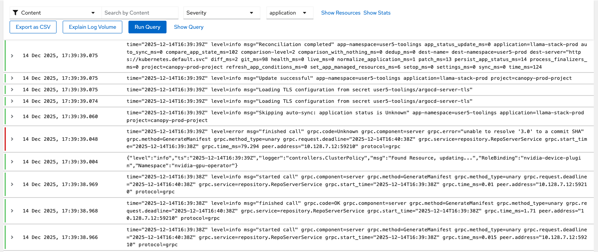

# 📝 Logging: The Detailed Story

While metrics answer "how much?" and "how fast?", logs answer "what exactly happened?" They're the detailed notes capturing exactly what happened, when, and in what context.

## Aggregating Loggings for LokiStack

OpenShift's built-in logging uses LokiStack to automatically collect anything your application writes to STDOUT or STDERR - no explicit configuration needed. Logs are collected via a collector running on each node, then indexed as time-series JSON in LokiStack.

Let's see what Canopy is telling us in its logs.

1. Navigate to **OpenShift Console → Observe → Logs**

   

   By default, you see logs from all applications across all namespaces that you have access. This is useful for cluster operators, but too noisy when you're focused on a specific application.

2. Let's filter to just Canopy in your test environment. Click **Show Query** and paste this LogQL query:

   ```logql
   { log_type="application", kubernetes_pod_name=~"canopy-backend.*", kubernetes_namespace_name="<USER_NAME>-canopy" }
   ```

   <!-- This LogQL query uses:
   - `log_type="application"`: Only application logs (not infrastructure/system logs)
   - `kubernetes_pod_name=~"canopy-ui.*"`: Regex matching any canopy-ui pod
   - `kubernetes_namespace_name="<USER_NAME>-test"`: Your test environment namespace -->

3. Click **Run Query** to see Canopy's recent logs streaming in real-time

   

   The logs appear with timestamps, pod names, and the actual log messages. You can scroll through them, search for specific text, and see patterns in your application's behavior.

This solves a critical problem: **container logs are ephemeral**. When a container restarts (crashes, gets redeployed, or scaled down), its logs disappear unless they've been aggregated elsewhere. LokiStack ensures you can investigate issues from hours or days ago, even if the pods involved are long gone.

## Why Aggregation Matters

If Canopy crashes at 2am and restarts automatically, you can still investigate what caused the crash because LokiStack:
- Continuously collects logs from all containers automatically
- Indexes them with Kubernetes metadata (namespace, pod, container)
- Stores them for the configured retention period
- Makes them searchable across all environments and timeframes

"The system crashed yesterday at 3pm" becomes something you can actually investigate, even though the crashed pod is long gone.

## Generating and Querying Custom Logs

Let's create some logs intentionally and then find them - simulating how you'd debug a real issue.

1. In **OpenShift Console → Workloads -> Pods**, connect to the Canopy UI pod Terminal in the `<USER_NAME>-canopy` namespace to run commands inside:

   

2. Inside the container, generate custom log messages:

   ```bash
   echo "🦙🦙🦙🦙" >> /tmp/custom.log
   tail -f /tmp/custom.log > /proc/1/fd/1 &
   echo "🦙🦙🦙🦙" >> /tmp/custom.log
   echo "🦙🦙🦙🦙" >> /tmp/custom.log
   echo "🦙🦙🦙🦙" >> /tmp/custom.log
   echo "🦙🦙🦙🦙" >> /tmp/custom.log
   exit
   ```

   This creates a log file and pipes it to STDOUT (file descriptor 1 of process 1), which OpenShift's logging agent automatically captures.

3. In the `Aggregated Logs` Tab, check the last logs or query specifically for your custom messages (in the Show Query button):

   ```logql
   { log_type="application", kubernetes_pod_name=~"canopy-ui.*", kubernetes_namespace_name="<USER_NAME>-canopy" } |= `🦙🦙🦙🦙` | json
   ```

   

You just simulated what happens when you're debugging an issue: you know what to look for (the llama emojis in this case, or error messages in real scenarios), and you can query logs to find exactly when and where it happened.

<!-- ## Logs vs. Metrics: When to Use Each (Move to Slides)

**Use metrics for:**
- Quantitative measurements (request rate, latency, error percentage)
- Alerting (when error rate exceeds threshold)
- Trends over time (is performance improving or degrading?)
- Low-cardinality data (service-level aggregates)

**Use logs for:**
- Detailed context (what specific error occurred?)
- Debugging (what sequence of events led to this problem?)
- High-cardinality data (user-specific, query-specific details)
- Audit trails (who did what when?)

**Use them together:**
- Metrics alert you to a problem: "Error rate spiked to 10%"
- Logs tell you what the errors are: "RAG service timeout connecting to Milvus"
- Traces show you where: "Milvus search span taking 30+ seconds" -->

## 🎯 Next Steps: Following the Request Journey

Logs show what happened in individual components, but modern AI systems are distributed - a single student question touches multiple services. How do you see the complete journey of a request through your entire system?

That's where distributed tracing comes in. Continue to **[Tracing](6-observability/4-tracing.md)** to see how requests flow through Canopy's architecture 🔍
