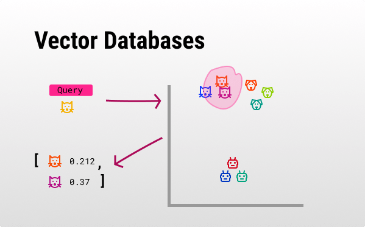

# 📊 Vector Stores: The Foundation of RAG

<div class="terminal-curl"></div>

Think of vector stores as the specialized libraries that power RAG systems. While a traditional library organizes books alphabetically, vector stores organize information by **meaning**, allowing AI to find relevant content based on semantic similarity (how close the meaning of two sentences are to each other) rather than just keyword matching.  
For example: 
- “The boy kicked the ball into the net.”
- “A child scored a goal by striking the soccer ball.”

Word by word these are very different, but semantically they are almost identical.

For educational platforms like Canopy, this means students can ask "How does bias affect hiring?" and get relevant information even if your course materials use terms like "discrimination in recruitment" or "algorithmic fairness in employment".

## 🔍 What are Vector Stores?

**Vector stores** (also called vector databases) are specialized databases that store and search through high-dimensional vectors - mathematical representations of text meaning. Here's how they work:


### The Vector Magic ✨

1. **Text → Numbers**: Every piece of text gets converted into a list of numbers (a vector) that captures its meaning
2. **Similarity Search**: When you ask a question, the system finds vectors that are close (in distance) in the mathematical space. The closer they are the more similar they are.
3. **Lightning Fast**: Even with millions of documents, searches happen in milliseconds



### Why Regular Databases Aren't Enough

Let's use a simple example to understand the difference. Imagine you're building a pet care app with these documents:

**❌ Traditional Keyword Search:**
- Searching for "dog" only finds documents containing the exact word "dog"
- Misses related documents about "puppy", "canine", "golden retriever", or "border collie"
- A search for "cat care" won't find a document titled "Feline Health Tips"
- Can't understand that "My furry friend loves to fetch" is about dogs

**✅ Vector-Based Semantic Search:**
- Searching for "dog" finds documents about puppies, specific breeds, and dog-related concepts
- Understands that "feline" and "cat" are related, so "cat care" finds "Feline Health Tips"
- Recognizes that "furry friend that fetches" is semantically similar to "dog behavior"
- Ranks results by conceptual relevance: "golden retriever training" scores higher than "cat toys" for a "dog" search

The magic happens because vectors capture *meaning*: "puppy", "canine", and "golden retriever" all get similar vector representations because they're conceptually related, even though they share no common letters!

## 🛠️ Vector Store Options

There are several vector database options available for RAG systems:

- **Milvus**: Open-source, highly scalable, great for production workloads
- **Chroma**: Lightweight, developer-friendly, good for prototyping
- **Pinecone**: Cloud-native, managed service, pay-as-you-scale
- **Weaviate**: GraphQL API, hybrid search capabilities
- **Qdrant**: Written in Rust, high performance, good for large datasets

For this module, we'll use **Milvus** as our vector database - it's open-source, highly scalable, and perfect for educational RAG systems that need to handle multiple courses and thousands of documents.

## 📊 Deploy Milvus Test & Prod

You've learned the concepts behind vector databases - now it's time to deploy the infrastructure that will power Canopy's intelligent search capabilities. Just like with Canopy, we need to set up vector database deployments that handle test and production environments with proper separation and configuration management.

After completing the deployment, you'll use your running Milvus instances in hands-on exercises to understand exactly how educational content becomes searchable through vector embeddings.

### 1. Set Up Milvus Directory Structure

We'll create separate configurations for test and prod environments under the canopy directory structure so the existing ApplicationSets can detect them:

```bash
mkdir -p /opt/app-root/src/genaiops-gitops/canopy/test/milvus
mkdir -p /opt/app-root/src/genaiops-gitops/canopy/prod/milvus
touch /opt/app-root/src/genaiops-gitops/canopy/test/milvus/config.yaml
touch /opt/app-root/src/genaiops-gitops/canopy/prod/milvus/config.yaml
```

### 2. Configure Milvus Config Files

`milvus` will use the same configuration for both test and prod environments, keeping it simple. Update both `canopy/test/milvus/config.yaml` and `canopy/prod/milvus/config.yaml` with the same configuration:

**Both TEST and PROD:**

```yaml
chart_path: charts/milvus
```

For now, we're happy with the default Milvus values. We will get some exciting updates as we continue to the other chapters :)

### 3. Deploy via GitOps

Now let's get these configurations deployed! Store all vector database definitions in Git:

```bash
cd /opt/app-root/src/genaiops-gitops
git add .
git commit -m "📊 ADD - Milvus test & prod vector databases 📊"
git push
```

### 4. Deploy with ApplicationSets

With all the vector database configurations stored in Git, the ApplicationSets you created in the previous Canopy deployment chapter will automatically detect the new Milvus configurations and deploy them to the appropriate namespaces:

- **Test Milvus** → deployed to `<USER_NAME>-test` namespace  
- **Prod Milvus** → deployed to `<USER_NAME>-prod` namespace

If you haven't created the ApplicationSets yet, you'll need to update them with your cluster details and apply them:

```bash
# Update ApplicationSet definitions with your cluster domain and username
sed -i -e 's/CLUSTER_DOMAIN/<CLUSTER_DOMAIN>/g' /opt/app-root/src/genaiops-gitops/appset-test.yaml
sed -i -e 's/USER_NAME/<USER_NAME>/g' /opt/app-root/src/genaiops-gitops/appset-test.yaml
sed -i -e 's/CLUSTER_DOMAIN/<CLUSTER_DOMAIN>/g' /opt/app-root/src/genaiops-gitops/appset-prod.yaml
sed -i -e 's/USER_NAME/<USER_NAME>/g' /opt/app-root/src/genaiops-gitops/appset-prod.yaml
```

If you didn't applied yet, apply the new 

```bash
# Apply the ApplicationSets
oc apply -f /opt/app-root/src/genaiops-gitops/appset-test.yaml -n <USER_NAME>-toolings
oc apply -f /opt/app-root/src/genaiops-gitops/appset-prod.yaml -n <USER_NAME>-toolings
```

You can verify the ApplicationSets are running and picking up the new configurations:

```bash
# Verify the ApplicationSets are running
oc get applicationsets -n <USER_NAME>-toolings

# Watch Argo CD automatically create the new Milvus applications
oc get applications -n <USER_NAME>-toolings | grep milvus
```

You should see the two Milvus applications, one for `test` and one for `prod` being automatically deployed by Argo CD to their respective namespaces.

> **💡 Deployment Note**: We're using **standalone deployments** of Milvus with default configurations, which are perfect for development and educational environments. Both test and prod environments provide the full vector database functionality needed for your RAG systems while keeping resource usage reasonable for learning purposes.

### 🖼️ Explore Milvus with Attu Web Interface

Each Milvus deployment includes Attu, a powerful web-based administration tool for managing and visualizing your vector database.

**Access Attu for Test Environment:**
```
https://milvus-test-attu-<USER_NAME>-test.<CLUSTER_DOMAIN>
```

**Access Attu for Prod Environment:**
```
https://milvus-test-attu-<USER_NAME>-prod.<CLUSTER_DOMAIN>
```

**What you can do with Attu:**
- 📊 **Visualize Collections**: See your vector database structure
- 🔍 **Browse Data**: Explore stored vectors and metadata
- 📈 **Monitor Performance**: Check database statistics and health
- 🛠️ **Manage Collections**: Create, modify, and delete collections
- 🔎 **Test Queries**: Run vector similarity searches interactively

Visit your test environment Attu interface now - you'll see an empty database, perfect for understanding the starting point before we populate it with educational content!

## 🧪 Hands-On Learning: Vector Database Fundamentals

Now that your Milvus instances are deployed and running, it's time to understand how vector databases work under the hood. This practical exploration will help you grasp the concepts that power Canopy's semantic search capabilities.

**📓 Interactive Notebook**: Complete the hands-on exercises in `canopy/6-rag/1-vector-databases.ipynb` to:

- **Connect to your deployed Milvus instance**: Use the vector database you just deployed via GitOps
- **Learn how text embeddings capture meaning**: Understand how course content becomes searchable vectors
- **Experience semantic search with educational content**: See how Machine Learning concepts are found even when using different terminology
- **Understand how Canopy finds relevant course materials**: Discover the technology behind intelligent student Q&A

## 🎯 Next Steps: Building Intelligent Apps with RAG

With your vector store deployed and your understanding of embeddings complete through the hands-on notebook exercises, you now have both the infrastructure and conceptual foundation for RAG. Next, you'll build the intelligent layer that knows how to search your vector database and create helpful responses for students.

Continue to **[🦙 LlamaStack & RAG](3-llamastack-rag.md)** to connect your vector store with LlamaStack and create your first RAG-powered educational assistant.