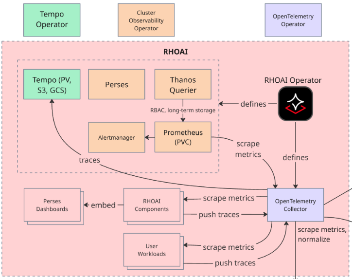

# 🔍 Enable Monitoring

In the context of production GenAI systems, observability is your ability to understand what's happening inside your AI applications by examining the data it produces. Think of it like a teacher monitoring a classroom: you need to see if students are engaged, struggling, or succeeding.

Without observability, running AI in production is like flying blind, you only know something's wrong when users complain. With proper observability, you can spot problems before they impact students and fix issues quickly.

## The Three Pillars of Observability

Modern observability relies on three complementary data types:

* **Metrics** 📊 - Quantitative measurements over time (response latency, request rate, error percentage, time for first token).
* **Logs** 📝 - Detailed event records from your application (error messages, user requests, system events).
* **Traces** 🔍 - Request paths through distributed services (how a student's question flows through Canopy's microservices, MCP tools, and LLMs).

Together, these three pillars give you complete visibility into Canopy's behavior. Let's see how to enable observability for Canopy!

## Red Hat AI Observability Stack

Red Hat OpenShift AI provides [centralized platform observability](https://docs.redhat.com/en/documentation/red_hat_openshift_ai_self-managed/3.0/html/managing_openshift_ai/managing-observability_managing-rhoai): an integrated, out-of-the-box solution for monitoring the health and performance of your OpenShift AI instance and user workloads.

This centralized solution includes a dedicated, pre-configured observability stack, featuring the OpenTelemetry Collector (OTC) for standardized data ingestion, Prometheus for metrics, and the Red Hat build of Tempo for distributed tracing. This architecture enables a common set of health metrics and alerts for OpenShift AI components and offers mechanisms to integrate with your existing external observability tools.



### Deploy Grafana

> Let's create some more dashboards with specific information about our model!

1. We can deploy a Grafana instance in our `genaiops` environment. Yet another tooling to support the end to end journey of CanopyUI. Therefore we need to install it through `genaiops-gitops/toolings/`

    Create `grafana` folder under `toolings`. And then create a file called `config.yaml` under `grafana` folder. Or simply run the below commands:

    ```bash
    mkdir /opt/app-root/src/genaiops-gitops/toolings/grafana
    touch /opt/app-root/src/genaiops-gitops/toolings/grafana/config.yaml
    ```

2. Open up the `grafana/config.yaml` file and paste the below line to let Argo CD know which chart we want to deploy.

    ```yaml
    chart_path: charts/grafana
    ```

3. Commit the changes to the repo as you’ve done before.

    ```bash
    cd /opt/app-root/src/genaiops-gitops
    git pull
    git add .
    git commit -m "📈 Grafana added 📈"
    git push
    ```

4. Once this change has been sync’d (you can check this in Argo CD), let’s login to Grafana by clicking [here](https://canopy-grafana-route-<USER_NAME>-toolings.<CLUSTER_DOMAIN>) and view the predefined dashboards for canopy. Alternatively, you can use the run the below command in your code-server workbench terminal:

    ```bash
    # get the route and open it in your browser
    echo https://$(oc get route canopy-grafana-route --template='{{ .spec.host }}' -n <USER_NAME>-toolings)
    ```

    Use your OpenShift credentials and click `Allow selected permissions` to log in.

5. In order to view the dashboards, go to `Dashboards` > `grafana <USER_NAME>-toolings Dashboards