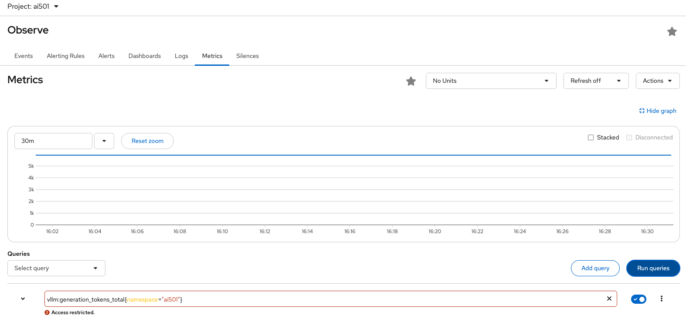

# 📊 Metrics: Measuring What Matters

Think of metrics like a teacher's gradebook combined with attendance records. A gradebook doesn't just tell you "students learned something" - it shows **how much**, **how consistently**, and **how the trend changes over time**. Metrics do the same for Canopy: not just "is it working?" but "how well is it working, and is that improving or degrading?"

Red Hat OpenShift AI automatically collects metrics from your AI workloads using Prometheus. Let's see what Canopy is already telling us about its performance.

## Understanding the Shared LLM metrics

Before diving into Canopy's specific application metrics, it's important to understand the infrastructure powering your Canopy AI assistant. In this lab environment, **all users share a single llama-3.2 model** deployed in the `ai501` namespace. This shared model serves as the LLM backend for everyone's CanopyUI microservices.

<!-- Why share a model? Running large language models requires significant GPU resources. By deploying one shared inference service, the lab environment can support many students simultaneously without requiring dedicated GPUs for each user. Your Canopy application sends requests to this shared vLLM endpoint, which processes them and returns generated text. -->

> If you're curious about the technical details, you can see the InferenceService configuration [here](https://github.com/rhoai-genaiops/deploy-lab/blob/main/student-content/templates/cloud-model/inferenceservice.yaml#L33) - this defines how the llama-3.2 model is deployed and exposed.

The vLLM inference engine powering this shared model automatically exports metrics about token generation, request processing, and model performance. These metrics flow into Prometheus automatically as the model is part of OpenShift AI's managed infrastructure.

For your Canopy application components (UI and Backend), metrics collection requires an additional label. The Canopy Helm charts have already been configured with `monitoring.opendatahub.io/scrape: 'true'` in their deployment templates, which tells Prometheus to scrape metrics from these workloads. This label is essential for custom applications, without it, Red Hat OpenShift AI Observability stack won't collect their metrics even if they expose them.

### Exploring vLLM Metrics in Prometheus

You already deployed Grafana in the [previous section](./1-enable-monitoring.md), and our Prometheus has been collecting metrics from the shared vLLM model this whole time. Let's query them directly.

1. Navigate to **OpenShift Console → Observe → Metrics** in your `ai501` project.

2. In the query box, enter this PromQL query to see total tokens generated by the shared model:

   ```promql
   vllm:generation_tokens_total{namespace="ai501"}
   ```

   This shows cumulative tokens the shared llama-3.2 model has generated across all users - a proxy for how much AI assistance the entire lab is providing.

   

   _Note: You may see an "Access restricted" warning - this is cosmetic and doesn't affect the metric query._

3. Try this query to see average request latency over time for the shared model:

   ```promql
   rate(vllm:e2e_request_latency_seconds_sum{namespace="ai501"}[5m]) / rate(vllm:e2e_request_latency_seconds_count{namespace="ai501"}[5m])
   ```

   This calculates average end-to-end response time over 5-minute windows - critical for understanding user experience. If this number starts climbing, students across the lab are waiting longer for answers.

4. Check the shared model's request success rate with this query:

   ```promql
   rate(vllm:request_success_total{namespace="ai501"}[5m])
   ```

   This shows successful requests per second for the shared inference service. A sudden drop indicates something's wrong with the model or infrastructure affecting all users.

## Visualizing Metrics in Grafana

While Prometheus queries are powerful for investigation, Grafana dashboards make metrics accessible to everyone on your team. No one wants to write PromQL just to check if the system is healthy!

The Grafana instance you deployed includes three pre-configured dashboards for monitoring your complete AI stack: the shared vLLM model, your Canopy UI, and your Canopy Backend.

### Dashboard 1: vLLM Shared Model Performance

This dashboard shows the health and performance of the shared llama-3.2 inference service that all users depend on.

1. Navigate to Grafana - you can use the Quick Links dropdown in OpenShift, or run this command to get the URL:

   ```bash
   echo https://$(oc get route canopy-grafana-route --template='{{ .spec.host }}' -n <USER_NAME>-toolings)
   ```

2. Log in with your OpenShift credentials and click **Allow selected permissions**.

3. Go to **Dashboards → Browse** and look for dashboards in the `<USER_NAME>-toolings Canopy Dashboards` folder.

4. Open the **vLLM AI501 Dashboard** to see visualizations of:

   **Token Throughput Metrics:**
   - **Generation Token Throughput**: How many tokens per second the model is generating (higher is better for faster responses)
   - **Prompt Token Throughput**: How many prompt tokens per second are being processed (indicates request volume)

   **Latency Metrics:**
   - **E2E Request Latency**: End-to-end time from request to completion (p50, p90, p95, p99 percentiles)
   - **Time To First Token (TTFT)**: How quickly the model starts responding (affects perceived responsiveness)
   - **Time Per Output Token**: Inter-token latency during generation (affects streaming speed)

   **Resource and Scheduler Metrics:**
   - **Scheduler State**: Number of requests running, waiting, or swapped (indicates queue pressure)
   - **KV Cache Utilization**: Memory usage for attention caching (high values may slow inference)
   - **Successfully Processed Requests**: Breakdown by finish reason (EOS token vs max length)

   **Request Characteristics:**
   - **Request Prompt Length**: Heatmap showing distribution of prompt sizes
   - **Request Generation Length**: Heatmap showing distribution of response sizes

   

These dashboards update in real-time. Since the vLLM model is shared, you'll see activity from all users in the lab. This is normal - you're observing the collective workload on the inference service.

### Dashboard 2: Canopy-UI Metrics

Your Canopy UI is the student-facing interface - the web application where users ask questions and receive answers. This dashboard shows how well the frontend is performing.

1. In Grafana, navigate to **Dashboards → Browse → `<USER_NAME>-toolings Canopy Dashboards`**

2. Open the **Canopy UI Dashboard** to see:

   **High-Level Stats (Top Row):**
   - **Total Requests (Last Hour)**: How many HTTP requests your UI has served
   - **Average Response Time**: p50 latency for UI responses (should be < 500ms for good UX)
   - **Error Rate (%)**: Percentage of failed requests (should be < 1%)
   - **Active Requests**: Number of requests currently being processed

   **Request Patterns:**
   - **Request Rate (req/sec)**: Real-time view of traffic to your UI
   - **Response Time Percentiles**: p50, p95, p99 latencies over time (watch for spikes)

   **Health Indicators:**
   - **HTTP Status Codes**: Distribution of 2xx, 4xx, 5xx responses
   - **Backend Request Duration**: How long calls from UI to backend are taking (p95)

The UI dashboard helps you understand the student experience. High latencies or error rates here mean students are having a poor experience, even if the backend and model are healthy.

### Dashboard 3: Canopy-Backend Metrics

Your Canopy Backend is the API layer that orchestrates calls between the UI and LlamaStackThis dashboard reveals backend performance and bottlenecks.

1. In the same Grafana folder, open the **Canopy Backend Dashboard** to see:

   **High-Level Stats (Top Row):**
   - **Total API Requests (Last Hour)**: Volume of backend API calls
   - **API Response Time (p95)**: 95th percentile latency for backend endpoints
   - **Error Rate (%)**: Percentage of failed API calls
   - **Active Requests**: Current backend request queue depth

   **Endpoint Performance:**
   - **Request Rate by Endpoint**: Which API endpoints are getting the most traffic
   - **Response Time by Endpoint (p95)**: Latency breakdown per endpoint (helps identify slow APIs)
   - **Endpoint Performance Summary**: Table view with request rate, latency, and error rate per endpoint

   **External Service Metrics:**
   - **LLM Call Duration (Outbound to llamastack)**: How long calls to the shared vLLM model are taking (p50, p95, p99)
   - **HTTP Status Distribution**: Success vs. error responses from the backend

The backend dashboard is crucial for debugging performance issues.

## Understanding the Metrics Flow

Your AI assistant spans three layers, each with its own metrics:

**1. Shared vLLM Model (ai501 namespace)** - The inference engine
- Metrics show: token throughput, latency, queue depth, cache usage
- **What it tells you**: Is the shared model healthy and responsive?

**2. Canopy-UI (`<USER_NAME>-canopy` namespace)** - The student-facing frontend
- Metrics show: request rate, response time, HTTP status codes
- **What it tells you**: Are students having a good experience?

**3. Canopy-Backend (`<USER_NAME>-canopy` namespace)** - The API orchestration layer
- Metrics show: endpoint performance, outbound call duration, error rates
- **What it tells you**: Where are bottlenecks in your application logic?

## AI-Specific Metrics That Matter

Beyond basic infrastructure metrics (CPU, memory), AI systems need specialized measurements that reflect the unique characteristics of LLM workloads:

### Model Performance Metrics

**Time to First Token (TTFT)**: How quickly does the model start responding? This affects perceived responsiveness. Students notice if there's a long pause before text starts appearing. You can see this in the vLLM dashboard as "Time To First Token Latency" with p50/p95/p99 percentiles.

**Tokens Per Second (TPS)**: How fast does the response stream? Higher TPS means faster completion of answers. During peak hours, you want to ensure TPS doesn't degrade. The vLLM dashboard shows this as "Generation Token Throughput".

**Context Length**: How much conversation history are we maintaining? The vLLM dashboard shows "Request Prompt Length" as a heatmap. Longer contexts provide better answers but consume more memory and slow down inference.

**Request Queue Depth**: The vLLM "Scheduler State" panel shows how many requests are running, waiting, or swapped. High wait queues indicate the shared model is overloaded.

These AI-specific metrics are what distinguish monitoring an LLM system from monitoring a traditional web application. A backend API might have great response times, but if TTFT is 5 seconds because the model is overloaded, students will think Canopy is broken.

## 🎯 Next Steps: Understanding Behavior with Logs

Metrics tell you **how much** and **how fast**, but not **what's happening** inside your application. When metrics show a problem (success rate dropping, latency spiking), you need details about what went wrong.

For that, we need logs - detailed records of every event in Canopy's operation. Continue to **[Logging](./3-logging.md)** to learn how to collect and query Canopy's logs 📝
