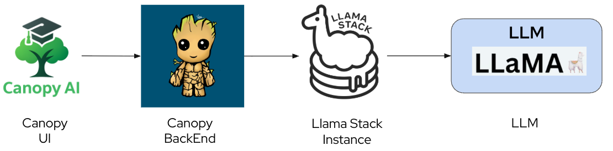
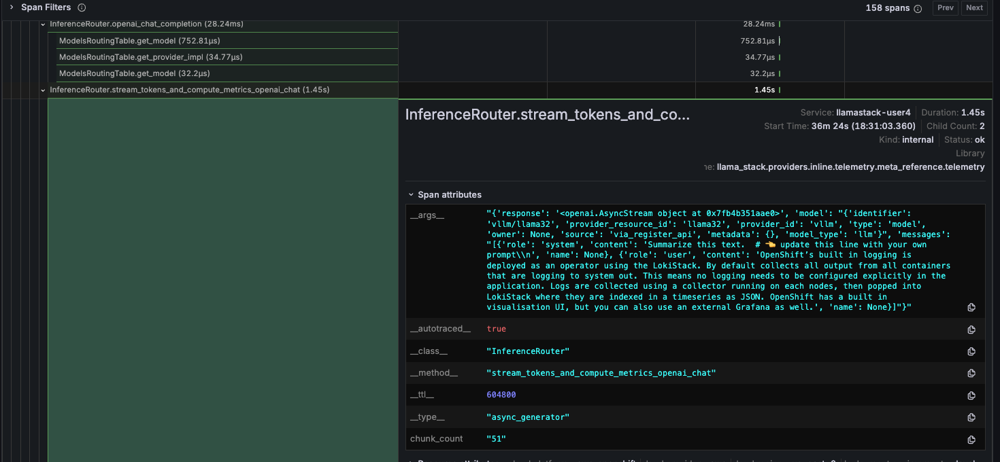

# 🔍 Tracing: Following the Journey

When a student asks Canopy "Explain quantum entanglement," that simple question triggers a complex dance across multiple services. 

How do you know where time is spent? Which service is the bottleneck? Where errors actually originate? **Distributed tracing** answers these questions by connecting the dots across your entire system, showing you the complete journey of each request.

## Understanding Distributed Tracing

Imagine following a student through their day on campus - from the library to the lab to office hours. You'd see where they spend the most time, where they get stuck, and what path they take. Distributed tracing does this for requests traveling through Canopy's microservices.

Each service instruments its code to emit **spans** - records of work done. These spans include:
- **Operation name**: What work was performed (e.g., "RAG query", "LLM inference")
- **Duration**: How long it took (critical for finding bottlenecks)
- **Parent span**: What triggered this operation (builds the request tree)
- **Attributes**: Metadata like user ID, query text, documents retrieved, tokens generated

When spans are connected by parent-child relationships, they form a **trace** - the complete story of a single request from the student's question to Canopy's answer.

In this trace visualization, you can see the waterfall view showing:
- Total request time and each service's contribution
- Which operations run sequentially vs. in parallel
- Where the most time is spent (the longest bars)
- Parent-child relationships (the tree structure)

## Auto-Injecting Tracing into Canopy

One of the powerful features of OpenShift's observability stack is the ability to automatically inject tracing into your applications without changing code.

### How Auto-Instrumentation Works

The OpenTelemetry Operator can automatically [inject instrumentation](https://docs.redhat.com/en/documentation/openshift_container_platform/4.19/html/red_hat_build_of_opentelemetry/otel-configuration-of-instrumentation) into your pods by:
1. Detecting the programming language (Python, Node.js, Java, etc.)
2. Injecting the appropriate OTel SDK as a sidecar or init container
3. Configuring environment variables to enable auto-instrumentation
4. Sending traces to the OpenTelemetry Collector, which forwards them to Tempo

For Canopy UI and Canopy Backend, this means you get distributed tracing with minimal configuration.

### Enabling Auto-Instrumentation

The observability stack deployed with OpenShift AI includes the OpenTelemetry Operator. To enable tracing for Canopy's components, you would annotate the deployments. Because we're using python based apps (both for frontend and backend), we need to set the `instrumentation.opentelemetry.io/inject-python: "true"` label. We already did it by default in the [Canopy UI](https://github.com/rhoai-genaiops/frontend/blob/main/chart/templates/deployment.yaml#L18) and the [Canopy Backend](https://github.com/rhoai-genaiops/backend/blob/main/chart/templates/deployment.yaml#L20).

This tells the operator to inject Python auto-instrumentation into the canopy-ui pods. The same approach works for the backend and other services.

## How Traces Flow Across Canopy AI App

When a student asks a question, the request flows through multiple services: **Canopy-UI → Canopy-Backend → LlamaStack → vLLM**. 

Each component is instrumented with OpenTelemetry to create **spans** - records of work performed with timing data.

**Trace Propagation:**
- **Canopy-UI** (auto-instrumented): Creates the root span and propagates trace context via HTTP headers (W3C Trace Context standard)
- **Canopy-Backend** (auto-instrumented): Receives the trace context, creates child spans for RAG queries and API calls
- **LlamaStack** (`otel_trace` sink): Continues the trace with spans for inference operations, token counting, and model routing
- **vLLM**: Generates spans for model inference and token generation

These spans connect into a **distributed trace** - a complete tree showing the request's journey across all services. OpenTelemetry automatically handles trace context propagation, ensuring spans link correctly even as the request crosses service boundaries. The traces are exported to **Red Hat build of Tempo** for storage and querying.

## Visualizing Traces in Grafana

Now let's see distributed tracing in action by exploring your Canopy AI request traces.

1. **Access the Traces Dashboard**: In your Grafana instance, navigate to the `<USER_NAME>-toolings Canopy Dashboards` folder and open **Llama Stack Traces**.

   

   The dashboard displays all captured traces for your Canopy AI application. Each row represents a complete request journey from user question to LLM response, showing:
   - **Trace ID**: Unique identifier linking all spans in this request
   - **Duration**: Total time from start to finish
   - **Spans**: Number of operations captured in this trace
   - **Service**: Which services participated (canopy-ui, canopy-backend, llamastack, vllm)

2. **Explore a Trace**: Click any trace to see its detailed waterfall view, visualizing the complete request flow from Canopy-UI through to the LLM.

   

   **What the Trace Shows:**

   The waterfall view displays the complete request hierarchy with precise timing. Each row represents a span, and indentation shows parent-child relationships:

   - **canopy-ui**: Initial requests for host config and health checks (microseconds)
   - **canopy-backend GET /feature-flags**: Frontend fetches feature toggles (890μs)
   - **canopy-backend POST /summarize**: Main AI request (1.44s total)
   - **llamastack-user4 /v1/chat/completions**: LLM inference call (1.35s)
   - **InferenceRouter.openai_chat_completion**: LlamaStack internal routing (31ms)
     - Model routing table lookups (1-69μs each)
     - **stream_tokens_and_compute_metrics**: Actual token generation (1.32s)

   **Key Insights:**
   - **Performance Bottleneck**: The LlamaStack inference (1.35s) dominates the 1.44s total time
   - **Service Boundaries**: Clear flow through UI → Backend → LlamaStack layers
   - **Optimization Opportunities**: Model selection is fast (<2ms), but token streaming takes 1.32s
   - **Debugging Power**: Instead of just seeing "request took 1.44s", you know exactly where time is spent

3. **Inspect Span Details**: Click any span to see its attributes and metadata. The `InferenceRouter.openai_chat_completion` span is particularly useful as it shows the actual prompt sent to the LLM, the model used, and token counts.

   

   Each span includes rich metadata like HTTP headers, model parameters, input/output samples, and error details - essential for debugging complex AI workflows.