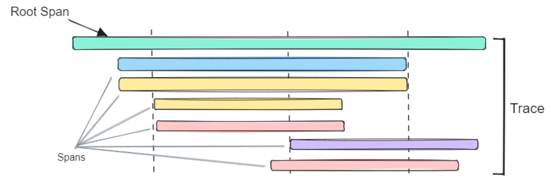

# 🔍 Tracing: Following the Journey

When a student asks Canopy "Explain quantum entanglement," that simple question triggers a complex dance across multiple services. 

How do you know where time is spent? Which service is the bottleneck? Where errors actually originate? **Distributed tracing** answers these questions by connecting the dots across your entire system, showing you the complete journey of each request.

## Understanding Distributed Tracing

Imagine following a student through their day on campus - from the library to the lab to office hours. You'd see where they spend the most time, where they get stuck, and what path they take. Distributed tracing does this for requests traveling through Canopy's microservices.

Each service instruments its code to emit **spans** - records of work done. These spans include:
- **Operation name**: What work was performed (e.g., "RAG query", "LLM inference")
- **Duration**: How long it took (critical for finding bottlenecks)
- **Parent span**: What triggered this operation (builds the request tree)
- **Attributes**: Metadata like user ID, query text, documents retrieved, tokens generated

When spans are connected by parent-child relationships, they form a **trace** - the complete story of a single request from the student's question to Canopy's answer.



In this trace visualization, you can see the waterfall view showing:
- Total request time and each service's contribution
- Which operations run sequentially vs. in parallel
- Where the most time is spent (the longest bars)
- Parent-child relationships (the tree structure)

## OpenTelemetry: The Standard for Tracing

Red Hat OpenShift AI uses **OpenTelemetry** (OTel), the open-source standard for distributed tracing. OpenTelemetry provides:

* **Automatic instrumentation** for common frameworks (Flask, FastAPI, Express, etc.)
* **Manual instrumentation** for custom operations specific to your application
* **Vendor-neutral format** that works with any tracing backend
* **Integration with metrics and logs** for complete observability

Canopy's components can be instrumented to emit OTel traces automatically. OpenShift collects these traces and stores them in the **Red Hat build of Tempo**, a distributed tracing backend that makes them queryable.

## Auto-Injecting Tracing into Canopy

One of the powerful features of OpenShift's observability stack is the ability to automatically inject tracing into your applications without changing code.

### How Auto-Instrumentation Works

The OpenTelemetry Operator can automatically inject instrumentation into your pods by:
1. Detecting the programming language (Python, Node.js, Java, etc.)
2. Injecting the appropriate OTel SDK as a sidecar or init container
3. Configuring environment variables to enable auto-instrumentation
4. Sending traces to the OpenTelemetry Collector, which forwards them to Tempo

For Canopy UI and Canopy Backend, this means you get distributed tracing with minimal configuration.

### Enabling Auto-Instrumentation

The observability stack deployed with OpenShift AI includes the OpenTelemetry Operator. To enable tracing for Canopy's components, you would annotate the deployments:

```yaml
apiVersion: apps/v1
kind: Deployment
metadata:
  name: canopy-ui
spec:
  template:
    metadata:
      annotations:
        instrumentation.opentelemetry.io/inject-python: "true"
```

This tells the operator to inject Python auto-instrumentation into the canopy-ui pods. The same approach works for the backend and other services.

## Reading a Trace


Let's interpret what a trace tells us. Here's an example trace breakdown:

```
Total Duration: 1.2s
├─ canopy-ui (50ms)
│  └─ HTTP POST /api/chat (50ms)
│     └─ canopy-be (1.15s)
│        ├─ guardrails-check (80ms)
│        ├─ rag-query (650ms)
│        │  ├─ milvus-search (600ms)
│        │  └─ rerank-results (50ms)
│        └─ llm-inference (420ms)
│           ├─ prompt-preparation (20ms)
│           └─ vllm-generate (400ms)
```

Without tracing, you'd only know "the request took 1.2s" - you wouldn't know **where** to focus optimization efforts. With tracing, it's clear: optimize the vector database query.
