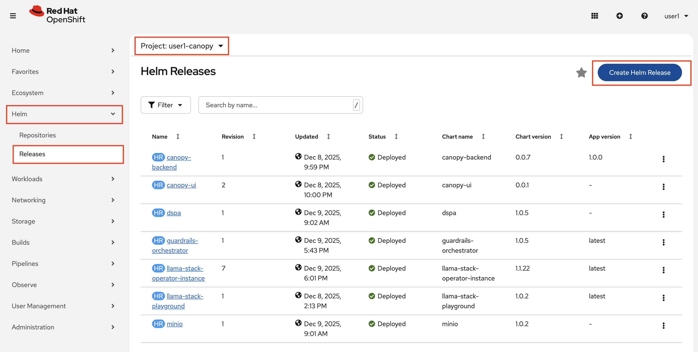
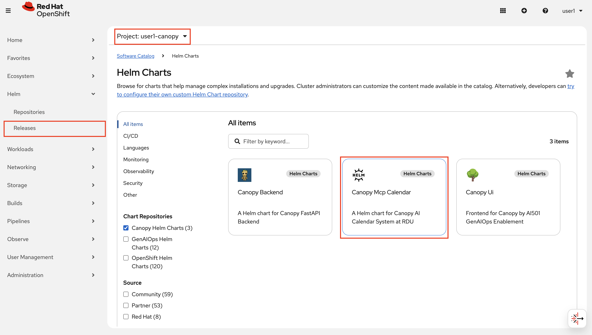
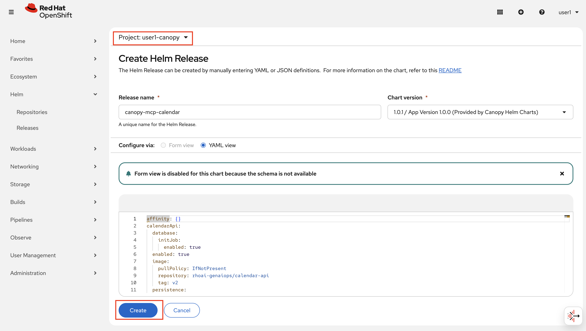
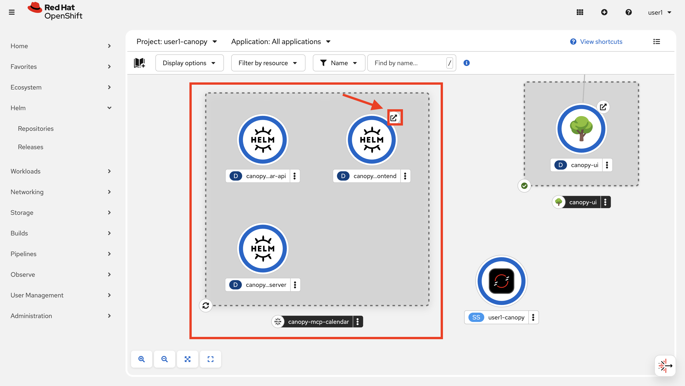
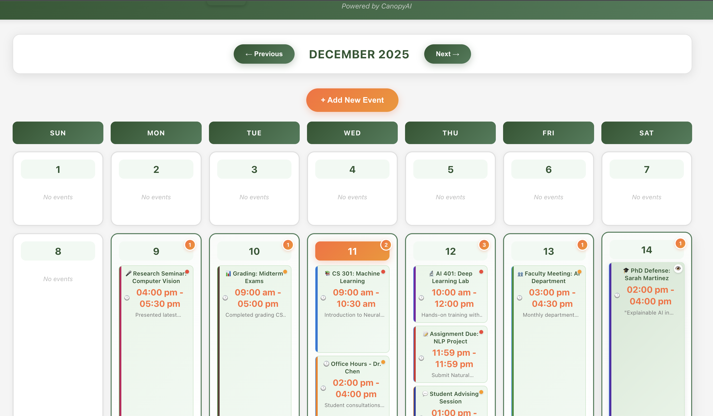

# What are tools?

## Tool basics

LLMs are pretty smart, but they have some awkward limitations. Ask an LLM "What's 847 × 923?" and watch it confidently give you the wrong answer. Or ask it to look up real-time information, interact with databases, or call external APIs - it simply can't.

We've already seen how RAG helps with knowledge limitations by giving LLMs access to documents. Now let's generalize this concept: **tools**.

A **tool** is any service we want the LLM to interact with - calculators, databases, ERP systems, weather APIs, you name it. We wrap these services with a simple communication layer (JSON in/out) that makes it easier for LLMs to format requests.

The LLM becomes a **coordinator** that uses tools and knows how to interpret their results.

This is all very high level, so let's look at some examples!  
Go to your workbench and run through the notebook: **`experiments/8-agents/1-intro-to-tools.ipynb`**

## MCP servers

Now that you've seen how a tool works in practice, let's scale it up!

**MCP (Model Context Protocol) servers** are collections of tools that can be called either remotely or locally. Instead of defining tools one-by-one, MCP servers provide entire suites of functionality - like a toolbox instead of a single tool.

Before we can use an MCP server, we need to deploy one, let's start with that!

1. Go to the OpenShift UI -> Helm -> Releases as before and click Create Helm Release.

    

2. Select `Canopy Helm Charts` in the left menu and then click on Canopy MCP Calendar:

    

3. You don't need to change anything here so just click Create right away.

    

4. After everything has been deployed, you can access the [Calendar website](https://canopy-mcp-calendar-frontend-<USER_NAME>-canopy.<CLUSTER_DOMAIN>), go see what it looks like by clicking the little arrow when the circles are all blue 🔵

    

    You should see something like this:

    

5. Go to your workbench and open up the notebook **`experiments/8-agents/2-MCP.ipynb`** to see how to use the MCP server and its tools. When you are done, come back here for more!

Now that you know what tools are, how they work, and how to use them, let's see how we can create even more powerful agents.