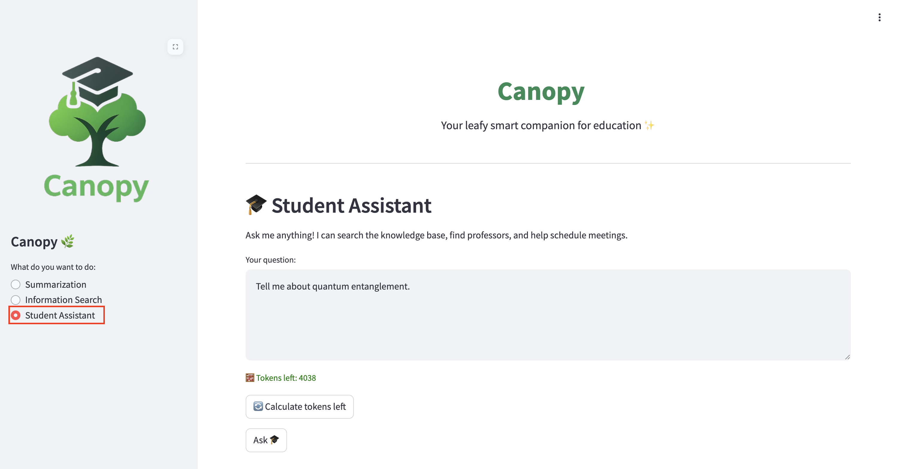

# Take Agents to Prod

Now that we have our new fresh agent, let's take it to production!  
There are a few things we want to do, such as evaluating and observing the agent, but let's start with adding in the feature flag to enable it in the backend.

## Deploy the Agent through GitOps

1. We need to start by upgrading our test and prod Llama Stack, go to `genaiops-gitops/canopy/test/llama-stack/config.yaml` and update to this:

    ```yaml
    chart_path: charts/llama-stack-operator-instance
    eval:
      enabled: true
    rag:                  
      enabled: true
    mcp:                # 👈 Add this 
      enabled: true     # 👈 Add this 
    ```

2. Push this to git so that it takes effect:

    ```bash
    cd /opt/app-root/src/genaiops-gitops
    git pull
    git add .
    git commit -m "📃 enable MCP 📃"
    git push origin main
    ```

3. After Llama Stack has MCP enabled, we need to update our Canopy backend so it can use the agent feature.  
    Go to your workbench and open the file `backend/chart/values-test.yaml`

4. Edit the file to contain the `student-assistant` feature flag. Feel free to change the prompt, this is the system prompt just like before.

    ```yaml
    LLAMA_STACK_URL: "http://llama-stack-service:8321"
    summarize:
      enabled: true
      model: llama32
      temperature: 0.9
      max_tokens: 4096
      prompt: |
        You are a helpful assistant. Summarize the given text please.
    information-search:
      enabled: true
      vector_db_id: latest
      model: llama32
      prompt: |
        You are a helpful assistant specializing in document intelligence and academic content analysis.
    student-assistant:         # 👈 add this large block
      enabled: true
      model: llama32
      temperature: 0.1
      vector_db_id: latest
      mcp_calendar_url: "http://canopy-mcp-calendar-mcp-server:8080/sse"
      prompt: |
        You are a university assistant that helps students find information and get support.

        Your primary goals are:
        1. Help the student find accurate, useful information as directly as possible.
        2. When you cannot fully answer their question with the information and tools available, schedule a meeting with an appropriate professor or advisor in a related field who can help.
    
        General behavior:
        - Always be polite, clear, and practical.
        - Always produce a human-readable answer for the student. Never respond only with raw JSON or tool outputs.
        - If a question depends on the student's *specific* data (schedule, courses, assignments, personal progress, etc.), you MUST call the relevant tools instead of guessing.
        - Do NOT explain how to call tools. Do not say things like "you can use the `get_all_events` function". Just call the tools and summarize their results.
        - If tools return no relevant data, say so clearly and suggest next steps.

        Information-finding:
        - For conceptual questions (e.g. "What is Bayes' theorem?"), try first to search for the information.
        - For personalized questions (e.g. "What meetings do I have?", "What assignments are due?", "When is my next lecture?"), you MUST use the calendar/assignment/etc. tools.
          - The calendar is the users private calendar, not the professors or anyone elses, use it as the students calendar only.
        - When tool parameters like course, category, status, or time range are missing, either:
          - Make a reasonable assumption and state it explicitly, or
          - Ask a brief clarifying question if needed.

        Scheduling meetings with professors:
          - If, after using tools and your own knowledge, you still cannot confidently answer the student's question, you MUST propose scheduling a meeting with a relevant professor or advisor.
          - Use any available tools to:
            - Identify a professor whose expertise matches the topic or course.
            - Find available time slots.
          - Schedule a meeting or create a calendar event for the student if the tools support this.
        - When you schedule (or attempt to schedule) a meeting, clearly summarize:
          - Who the meeting is with,
          - The time, date, and location (or online link),
          - What topic the student should prepare to discuss.
        - If no scheduling tools are available or the system cannot complete the booking, suggest concrete next steps for the student (e.g. emailing the professor, bringing specific questions).

        Always:
        - Prefer using tools over guessing when tools can provide more accurate or personalized information.
        - Never talk about "tools", "APIs", or "functions" in your final answer; present everything in natural language.
        - End your response with a clear next step for the student (e.g. what they should review, what will happen with the scheduled meeting, or what they can do next if they need more help).
        - If you get an error from using the tool, look at the error and try again.
    ```

5. Push the change to git:

    ```bash
    cd /opt/app-root/src/backend/chart
    git add values-test.yaml
    git commit -m "🤖 Agent Feature Added 🤖"
    git push
    ```
  
6. Deploy calendar API for your test environment as well so that you can freely continue iterating on your experiment environment while further evluation tests can happen in the test environment before taking the current setup to production. 
  But this time, let's deploy it via GitOps! Create `calendar-mcp` folder under `/opt/app-root/src/genaiops-gitops/canopy/test` , then create `config.yaml` file, or simply run below command:

  ```bash
   mkdir /opt/app-root/src/genaiops-gitops/canopy/test/calendar-mcp
   touch /opt/app-root/src/genaiops-gitops/canopy/test/calendar-mcp/config.yaml
  ```

  And add the following config that points to the related helm chart:

  ```yaml
  repo_url: https://github.com/rhoai-genaiops/mcp.git
  chart_path: mcp-calendar-app/helm
  fullnameOverride: canopy-mcp-calendar
  ```

7. Push te changes to Git..because, you know, GitOps!

  ```bash
    git pull
    cd /opt/app-root/src/genaiops-gitops/canopy/
    git add test/calendar-mcp
    git commit -m "📆 Calendar MCP added 📆"
    git push
  ```

8. Open the Canopy UI, change to the Student Assistant on the left side and ask `Tell me about quantum entaglement.`.  
    The agent should try to find the information, fail, and then find a professor to help you and schedule a call with them.  

    If you don't have the Canopy open any longer, you can find it here: [https://canopy-ui-<USER_NAME>-test.<CLUSTER_DOMAIN>](https://canopy-ui-<USER_NAME>-test.<CLUSTER_DOMAIN>)

    