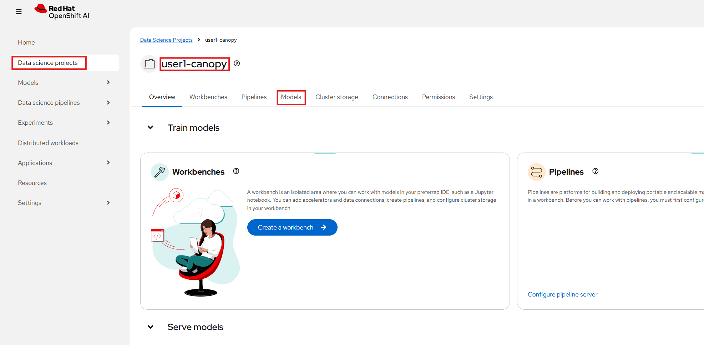
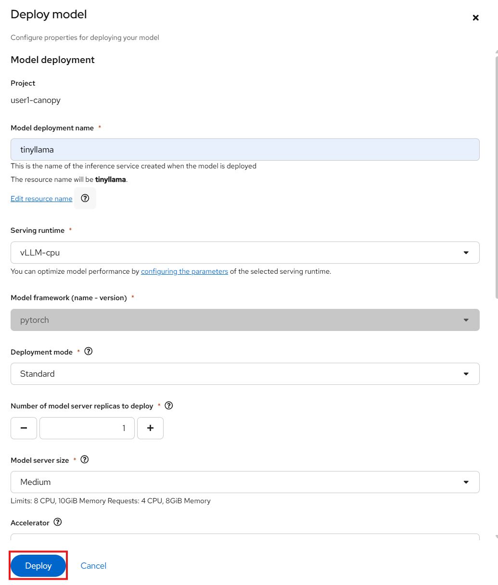

# 🏠 Deploy LLMs On-Prem

Due to data confidentiality requirements, we need to host the model ourselves. Running LLMs in-house keeps sensitive student data within your infrastructure, giving you full control over data governance and compliance.

We know that high-performance inference typically requires dedicated GPU resources. But IT just informed us they can't spare a GPU at the moment. So how do we continue development without compromising on our privacy requirements?

The answer: start with smaller, CPU-friendly models while building the infrastructure. Let's explore your options.

## 🔍 What Models Can Run On-Prem?

Not all models require massive GPU clusters. The LLM landscape includes models designed for various hardware configurations—from powerful data center GPUs to modest CPU-only deployments.

### 📄 How to Read a Model Card

Every well-documented LLM on platforms like [Hugging Face](https://huggingface.co/models) comes with a **model card**, essentially a fact sheet for the model. When evaluating models for Canopy, here's what to look for:

| Section                   | What to Look For                                                          |
| ------------------------- | ------------------------------------------------------------------------- |
| **Model Architecture**    | Is it based on LLaMA, Mistral, GPT, etc.?                                 |
| **Size (parameters)**     | More parameters often = more capability, but also more resource-intensive |
| **Intended Use**          | Is it optimized for instruction-following, general chat, code, etc.?      |
| **Training Data**         | Does it align with educational use? Was any filtering done?               |
| **Limitations**           | Any known biases or weaknesses?                                           |
| **License**               | Is it open for commercial/educational use?                                |
| **Hardware Requirements** | CPU-only, GPU-required, or specific memory constraints?                   |

We've been using Llama 3.2 3B for Canopy so far. Take a look at its model card: [meta-llama/Llama-3.2-3B-Instruct](https://huggingface.co/meta-llama/Llama-3.2-3B-Instruct)

Notice how the model card specifies the intended use cases, training methodology, and hardware recommendations. This information is crucial when deciding if a model fits your deployment constraints.

## 💻 What Are the Infrastructure Requirements?

Not every model needs a high-end GPU, but some certainly do. Here's a general sizing guide:

| Model Size | GPU Memory Required | Example Models |
| ---------- | ------------------- | -------------- |
| **< 3B parameters** | ~8–12GB VRAM (or CPU-only) | TinyLlama 1.1B, Granite 2B |
| **3B–7B parameters** | ~16–24GB VRAM | Llama 3.2 3B, Mistral 7B |
| **7B–13B parameters** | ≥24GB GPU memory | Llama 3.1 8B, CodeLlama 13B |
| **> 30B parameters** | Multi-GPU setups (A100s) | Llama 3.1 70B, Mixtral 8x7B |

**Don't have a GPU?** You have options:

* **CPU-only runtimes**: Slower inference, but perfectly acceptable for development, demos, or low-traffic deployments
* **Quantized models**: Reduced precision models (4-bit, 8-bit) that require less memory (no more spoilers! 🤫🤫🤫)
* **Cloud-based endpoints**: What we've been using, but not viable for confidential data

Since GPU allocation isn't available right now and cloud endpoints are off the table for compliance reasons, let's look at what we can deploy on CPU. And since you love llamas 🦙🦙🦙, you discover [TinyLlama](https://huggingface.co/TinyLlama/TinyLlama-1.1B-Chat-v1.0)—a compact 1.1B parameter model specifically designed for CPU inference.

Perfect for getting started while you wait for GPU allocation!


## 🚀 How Do I Serve a Model?

Serving a model means making it accessible via an API endpoint that applications—like Canopy or the Llama Stack Playground—can call. Instead of embedding the model directly in your application, you deploy it as a standalone service that responds to inference requests.

In OpenShift AI, we use **KServe** with **vLLM** as the serving runtime to deploy models as containerized workloads. vLLM provides efficient inference with features like continuous batching and PagedAttention for optimized memory usage.

### Deploy Your First On-Prem Model

1. Navigate to **OpenShift AI** → **Data Science Projects** → **`<USER_NAME>-canopy`** → **Models**

    

2. Click **Deploy model**

    

3. Fill in the form with the following settings:

    | Setting | Value |
    | ------- | ----- |
    | Model deployment name | `tinyllama` |
    | Serving runtime | `vLLM-CPU` |
    | Deployment Mode | `Standard` |
    | Number of model server replicas | `1` |
    | Model server size | `Medium` |
    | Accelerator | `None` |

    For **Model route** settings:
    - **Uncheck** `Make deployed models available through an external route`
    - **Uncheck** `Require token authentication`

    For **Source model location**:
    - Select `Existing connection` → `tinyllama`

    Leave the remaining settings as defaults and click **Deploy**.

    

4. Watch the deployment progress. Wait until the status indicator turns green, indicating the model is ready to serve requests.

    

> **Tip**: Feel free to deploy the other available models (`llama3.2-3b` or `granite-2b`) as well. Having multiple models deployed allows you to compare their responses and choose which one best fits Canopy's needs.

## 🌐 How Do I Access the Model?

Once deployed, your model gets an internal REST endpoint following the OpenAI-compatible API format. The endpoint URL follows this pattern:

```
http://<model-name>-predictor.<namespace>.svc.cluster.local:8080/v1
```

For example, if you deployed TinyLlama in your `<USER_NAME>-canopy` namespace:

```
http://tinyllama-predictor.<USER_NAME>-canopy.svc.cluster.local:8080/v1
```

### Test the Model Endpoint

Go back to your workbench and run this command in the terminal to verify the model is responding:

```bash
curl -s http://tinyllama-predictor.<USER_NAME>-canopy.svc.cluster.local:8080/v1/chat/completions \
  -H "Content-Type: application/json" \
  -d '{
    "model": "tinyllama",
    "messages": [
      {"role": "system", "content": "You are a helpful assistant."},
      {"role": "user", "content": "Hello! Can you introduce yourself?"}
    ],
    "max_tokens": 100
  }' | jq .
```

You should see a JSON response with the model's reply. The response time might be slower than what you experienced with the cloud endpoint—that's expected for CPU-only inference.

> **Note**: The model is only accessible from within the cluster (no external route). This is intentional for security—keeping the model endpoint internal reduces your attack surface.

---

Maybe it's not super fast for your taste, but it works! And most importantly, your data never leaves your infrastructure.

Now let's update Llama Stack and Canopy to use this new on-prem endpoint.

## 🎯 Next Steps

Continue to **[Update Canopy](9-on-prem-practicum/2-update-canopy.md)** to configure Llama Stack and your frontend to use the locally-hosted model.
