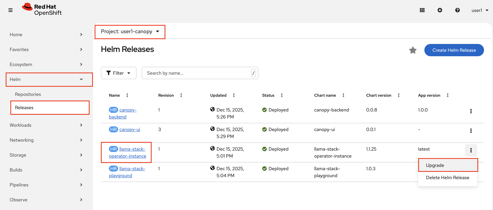
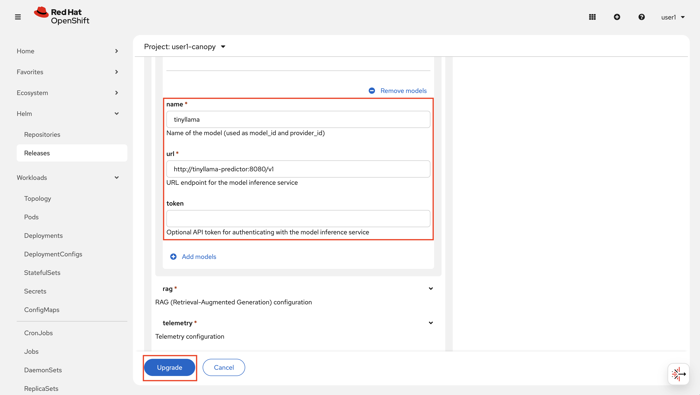
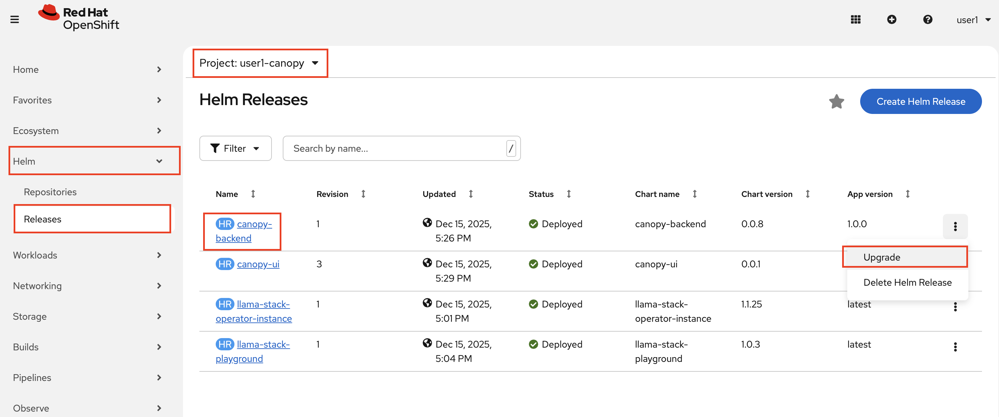
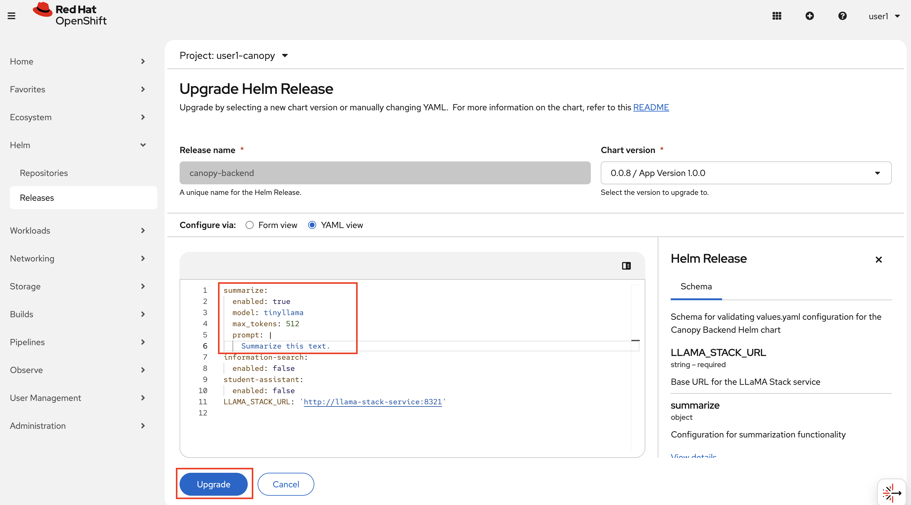

# 🔄 Update Canopy to Use On-Prem Models

Now that we have a model running locally, it's time to connect it to our application stack. This involves two steps: updating Llama Stack to point to the new model endpoint, and verifying Canopy works with the on-prem setup.

## 🦙 Update Llama Stack Configuration

Llama Stack acts as the middleware between your frontend and the LLM. Currently, it's configured to use the cloud-hosted endpoint. Let's reconfigure it to use our locally-deployed TinyLlama.

### Update via Helm

1. Navigate to **OpenShift Console** → **Helm** → **Releases** and find your `llama-stack-operator-instance` release in the `<USER_NAME>-canopy` project.

2. Click on the release and select **Upgrade**.

    

3. Update the model configuration to point to your on-prem endpoint:

    - **Model Name**: `tinyllama`
    - **Model URL**: `http://tinyllama-predictor:8080/v1`

4. Click **Upgrade** to apply the changes.

    

5. Also we need to update the `backend` and lower the `max_token` because TinyLlama can't handle as much as previous 😅 So find `canopybackend` under **OpenShift Console** → **Helm** → **Releases** 

    

6.  And add these under `summarize`.

    ```yaml
    summarize:
      enabled: true
      max_tokens: 512 # 👈 update this ❗️❗️❗️
      model: tinyllama # 👈 update this ❗️❗️❗️
      prompt: "<your prompt>"
    ```

7. Click **Upgrade** to apply the changes.

    

### 🌳 Test Canopy with the New Model

Once Llama Stack and backend are back up, let's verify it can communicate with the on-prem model.

1. Go to [Canopy UI](https://canopy-ui-<USER_NAME>-canopy.<CLUSTER_DOMAIN>) and test summarization. You can copy the text about Turkish tea from the previous chapters if you wish ☕️

   And please be patient. Tiny Llama is doing its best for you 🦙🏋️‍♀️♥️

2. You should receive a response from TinyLlama. Notice how the response style and capabilities might differ from Llama 3.2 3B. That's expected given the smaller model size.

> **Observation**: TinyLlama responses will be faster to start (lower latency to first token) but may be less sophisticated than larger models. This is the trade-off you make for CPU-only deployment.

3. Compare the responses to what you experienced with the cloud-hosted model. Consider:
   - **Response quality**: Are answers still helpful and accurate?
   - **Response time**: How does latency compare?

## 📊 Performance Considerations

Running models on CPU introduces different performance characteristics:

| Metric | Cloud Endpoint | On-Prem CPU |
| ------ | -------------- | ----------- |
| Time to First Token | ~100-500ms | ~1-3 seconds |
| Tokens per Second | 50-100+ | 5-15 |
| Concurrency | High | Limited |
| Data Privacy | External | Full control |

For development and testing, CPU inference is perfectly acceptable. For production workloads with higher traffic, you'll want to revisit GPU allocation or consider model optimization techniques 😉

You've successfully deployed an LLM on-premises and connected your entire Canopy stack to use it. Your student data now can stay completely within your infrastructure.

But are your fellow students and professors going be happy with this? 

Let's look into model optimization and compression before we settle with Tiny Llama actually 🦙🌿